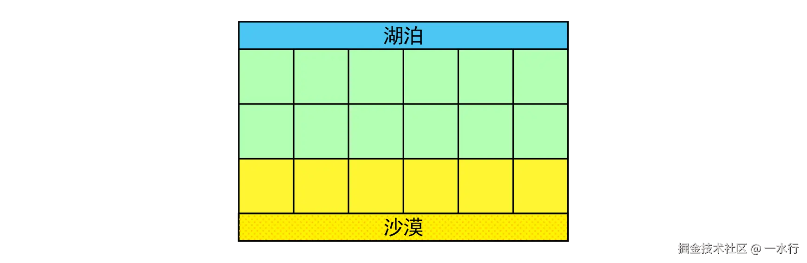
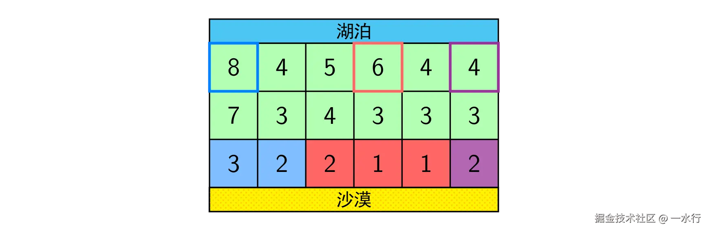

原题：[P1514 \[NOIP 2010 提高组\] 引水入城](https://www.luogu.com.cn/problem/P1514)

题面：

## 题目背景

NOIP2010 提高组 T4

## 题目描述

在一个遥远的国度，一侧是风景秀美的湖泊，另一侧则是漫无边际的沙漠。该国的行政区划十分特殊，刚好构成一个 $N$ 行 $M$ 列的矩形，如上图所示，其中每个格子都代表一座城市，每座城市都有一个海拔高度。



为了使居民们都尽可能饮用到清澈的湖水，现在要在某些城市建造水利设施。水利设施有两种，分别为蓄水厂和输水站。蓄水厂的功能是利用水泵将湖泊中的水抽取到所在城市的蓄水池中。

因此，只有与湖泊毗邻的第 $1$ 行的城市可以建造蓄水厂。而输水站的功能则是通过输水管线利用高度落差，将湖水从高处向低处输送。故一座城市能建造输水站的前提，是存在比它海拔更高且拥有公共边的相邻城市，已经建有水利设施。由于第 $N$ 行的城市靠近沙漠，是该国的干旱区，所以要求其中的每座城市都建有水利设施。那么，这个要求能否满足呢？如果能，请计算最少建造几个蓄水厂；如果不能，求干旱区中不可能建有水利设施的城市数目。

## 输入格式

每行两个数，之间用一个空格隔开。输入的第一行是两个正整数 $N,M$，表示矩形的规模。接下来 $N$ 行，每行 $M$ 个正整数，依次代表每座城市的海拔高度。

## 输出格式

两行。如果能满足要求，输出的第一行是整数 $1$，第二行是一个整数，代表最少建造几个蓄水厂；如果不能满足要求，输出的第一行是整数 $0$，第二行是一个整数，代表有几座干旱区中的城市不可能建有水利设施。

## 输入输出样例 #1

### 输入 #1

    2 5
    9 1 5 4 3
    8 7 6 1 2

### 输出 #1

    1
    1

## 输入输出样例 #2

### 输入 #2

    3 6
    8 4 5 6 4 4
    7 3 4 3 3 3
    3 2 2 1 1 2

### 输出 #2

    1
    3

## 说明/提示

**样例 1 说明**

只需要在海拔为 $9$ 的那座城市中建造蓄水厂，即可满足要求。

**样例 2 说明**



上图中，在 $3 $ 个粗线框出的城市中建造蓄水厂，可以满足要求。以这 $3 $ 个蓄水厂为源头在干旱区中建造的输水站分别用 $3$ 种颜色标出。当然，建造方法可能不唯一。

**数据范围**

本题有 10 个测试数据，每个数据的范围如下表所示：

| 测试数据编号 | 能否满足要求 | $N\le$ | $M\le$ |
| :----------: | :----------: | :----: | :----: |
|      1       |     不能     |  $10$  |  $10$  |
|      2       |     不能     | $100$  | $100$  |
|      3       |     不能     | $500$  | $500$  |
|      4       |      能      |  $1$   |  $10$  |
|      5       |      能      |  $10$  |  $10$  |
|      6       |      能      | $100$  |  $20$  |
|      7       |      能      | $100$  |  $50$  |
|      8       |      能      | $100$  | $100$  |
|      9       |      能      | $200$  | $200$  |
|      10      |      能      | $500$  | $500$  |

对于所有 10 个数据，每座城市的海拔高度都不超过 $10^6$。

## $Solution$

其实感觉这道题还是不难的，并没有蓝的难度吧。

看一眼题意，可以发现输水站的建造并没有被限制，所以我们的水流可以从任何一个较高的格子流向和它相邻的较低的格子。

首先我们思考应该怎么判断所有的沙漠区域是否能够有水流入。可以考虑对于所有的蓄水厂，跑一个多源 $bfs$ ，然后对第 $n$ 行的格子进行标记，如果最终有格子没有被标记，就说明这个格子没有水流入，我们直接计数输出即可。

这道题的主要的难点在于如何确定最少的蓄水厂使得所有的沙漠格子均有水流入。一开始我选择了直接来暴力搜索，同样是在一个多源 $bfs$ 中求解，记录每一步的状态 $state$ ，$state$ 中标记了当前的横纵坐标以及这股水流的来源 $source$ 。然后如果流到了第 $n$ 行的格子，就将当前这个沙漠格子的计数加一，说明多了一股水流流进这个格子。同时使用一个 $reach$ 数组来记录每一个蓄水厂能够流到哪个沙漠格子。最终计算答案时，枚举每一个蓄水厂，并查找这个蓄水厂可以流到的每一个沙漠格子，如果这些沙漠格子的计数均大于 $1$ ，就说明当前的这个蓄水厂是不必要的，记录原始答案为 $m$ ，此时直接减一即可。同时将这些沙漠格子的计数也减一，防止后面的蓄水厂被误判为不必须。

为了标记当前格子没有走过，我考虑到此题的 $n \le 500$ ，如果直接开一个 $n^3$ 大小的 $bool$ 数组估计会爆空间，所以我选择直接用了一个 $unordered\_set$ 来标记当前状态有没有走过，甚至还写了重载运算符和一个关于 $state$ 的哈希...

最终得分为 $90pts:$

```cpp
#include <iostream>
#include <cstring>
#include <iomanip>
#include <cmath>
#include <vector>
#include <algorithm>
#include <queue>
#include <unordered_set>
using namespace std;

#define ll long long
#define ull unsigned long long
#define debug(x) cout << #x << "=" << x << "\n";

int n, m;
const int maxn = 510;
int h[maxn][maxn];
vector<int> reach[maxn];
int cnt[maxn];
int dx[4] = {1, 0, -1, 0};
int dy[4] = {0, 1, 0, -1};
struct state
{
    int x, y;
    int source;

    bool operator==(const state &other) const
    {
        return x == other.x && y == other.y && source == other.source;
    }
};

struct hash_state
{
    size_t operator()(state const &s) const noexcept
    {
        return ((s.x * 1000 + s.y) * 1000 + s.source);
    }
};

unordered_set<state, hash_state> vis;

void bfs()
{
    queue<state> q;
    for (int i = 1; i <= m; i++)
    {
        state st = {1, i, i};
        q.push(st);
        vis.insert(st);
    }

    while (!q.empty())
    {
        state cur = q.front();
        q.pop();

        int x1 = cur.x, y1 = cur.y;
        int s = cur.source;
        
        if(x1==n)
        {
            cnt[y1]++;
            reach[s].push_back(y1);
        }

        for (int i = 0; i < 4; i++)
        {
            int x2 = x1 + dx[i], y2 = y1 + dy[i];
            if (x2 < 1 || x2 > n || y2 < 1 || y2 > m)
                continue;
            if (h[x2][y2] >= h[x1][y1])
                continue;
            state next = {x2, y2, s};
            if (vis.count(next))
                continue;

            vis.insert(next);
            q.push(next);
        }
    }
}

int main()
{
    ios::sync_with_stdio(false);
    cin.tie(nullptr);

    cin >> n >> m;
    for (int i = 1; i <= n; i++)
    {
        for (int j = 1; j <= m; j++)
            cin >> h[i][j];
    }

    bfs();

    int unreached = 0;
    for (int i = 1; i <= m; i++)
    {
        // cout << cnt[i] << " ";
        if (cnt[i] == 0)
            unreached++;
    }

    if (unreached)
    {
        cout << "0\n";
        cout << unreached;
        return 0;
    }

    int ans = m;
    for (int i = 1; i <= m; i++)
    {
        bool flag = true;
        for (auto x : reach[i])
        {
            if (cnt[x] == 1)
            {
                flag = false;
                break;
            }
        }

        if (flag)
        {
            ans--;
            for (auto x : reach[i])
                cnt[x]--;
        }
    }

    cout << "1\n";
    cout << ans;

    return 0;
}
```

有一个点爆了空间，最终还是状态数太多了。

所以考虑一下怎么优化。感恩 $gpt$ 神力！给我提出了一个可能的优化方案：

使用三维 $vector$ 来标记，为什么 $vector$ 可以呢？因为 $bool$ 类型的 $vector$ 是普通 $vector$ 的一个特化版本，在C++中，为了节省内存空间，会将每个 $bool$ 压缩到一个比特位上，所以内存占用直接变成接近于原来的八分之一，即使再加上 $vector$ 的一些额外的内存支出，也是一个非常大的优化。

缺点是访问比较慢，其一是需要多重指针的解引用，其二是每层 $vector$ 的内存在堆上独立分配，对CPU缓存不友好，其三是在访问到之后还需要进行位运算来获取对应值。相当于用时间换空间的操作吧，在本题是可以通过的。

$100pts:$

```cpp
#include <iostream>
#include <cstring>
#include <iomanip>
#include <cmath>
#include <vector>
#include <algorithm>
#include <queue>
using namespace std;

#define ll long long
#define ull unsigned long long
#define debug(x) cout << #x << "=" << x << "\n";

int n, m;
const int maxn = 510;
int h[maxn][maxn];
vector<int> reach[maxn];
int cnt[maxn];
int dx[4] = {1, 0, -1, 0};
int dy[4] = {0, 1, 0, -1};
vector<vector<vector<bool>>> vis(maxn, vector<vector<bool>>(maxn, vector<bool>(maxn, false)));
struct state
{
    int x, y;
    int source;
};

void bfs()
{
    queue<state> q;
    for (int i = 1; i <= m; i++)
    {
        state st = {1, i, i};
        q.push(st);
        vis[1][i][i] = true;
    }

    while (!q.empty())
    {
        state cur = q.front();
        q.pop();

        int x1 = cur.x, y1 = cur.y;
        int s = cur.source;

        if (x1 == n)
        {
            cnt[y1]++;
            reach[s].push_back(y1);
        }

        for (int i = 0; i < 4; i++)
        {
            int x2 = x1 + dx[i], y2 = y1 + dy[i];
            if (x2 < 1 || x2 > n || y2 < 1 || y2 > m)
                continue;
            if (h[x2][y2] >= h[x1][y1])
                continue;
            state next = {x2, y2, s};
            if (vis[x2][y2][s])
                continue;

            vis[x2][y2][s] = true;
            q.push(next);
        }
    }
}

int main()
{
    ios::sync_with_stdio(false);
    cin.tie(nullptr);

    cin >> n >> m;
    for (int i = 1; i <= n; i++)
    {
        for (int j = 1; j <= m; j++)
            cin >> h[i][j];
    }

    bfs();

    int unreached = 0;
    for (int i = 1; i <= m; i++)
    {
        if (cnt[i] == 0)
            unreached++;
    }

    if (unreached)
    {
        cout << "0\n";
        cout << unreached;
        return 0;
    }

    int ans = m;
    for (int i = 1; i <= m; i++)
    {
        bool flag = true;
        for (auto x : reach[i])
        {
            if (cnt[x] == 1)
            {
                flag = false;
                break;
            }
        }

        if (flag)
        {
            ans--;
            for (auto x : reach[i])
                cnt[x]--;
        }
    }

    cout << "1\n";
    cout << ans;

    return 0;
}
```

事实上，本题具有更加特殊的性质，可以利用这个性质求解。

重新考虑问题，我们可以发现，对于每一个蓄水厂，它能流到的沙漠格子一定是一个连续的区间，如果对于每个沙漠格子都有水流流入的话。

为什么？假设此时我们已经知道蓄水厂 $i$ 所能灌溉的区间为 $[l,m)$ 和 $(m,r]$ ，则现在只需证明该蓄水厂也能灌溉 $m$ 。分析这个水流动的形状，可以看出到达中间这个格子的路径一定是被到达其他格子的水流包围的，所以假设这个格子被另一个蓄水厂 $j$ 所连通，则从蓄水厂 $j$ 到沙漠格子 $m$ 的路径必然经过蓄水厂 $i$ 的某一条水流。由于所有的水流都可以从高处流向低处，故若蓄水厂 $j$ 的水流可以流到 $m$ ，则蓄水厂 $i$ 的水流也可以通过后面某一段相同的路径流到 $m$ 。故灌溉区间为连续区间。

知道了这个特性，我们可以怎么做呢？假设每个蓄水厂有一个灌溉区间 $[l,r]$ ，则我们要用最少的区间覆盖整个区间 $[1,m]$ ，这就变成了一个区间覆盖问题，我们来使用贪心求解。

具体地，我们最初设当前的左端点为 $cur=1$ ，然后对于每一个区间 $[l_i,r_i]$ ，若有 $l_i \le cur$ ，则更新当前扩展区间右端点 $R=max(R,r_i)$ ，接着更新 $cur=R$ ，进行下一轮枚举。这样的话就可以达到用最少的区间个数覆盖全部沙漠格子的目的。

关于贪心正确性的证明，这里简略地说一下。对于当前的一个已经枚举到的左端点 $cur$ ，我们接下来要选取另一个点来充当新的左端点。可以看出每一次选取之后，问题的本质不变，仍然相当于在这个剩下的子区间 $[cur,m]$ 中找到最少的区间来覆盖它。所以我们显然可以令每一步选取最优，从而尽可能地缩小剩下需要覆盖的区间的大小。如何选取最优？就是选择我们能扩展到的最右端的点。这样选取会不会影响达到最终目的的最优解？不会，因为每次当我们选取尽量右端的端点时，下一步能选取的区间只会更多，从而在下一步中达到更右端的可能更大。因此满足最优子结构特征。

## $Coding$

```cpp
#include <iostream>
#include <cstring>
#include <iomanip>
#include <cmath>
#include <vector>
#include <algorithm>
#include <queue>
using namespace std;

#define ll long long
#define ull unsigned long long
#define debug(x) cout << #x << "=" << x << "\n";

int n, m;
const int maxn = 510;
int h[maxn][maxn];
bool cnt[maxn];
int dx[4] = {1, 0, -1, 0};
int dy[4] = {0, 1, 0, -1};
bool vis[maxn][maxn][maxn];
struct state
{
    int x, y;
};
struct Range
{
    int l, r;
} range[maxn];

void bfs(int id)
{
    queue<state> q;
    q.push({1, id});
    vis[id][1][id] = true;

    while (!q.empty())
    {
        state cur = q.front();
        q.pop();

        int x1 = cur.x, y1 = cur.y;

        if (x1 == n)
        {
            cnt[y1] = true;
            range[id].l = min(range[id].l, y1);
            range[id].r = max(range[id].r, y1);
        }

        for (int i = 0; i < 4; i++)
        {
            int x2 = x1 + dx[i], y2 = y1 + dy[i];
            if (x2 < 1 || x2 > n || y2 < 1 || y2 > m)
                continue;
            if (h[x2][y2] >= h[x1][y1])
                continue;
            if (vis[id][x2][y2])
                continue;

            vis[id][x2][y2] = true;
            q.push({x2, y2});
        }
    }
}

int main()
{
    ios::sync_with_stdio(false);
    cin.tie(nullptr);

    cin >> n >> m;
    for (int i = 1; i <= n; i++)
    {
        for (int j = 1; j <= m; j++)
            cin >> h[i][j];
    }

    for (int i = 1; i <= m; i++)
    {
        range[i].l = range[i].r = i;
        bfs(i);
    }

    int unreached = 0;
    for (int i = 1; i <= m; i++)
    {
        if (!cnt[i])
            unreached++;
    }

    if (unreached)
    {
        cout << "0\n";
        cout << unreached;
        return 0;
    }

    int ans = 0;
    int cur = 1;
    while (cur <= m)
    {
        int maxr = -1;
        for (int i = 1; i <= m; i++)
        {
            if (range[i].l <= cur)
                maxr = max(maxr, range[i].r);
        }

        cur = maxr + 1;
        ans++;
    }

    cout << "1\n";
    cout << ans;

    return 0;
}
```

其实贪心的做法和我那个暴力的做法效率并没有相差太多，因为这个也等同于是进行了多次 $bfs$ 。

同时，关于 $vis$ 数组，为什么在这里不会爆空间？这是因为我们对每个维度的合理调配。注意到我们这里选取了第一维来代表当前源，而第二第三维来存储坐标。而如果我们用第三维来代表当前源，就会爆空间了。为什么？因为在C++中，一开始申请的静态数组在未使用时只是一个地址，而没有占据实际空间。只有当我们真正使用到这个位置了，才会申请占用空间。而如果把源的编号放在第一维，就可以节省大量未访问到的坐标的空间。反之则每一个位置都会被使用，最终直接gg。
