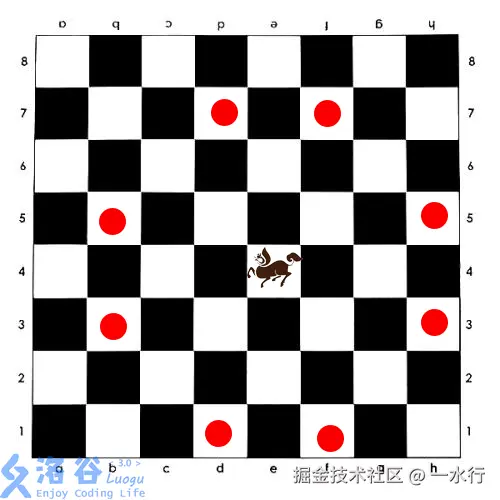

原题：[P5030 长脖子鹿放置](https://www.luogu.com.cn/problem/P5030)

题面：

## 题目背景

众所周知，在西洋棋中，我们有城堡、骑士、皇后、主教和长脖子鹿。

## 题目描述

如图所示，西洋棋的“长脖子鹿”，类似于中国象棋的马，但按照“目”字攻击，且没有中国象棋“别马腿”的规则。（因为长脖子鹿没有马腿）



给定一个 $N \times M$ 的棋盘，有一些格子禁止放棋子。问棋盘上最多能放多少个不能互相攻击的长脖子鹿。

## 输入格式

输入的第一行为两个正整数 $N,M,K$。其中 $K$ 表示禁止放置长脖子鹿的格子数。

输入的第 $2 \sim K+1$ 行每一行为两个整数 $X_i, Y_i$，表示禁止放置的格子。

不保证禁止放置的格子互不相同。

## 输出格式

一行一个正整数，表示最多能放置的长脖子鹿个数。

## 输入输出样例 #1

### 输入 #1

    2 2 1
    1 1

### 输出 #1

    3

## 输入输出样例 #2

### 输入 #2

    8 7 5
    1 1
    5 4
    2 3
    4 7
    8 3

### 输出 #2

    28

## 说明/提示

对于 $10\%$ 的数据，$1 \le N,M \le 5$；

对于 $30\%$ 的数据，$1 \le N,M \le 10$；

对于 $60\%$ 的数据，$1 \le N,M \le 50$；

对于 $80\%$ 的数据，$1 \le N,M \le 100$；

对于 $100\%$ 的数据，$1 \le N,M \le 200$。

## $Solution$

其实一开始做这道题之前我没有学过二分图最大匹配，就在那考虑用超级节点然后拆点连边跑最大流什么的，最后自然是啥也做不出来。后来去学了一下，发现这道题其实挺简单的。

二分图是什么？就是这样一个图，图中的所有点都能分成两个集合 $L,R$ ，并且图中所有的边只允许从 $L$ 到 $R$ ，不允许在同一个集合内连边。

而匹配，就是一组边，且其中所有的节点只允许被选用一次，而最大匹配就是选出最多的像这样的边，其中所有的边都不冲突，即没有同一个集合内连边，也没有节点同时出现在两条边里。

而最大匹配又和这题有什么关系呢？此时我们就要引出一个定理：

$König 定理:最大独立集=总点数-最大匹配数$

注意这个定理仅在二分图内有效，因为仅在二分图里，最大匹配数=最小点覆盖数。

而我们本题要求的是什么？是不是就是放置最多的棋子，使得每一个棋子都不冲突，等价于每个棋子是独立的，这就是求最大独立集。然后我们的匹配就相当于每个位置与它能到达的位置的冲突关系。现在我们要求能放置尽量多的棋子，就要求那些不能放棋子的位置最少，即删除的格子个数最少，等价于删点覆盖最小，即为最小点覆盖问题。

更一般地，这就是一个典型的模型：在类似这样的冲突图中，每存在一条冲突关系，就要求删掉一个点，然后使剩下的不冲突集合最大，这就可以转化为最大匹配数的求解。

所以此时我们考虑将这个图转化为二分图。注意到这和普通的棋盘二分方法不同，在这里，马的每一次跳跃不会改变其本身格子的颜色，即 $i+j$ 的奇偶性不会改变，因此我们无法直接通过经典的根据 $i+j$ 的奇偶性建立二分图。那我们怎么考虑呢？注意到我们的每一次跳跃，行（或者列）的奇偶性都会改变，因为 $dx,dy$ 都是奇数，所以我们可以单独按照行或者列的奇偶性来构造二分图，从而在这个二分图中求最大匹配。

而最大匹配问题就可以通过最大流算法求解。

## $Coding$

```cpp
#include <iostream>
#include <cstring>
#include <iomanip>
#include <cmath>
#include <vector>
#include <algorithm>
#include <queue>
using namespace std;

#define ll long long
#define ull unsigned long long
#define debug(x) cout << #x << "=" << x << "\n";

int n, m, k;
int s, t;
bool flag[210][210];
int dx[10] = {1, 3, 1, 3, -1, -3, -1, -3};
int dy[10] = {3, 1, -3, -1, 3, 1, -3, -1};
const int maxn = 1e5 + 10, maxm = 1e6 + 10;
const int INF = 1E9;
struct Edge
{
    int to, cap, next;
} edge[maxm];
int head[maxn], cur[maxn], level[maxn];
int tot = 2;

void add_edge(int u, int v, int c)
{
    edge[tot] = {v, c, head[u]};
    head[u] = tot++;
    edge[tot] = {u, 0, head[v]};
    head[v] = tot++;
}

bool bfs(int s, int t)
{
    queue<int> q;
    q.push(s);
    memset(level, -1, sizeof(level));
    level[s] = 0;

    while (!q.empty())
    {
        int u = q.front();
        q.pop();

        if (u == t)
            return true;

        for (int i = head[u]; i; i = edge[i].next)
        {
            int v = edge[i].to;
            if (level[v] == -1 && edge[i].cap > 0)
            {
                level[v] = level[u] + 1;
                q.push(v);
            }
        }
    }

    return false;
}

int dfs(int u, int t, int flow)
{
    if (u == t)
        return flow;

    int used = 0;
    for (int &i = cur[u]; i; i = edge[i].next)
    {
        int v = edge[i].to, cap = edge[i].cap;
        if (cap <= 0)
            continue;

        if (level[v] == level[u] + 1)
        {
            int ret = dfs(v, t, min(flow - used, cap));
            if (ret)
            {
                edge[i].cap -= ret;
                edge[i ^ 1].cap += ret;
                used += ret;
                if (used == flow)
                    break;
            }
        }
    }

    return used;
}

int dinic(int s, int t)
{
    int max_flow = 0;
    while (bfs(s, t))
    {
        memcpy(cur, head, sizeof(head));
        max_flow += dfs(s, t, INF);
    }

    return max_flow;
}

void combine(int x, int y)
{
    int u = (x - 1) * m + y;

    if (x % 2 == 1)
    {
        add_edge(s, u, 1);

        for (int i = 0; i < 8; i++)
        {
            int x1 = x + dx[i], y1 = y + dy[i];
            if (x1 < 1 || x1 > n || y1 < 1 || y1 > m)
                continue;
            if (flag[x1][y1])
                continue;

            int v = (x1 - 1) * m + y1;
            add_edge(u, v, 1);
        }
    }
    else
        add_edge(u, t, 1);
}

int main()
{
    ios::sync_with_stdio(false);
    cin.tie(nullptr);

    cin >> n >> m >> k;
    s = 0, t = 2 * n * m + 1;
    int tot_free = 0;

    for (int i = 1; i <= k; i++)
    {
        int x, y;
        cin >> x >> y;
        flag[x][y] = 1;
    }

    for (int i = 1; i <= n; i++)
    {
        for (int j = 1; j <= m; j++)
        {
            if (!flag[i][j])
            {
                tot_free++;
                combine(i, j);
            }
        }
    }

    int max_matching = dinic(s, t);
    cout << tot_free - max_matching;

    return 0;
}
```

总体时间复杂度：大概是 $O(nm \sqrt {nm})$ ,实际会略小，因为还有些节点不能放置棋子。
