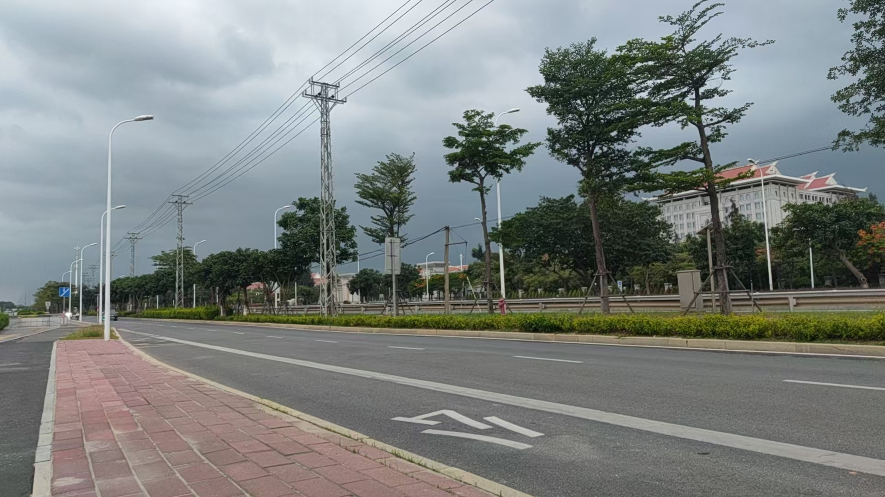
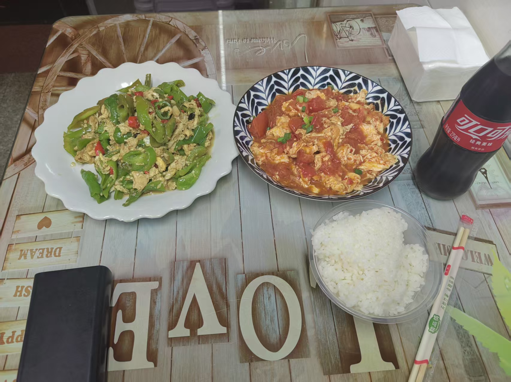
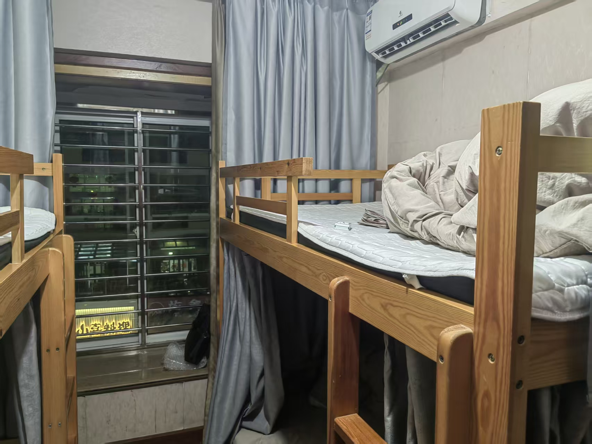
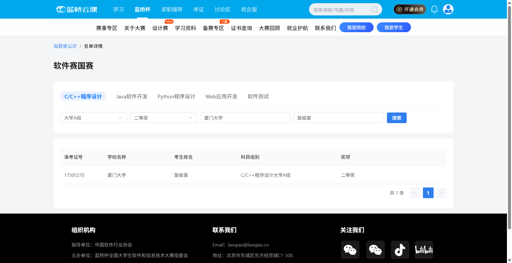

## Day -1

周五，前一天晚上把衣服收好装在包里，早上起来上微积分早八，发现居然忘记拿了！想着算了下午回去再拿吧。

中午在图书馆自习，发现400块买的神秘**16+256GB**内存的平板到了，当即决定迅速取回品鉴一下。

吭哧吭哧骑车去到快递站取回快递，再回宿舍开箱，一下验机软件发现果然是假的，运行内存只有3GB...而且还是老安卓系统看到的时候要笑死了。

叫lpl帮我下单了新平板之后这个先拿手上玩两天，看看视频之类的还是可以的，而且续航还是比我手机好。

回到图书馆发现暂离太久被记违规了，悲，此时已经下午两点了，收拾东西去上电路。

路上发现这次回去还是没有拿上衣服，猪脑发力，其实后面还在继续发力。

第一节课上到一半，看了一眼天气发现居然要下雨？！顿时惶惶，于是干脆趁着第一节课下课的间隙又费劲骑车骑回宿舍拿衣服，顺便拿了个袋子装雨衣和雨伞。

回到课室已经满头大汗了，进门老师看到我就问会不会做黑板上的题，诚实摇头，他问我去干嘛了，我说去上厕所，~~我能跟你讲就算刚才我听了我也不会吗，我才刚复习到二极管~~

熬到下课，骑上车飞奔至校门口，那个翔安南门的公交站我没去过，看到导航指路说从南大门出发直接横穿马路过去，我说你不是扯吗，于是果断绕到南三门走地下通道

然后到马路对面之后走了几百米，发现南大门居然也有地下通道...气昏了

当时的场景就是这样的，从未这么焦急地等待公交车

坐公交坐到石井客运站，等了半天K207路，到的时候绝望地发现车上已经完全被小屁孩初中生挤满了！无奈只能退回上车的脚步

看到前面一站就是起点站，寻思了一下决定直接走过去，这下总能坐上了吧

撑着雨伞走了一公里多，鞋里袜子都已经全湿了，背包也淋湿了，绝望中

到那边刚好有车出发，这一趟坐了一个多小时，直达泉州

到那边已经是晚上七点多，到了青旅楼下转了几圈没发现入口在哪，打电话也打不通，只好去吃饭

楼下一家60小炒看着人很多的样子，走进去一看：！！价格这么实惠，点了一份番茄炒蛋和一份青椒炒蛋，又加了一瓶可乐，一共才22，而且鸡蛋放得很多很好吃！

饱餐一顿，老板叫人下来带我上去，原来就是在居民楼里，看了一圈发现环境意外地不错，28一晚可以说相当划算了

此时发现没带身份证，但还好能用身份证照片

收拾完东西洗完澡已经是九点多快十点，坐在床上拿出电脑决定复习一下半个多月没写的cpp，但是头昏昏沉沉，只勉强写了个并查集和Dijkstra模板就拉倒摆烂了，明天直接暴力猛攻

此时突然想起自己居然还没打印准考证！于是地图上搜索了一下发现一两公里以外有一家24小时打印店，只好穿上拖鞋下去打印，手机也只剩十几格电量了

打印完回来的路上看了一眼准考证，发现考生规则里写着要带上身份证原件入场？！！那一刻已经有点绝望了，看到美团跑腿要一百六十多更绝望了，猪脑正在过载

心念电转之下，想起可以拜托还没出发的学长帮忙带，于是找到了chb学长，在此再次感谢

回去之后倒头便睡

## Day 0

第二天早上六点五十多起来，定的闹钟全都没用上，本来想再睡会但看到八点二十五要拍集体照，只好下床收拾东西出发

洗漱完坐了二十多分钟公交到泉州师范学院，转悠了一下走了几百米去包子铺买了俩包子，其实完全不饿因为昨天晚上吃得太多，但是习惯了早上吃点东西

天气很热，身上出汗了，闷闷地很难受，在学校里自助售货机买了瓶绿茶

从学长那里拿到身份证，拍完了合照，上楼到考场

等待了一会，很无聊，听其他人闲扯，比赛准备开始，进考场了

居然还给每人发了一份零食，有点震撼

蓝桥杯一定要考试开始之后才公布解压密码拖几分钟都是统一的吗，虽然多几分钟我也做不了什么东西

### A

填空，问20262026个9和2026个9相乘得到的数的特定三个数位的数是什么

思考了一下，决定直接写个高精度打表看看规律，但此时心里毛毛的，因为高精度这玩意我就从来没怎么手写过

但可能当时刚开场手感和脑子都比较在线，也没写处理前导零逻辑，直接一次写过了，看了一眼规律填了上去，但此时我其实看错题目了！误以为是从右往左数的位数，还好结束前五分钟改过来了

### B

一道很经典的蓝桥杯组合数学填空题，看了一眼没思路就直接跳过了

### C

一道有点恶心的模拟，给一个多项式函数要求它的积分

看到之后想了一会处理逻辑，直接开写，写出来一长串屎山代码，甚至有六七层的if和for嵌套

写完之后编译，发现有一个地方报错了，说是`atoi`函数好像不能直接处理`string`类型？我怎么记得可以来着，此时时间过了快一个小时了，有点急就直接放了去看后面的题目

后面最后一个小时回过头来再看，干脆不用`atoi`函数了，直接写了个`to_int`函数来处理字符串转数字，后面又报了大概有五六个错误，依次修改之后尝试跑样例

意料之外地，居然问题不算很大，稍微调了一下之后，题目给的样例全部过了，又搓了几个小样例也过了，于是干脆直接不管了交吧，此时代码已经将近两百行

### D

说给一棵树，规定子树大小为偶数的节点为稳定节点，一条路径上如果都是稳定节点就是稳定路径，问有多少条稳定路径

本来想直接无脑暴力，然后细想了一下，感觉可以预处理子树大小，然后用并查集维护连通块，也就是稳定节点构成的连通块，然后对于一个大小为 $k$ 的连通块，所能贡献的稳定路径条数就是 $k(k - 1)$ ，然后对处理过的连通块染色防止重复，遍历一遍所有节点就可以了

不知道思路对不对，总之顺利打出来了

### E

定义一个数组的价值为所有相邻项异或值求和，让你挑两个长度为 $3$ 且不重叠的区间，将里面的数任意重新排列，问最终能达到的最大价值是多少

稍微思考了一会，没有思考出什么结果，直接打了暴力

### F

给了平面上的很多个点，然后对于每个点 $(x, y)$，均有 $|y| = 1$，现在要挑一些点让它们各自组成三角形，且三角形的顶点不能重合，问在组成三角形个数最多的情况下，三角形最大的总面积是多少

题目看到就有点力竭了，先尝试将 $y = 1$ 和 $y = -1$ 的点分组然后按 $x$ 轴排序了一下，求最大个数很容易，但是怎么求最大面积毫无思路，最后直接打了个暴力dfs

### G

一道任务调度的题目，说给 $n$ 个任务，每个任务有截止时间 $t$，价值 $w$，以及是否为关键任务 $is\_key \in \{0, 1 \}$，问在完成关键任务数量尽量多的前提下，最多能完成多大价值的任务

想到是先把那些关键任务按照 $t$ 从小到大为第一关键字，$w$ 从大到小为第二关键字排序，得出来完成最多关键任务的最优解，然后尝试在完成这些任务的前提下去做剩下那些任务

但是我不会写。

于是跳题跑路

### H

给了一些单词，两个人进行博弈，每次一个人可以选取当前剩余单词的共有前缀，然后去掉那些包含这个前缀的单词，谁先清空集合谁就胜利

博弈论+$Trie$，那还说啥了，给你了

### I

感觉最可惜没认真做的是这题

给了一个 $n$，然后定义对于一个排列其中的一个位置，若它前面的小于这个位置上的数的数量等于它后面的大于这个位置上的数的数的数量，则为一个叫什么位置来着我忘了，然后一个排列如果有 $\lceil \frac{n}{2} \rceil$ 个这样的位置，就是好排列，问长度为 $n$ 的排列有多少个这样的好排列

当时脑子已经有点混沌了，没有细想就直接打了个暴力去看J题了，但赛后发现只是一个观察一下就可以出来的结论，大分值丢了

### J

给 $n$ 个数，两个人博弈（没错还是博弈！），每次一个人可以将其中一个数变成与它不互质的且小于它的另一个数，最后谁不能操作的就输了，问谁胜

看到博弈论就跑路了TAT

总结就是，前面三个小时进行了一个爽暴力的运动，毫无思考全是本能，后面一小时补完C题尝试挣扎了一下，还是gg了

需要控诉的是！泉州师院你们机房的键盘真的太烂了！写一行代码可以卡七八次键，键盘上还油腻腻的不知道什么东西，呃呃，总之体验很糟，~~虽然给我好键盘我也写不出来什么，但我还是要控诉~~

就这样啦，打完摆烂了领了个神秘的蓝桥杯T恤，就回青旅收拾东西回学校了，本来想在泉州玩一会的但是太累了就直接走了

明年希望表现能更好吧！如果明年还参加的话

update-06-11:出成绩啦，狗运混到国二！

