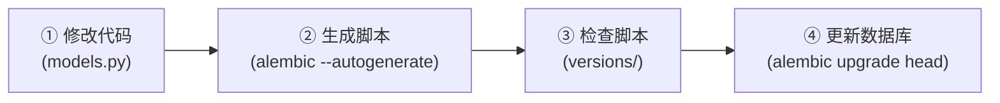

## 1.绪言

关于Python的数据库管理，先前只接触过SQLAlchemy，类似于用Python对象的形式管理数据库，但是始终不太清楚这背后的运作逻辑

在做项目的时候，获知了Alembic这个工具，方知晓SQLAlchemy是如何实现数据库的版本管理的

---

## 2.Alembic简介

如果用一句话简要地描述Alembic，那么就可以将它看作是**数据库层面上的Git**

就是说，通过Alembic，我们可以实现数据库的版本管理，那么具体是怎么实现的呢？

首先对于Alembic，我们有三大核心要素：

- `alembic.ini`：总配置文件，像是告诉Alembic你的数据库链接地址，迁移脚本存放目录，以及日志管理配置等
- `env.py`：相当于控制中心，它是运行时第一个被执行的Python脚本，负责连接数据库，并把SQLAlchemy模型结构读取并与当前真实数据库结构进行比对
- `versions/`：版本历史库，存放一张张具体的迁移脚本，根据迁移脚本的`upgrade()`和`downgrade()`函数，可以分别进行版本升级和降级

---

## 3.工作流程

用一张图来描述：



就以我当前做的这个项目为例：

首先，我在`app.models.problem`中定义了问题模型，在这个时候数据库为空：

```python
from datetime import datetime

from sqlalchemy import DateTime, String, Text, func
from sqlalchemy.orm import Mapped, mapped_column

from app.database import Base


class Problem(Base):
    __tablename__ = "problems"
    
    id: Mapped[int] = mapped_column(primary_key=True, index=True)
    slug: Mapped[str] = mapped_column(String(100), unique=True, index=True)
    title: Mapped[str] = mapped_column(String(200))
    description: Mapped[str] = mapped_column(Text)
    created_at: Mapped[datetime] = mapped_column(DateTime, server_default=func.now())
    updated_at: Mapped[datetime] = mapped_column(DateTime, server_default=func.now(), onupdate=func.now())
```

然后要做的就是让Alembic比对差异并生成脚本：

```bash
alembic revision --autogenerate -m "create problems table"
```

在这个时候Alembic干了什么？首先它运行了我们前面所提到的`env.py`：

```python
import asyncio
from logging.config import fileConfig

from alembic import context
from sqlalchemy import pool
from sqlalchemy.engine import make_url
from sqlalchemy.ext.asyncio import async_engine_from_config

from app.config import get_settings
from app.database import Base
from app.models import problem  # noqa: F401


config = context.config
if config.config_file_name is not None:
    fileConfig(config.config_file_name)

target_metadata = Base.metadata


def get_database_url() -> str:
    """读取运行时配置，并确保 Alembic 使用异步 PostgreSQL URL。"""

    return get_settings().database_url


def run_migrations_offline() -> None:
    context.configure(
        url=get_database_url(),
        target_metadata=target_metadata,
        literal_binds=True,
        dialect_opts={"paramstyle": "named"},
    )
    with context.begin_transaction():
        context.run_migrations()


def do_run_migrations(connection) -> None:
    context.configure(connection=connection, target_metadata=target_metadata)
    with context.begin_transaction():
        context.run_migrations()


async def run_async_migrations() -> None:
    configuration = config.get_section(config.config_ini_section, {})
    configuration["sqlalchemy.url"] = get_database_url()
    configuration["connect_args"] = {}
    connectable = async_engine_from_config(
        configuration,
        prefix="sqlalchemy.",
        poolclass=pool.NullPool,
    )

    async with connectable.connect() as connection:
        await connection.run_sync(do_run_migrations)
    await connectable.dispose()


def run_migrations_online() -> None:
    url = make_url(get_database_url())
    if not url.drivername.endswith("+asyncpg"):
        raise RuntimeError("Alembic requires a postgresql+asyncpg DATABASE_URL")
    asyncio.run(run_async_migrations())


if context.is_offline_mode():
    run_migrations_offline()
else:
    run_migrations_online()
```

它拿到了`Base.metadata`，也就是当前的设计，以及数据库的结构

在对比之后，发现少了一张`problems`表，于是根据模板文件`script.py.mako`：

```python
"""${message}

Revision ID: ${up_revision}
Revises: ${down_revision | comma,n}
Create Date: ${create_date}

"""
from typing import Sequence, Union

from alembic import op
import sqlalchemy as sa
${imports if imports else ""}

revision: str = ${repr(up_revision)}
down_revision: Union[str, None] = ${repr(down_revision)}
branch_labels: Union[str, Sequence[str], None] = ${repr(branch_labels)}
depends_on: Union[str, Sequence[str], None] = ${repr(depends_on)}


def upgrade() -> None:
    ${upgrades if upgrades else "pass"}


def downgrade() -> None:
    ${downgrades if downgrades else "pass"}
```

生成了对应的迁移文件`0001_create_problems_table.py`

```python
"""create problems table

Revision ID: 0001
Revises:
Create Date: 2026-09-02

"""
from typing import Sequence, Union

from alembic import op
import sqlalchemy as sa


revision: str = "0001"
down_revision: Union[str, None] = None
branch_labels: Union[str, Sequence[str], None] = None
depends_on: Union[str, Sequence[str], None] = None


def upgrade() -> None:
    op.create_table(
        "problems",
        sa.Column("id", sa.Integer(), autoincrement=True, nullable=False),
        sa.Column("slug", sa.String(length=100), nullable=False),
        sa.Column("title", sa.String(length=200), nullable=False),
        sa.Column("description", sa.Text(), nullable=False),
        sa.Column("created_at", sa.DateTime(), server_default=sa.func.now(), nullable=False),
        sa.Column("updated_at", sa.DateTime(), server_default=sa.func.now(), nullable=False),
        sa.PrimaryKeyConstraint("id"),
        sa.UniqueConstraint("slug"),
    )
    op.create_index("ix_problems_id", "problems", ["id"], unique=False)
    op.create_index("ix_problems_slug", "problems", ["slug"], unique=False)


def downgrade() -> None:
    op.drop_index("ix_problems_slug", table_name="problems")
    op.drop_index("ix_problems_id", table_name="problems")
    op.drop_table("problems")
```

最后真正执行迁移，改动数据库

```bash
alembic upgrade head
```

此时，Alembic读取`versions/`中的脚本，执行`upgrade()`函数，向数据库发送`CREATE TABLE problems...`语句，数据库就成功创建了一张`problems`表
