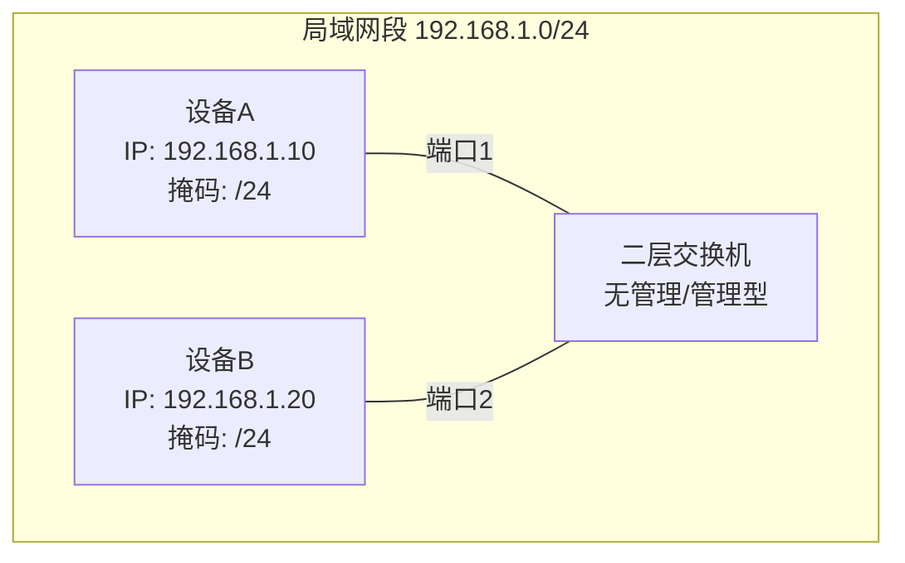
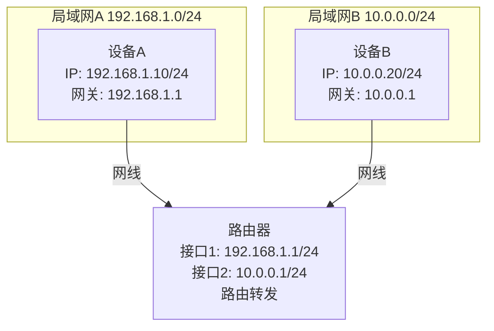
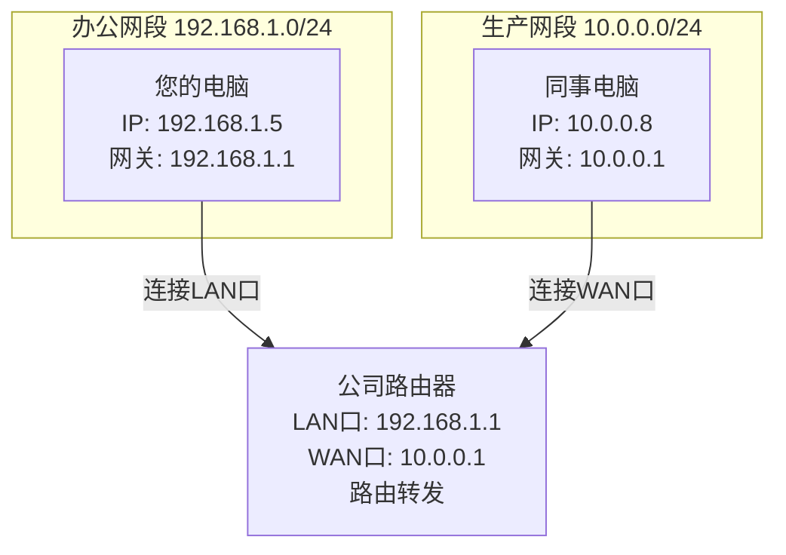

## 1.绪言

大概就是小学期程设，要求做一个大作业，然后手头已经做好的HardSeat本来想直接交上去的，但想了想，FastAPI+React，貌似和cpp没有半毛钱关系，于是决定开个新坑

让AI帮忙想了想idea，最终决定做一个局域网传输文件的东西，说不定以后还可以扩展，在这里再次挖个坑，看以后填不填

起名废不会取名，于是让哈基米取了英文名，然后拿着英文名去问ds，给了个文艺的中文名（

最终决定英文名叫*BeamDrop*，意为“光束坠落”，中文名叫做*邻光*，邻也就是局域网，光就是说传输得像光那样快，~~其实不然~~

---

## 2.从计网开始

首先我们需要知道，局域网内是如何实现传输的

### 2.1.物理层与数据链路层

#### 2.1.1.概述

这里是底层的网络设施，要实现局域网传输，需要先在这一层打通

- 首先是**传输介质**：传播肯定是需要介质的，这里分有线和无线，有线就是双绞线即网线，无线就是WiFi，我们选择WiFi作为传输介质
- **网络适配器**：也就是网卡，主机的`0101`这样的数字信号，需要转化成网线中的电信号或者无线电波才能发送出去；同样外部传来的电信号和无线电波需要转为`0101`数字信号才能为计算机所识别。而网络适配器就承担着这个转换信号的职责
- **网络互联设备**：主要有**数据链路层**的**交换机**和**网络层**的**路由器**，其中**交换机**就用于同一个子网内部的传输；然后**路由器**用于根据IP地址寻路，连接不同的子网，也就是说它负责和外部相连，比如看看AbelTomato的blog什么的

---

#### 2.1.2.交换机

它工作在数据链路层上，依赖于本身持有的一个**MAC地址表**

所谓MAC地址，就是固定标记在你的电脑或者某台主机的网卡上的地址，当主机内部向外部发送数据包，经过网卡转发的同时也会带上这个MAC地址

而交换机的MAC地址表就记录着哪个端口连接哪个设备的硬件地址也就是MAC

具体来说，它的工作流程如下：

- **泛洪**：当`A`想要找`B`，但是此时交换机刚刚开机，什么都没有，这时就会广播信号到每一个连接的端口，也就是泛洪
- **学习**：在转发的同时，交换机注意到`A`是从端口1进来的，就记录下端口1对应`A`的MAC地址
- **单播**：当`B`接收到信号回应的时候，交换机也把对应的端口和`B`的MAC地址绑定在一起，这样后面`A`和`B`再想要通信，就可以直接建立通道，而无需再广播其他端口

---

#### 2.1.3.路由器

核心工作就是以下两点：

- **路由**：也就是找路，路由器通过各种路由算法，和全世界其他的路由器接头，拼凑出完整的网络地图，生成路由表
- **转发**：也就是赶路，当一个数据包从路由器的某个输入端口进来时，路由器查询路由表，决定从哪个输出端口丢出去

#### 2.1.4.BeamDrop如何

对于BeamDrop，它显然无法直接操纵物理层和数据链路层，所以它只能工作在以下两种环境：

- 处于同一个二层广播域，也就是连接同一个WiFi SSID且在同一个交换机下
- 或者通过路由可达

什么叫通过路由可达，就是说，如果此时两台主机不工作在同一个子网下，`A`找不到`B`，就把数据包发送给默认网关也就是路由器，路由器查询路由表，如果知道对方的IP地址在哪个端口，就转发出去

拆开来看，也就是同子网和跨子网

- **同子网**

- **跨子网**

举个例子，假设你在办公室连接了WiFi(子网`192.168.1.0/24`)，同事在另一个楼层连的是另一个交换机出口(子网`10.0.0.0/24`)，两个子网之间有个三层交换机或者路由器接通

这时在BeamDrop中，仍然能连上，因为两个子网之间路由可达

但是如果在没有路由器的纯二层局域网，比如两个设备之间直连同一台傻瓜交换机，则必须在同一个子网中才能通信

一句话总结，不限制在同一子网，只要能`ping`通IP，而且目标端口没有被防火墙拦截，就能连接

---

### 2.2.网络层

#### 2.2.1.内核网络协议栈

简单来说，内核网络协议栈就是操作系统内核中负责处理网络数据包的一套核心代码

- **发送数据时**：应用把一堆应用层文本(比如JSON)扔给它，协议栈负责把它套上HTTP头、TCP头、IP头、MAC头，最后扔给网卡发出去
- **接收数据时**：网课抓到一堆电信号，协议栈负责一层层拆掉TCP/IP的外包装，检查有没有损坏，最后把干净的数据塞给应用层

既然叫做栈，它在结构上就是自上而下一层压一层的，严格对应TCP/IP的四层模型：

- **Socket接口层**：内核留给应用层，也就是你的窗口，和我们后面要讲到的套接字有关
- **传输层(TCP/UDP)**：负责保证传输(TCP三次握手、四次挥手、滑动窗口、拥塞控制)
- **网络层(IP)**：负责路由
- **链路层与驱动**：最底层，负责把IP变成MAC地址，调动网卡驱动，把数据变成电信号或者光信号

#### 2.2.2.套接字

我们知道，应用层需要一个接口来控制网络层的行为，从而实现传输，而这个所谓的接口就是套接字
