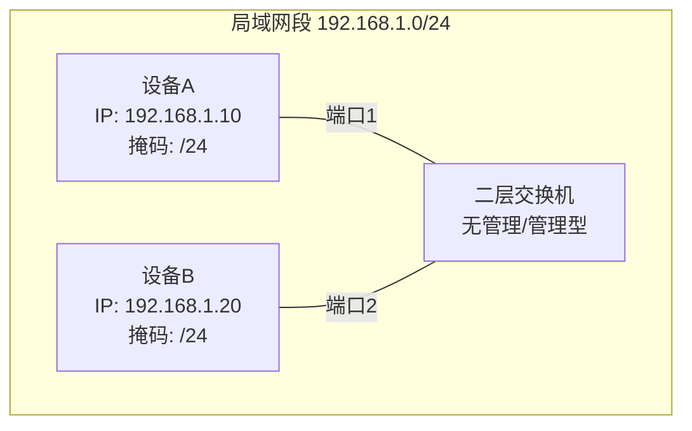
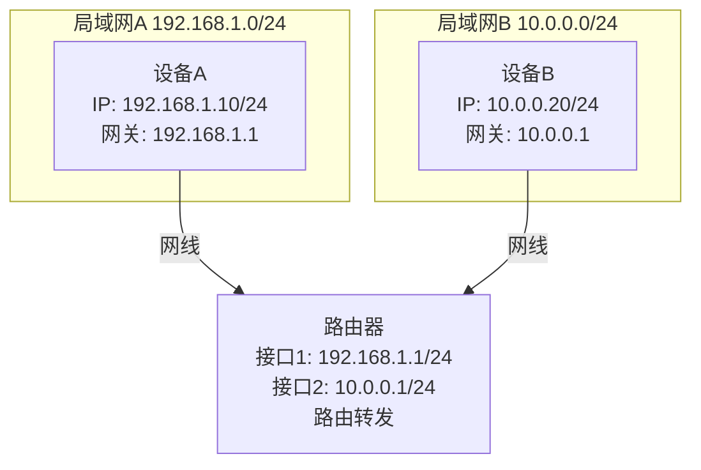
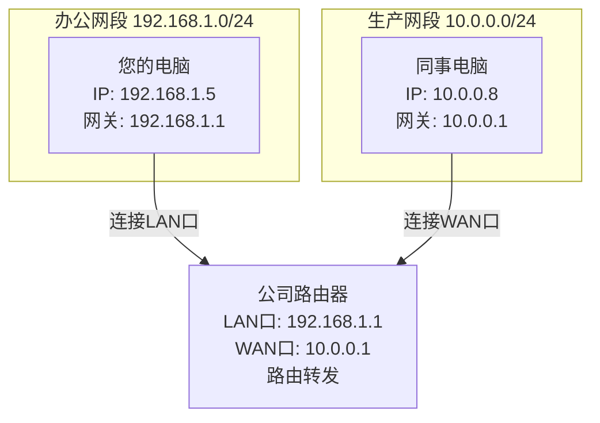
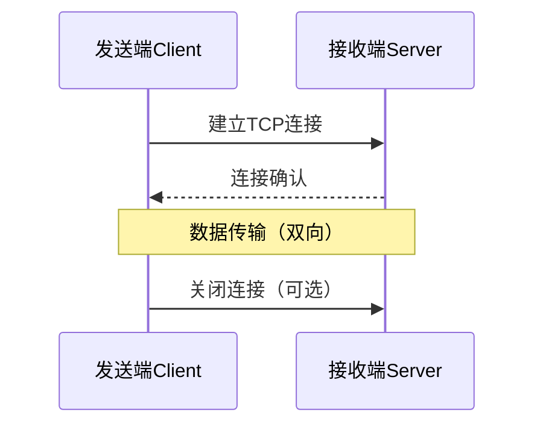
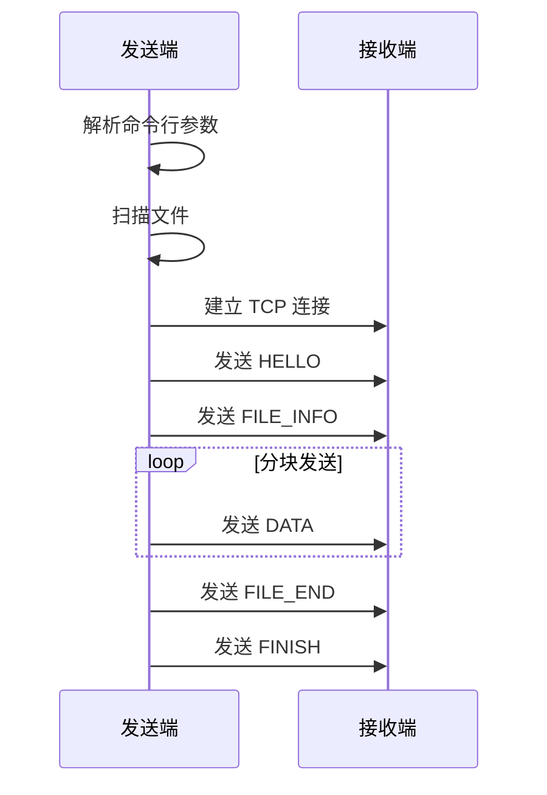
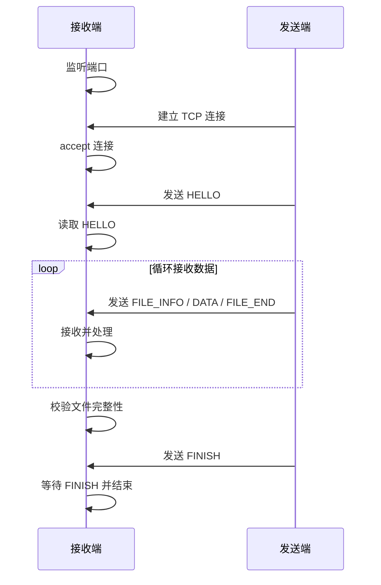
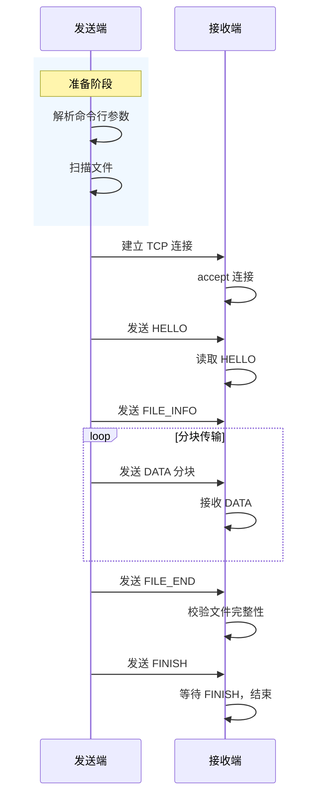

## 1.绪言

大概就是小学期程设，要求做一个大作业，然后手头已经做好的HardSeat本来想直接交上去的，但想了想，FastAPI+React，貌似和cpp没有半毛钱关系，于是决定开个新坑

让AI帮忙想了想idea，最终决定做一个局域网传输文件的东西，说不定以后还可以扩展，在这里再次挖个坑，看以后填不填

起名废不会取名，于是让哈基米取了英文名，然后拿着英文名去问ds，给了个文艺的中文名（

最终决定英文名叫*BeamDrop*，意为“光束坠落”，中文名叫做*邻光*，邻也就是局域网，光就是说传输得像光那样快，~~其实不然~~

---

## 2.从计网开始

首先我们需要知道，局域网内是如何实现传输的

### 2.1.物理层与数据链路层

#### 2.1.1.概述

这里是底层的网络设施，要实现局域网传输，需要先在这一层打通

- 首先是**传输介质**：传播肯定是需要介质的，这里分有线和无线，有线就是双绞线即网线，无线就是WiFi，我们选择WiFi作为传输介质
- **网络适配器**：也就是网卡，主机的`0101`这样的数字信号，需要转化成网线中的电信号或者无线电波才能发送出去；同样外部传来的电信号和无线电波需要转为`0101`数字信号才能为计算机所识别。而网络适配器就承担着这个转换信号的职责
- **网络互联设备**：主要有**数据链路层**的**交换机**和**网络层**的**路由器**，其中**交换机**就用于同一个子网内部的传输；然后**路由器**用于根据IP地址寻路，连接不同的子网，也就是说它负责和外部相连，比如看看AbelTomato的blog什么的

---

#### 2.1.2.交换机

它工作在数据链路层上，依赖于本身持有的一个**MAC地址表**

所谓MAC地址，就是固定标记在你的电脑或者某台主机的网卡上的地址，当主机内部向外部发送数据包，经过网卡转发的同时也会带上这个MAC地址

而交换机的MAC地址表就记录着哪个端口连接哪个设备的硬件地址也就是MAC

具体来说，它的工作流程如下：

- **泛洪**：当`A`想要找`B`，但是此时交换机刚刚开机，什么都没有，这时就会广播信号到每一个连接的端口，也就是泛洪
- **学习**：在转发的同时，交换机注意到`A`是从端口1进来的，就记录下端口1对应`A`的MAC地址
- **单播**：当`B`接收到信号回应的时候，交换机也把对应的端口和`B`的MAC地址绑定在一起，这样后面`A`和`B`再想要通信，就可以直接建立通道，而无需再广播其他端口

---

#### 2.1.3.路由器

核心工作就是以下两点：

- **路由**：也就是找路，路由器通过各种路由算法，和全世界其他的路由器接头，拼凑出完整的网络地图，生成路由表
- **转发**：也就是赶路，当一个数据包从路由器的某个输入端口进来时，路由器查询路由表，决定从哪个输出端口丢出去

#### 2.1.4.BeamDrop如何

对于BeamDrop，它显然无法直接操纵物理层和数据链路层，所以它只能工作在以下两种环境：

- 处于同一个二层广播域，也就是连接同一个WiFi SSID且在同一个交换机下
- 或者通过路由可达

什么叫通过路由可达，就是说，如果此时两台主机不工作在同一个子网下，`A`找不到`B`，就把数据包发送给默认网关也就是路由器，路由器查询路由表，如果知道对方的IP地址在哪个端口，就转发出去

拆开来看，也就是同子网和跨子网

- **同子网**



- **跨子网**



举个例子，假设你在办公室连接了WiFi(子网`192.168.1.0/24`)，同事在另一个楼层连的是另一个交换机出口(子网`10.0.0.0/24`)，两个子网之间有个三层交换机或者路由器接通



这时在BeamDrop中，仍然能连上，因为两个子网之间路由可达

但是如果在没有路由器的纯二层局域网，比如两个设备之间直连同一台傻瓜交换机，则必须在同一个子网中才能通信

一句话总结，不限制在同一子网，只要能`ping`通IP，而且目标端口没有被防火墙拦截，就能连接

---

### 2.2.网络层

#### 2.2.1.内核网络协议栈

简单来说，内核网络协议栈就是操作系统内核中负责处理网络数据包的一套核心代码

- **发送数据时**：应用把一堆应用层文本(比如JSON)扔给它，协议栈负责把它套上HTTP头、TCP头、IP头、MAC头，最后扔给网卡发出去
- **接收数据时**：网课抓到一堆电信号，协议栈负责一层层拆掉TCP/IP的外包装，检查有没有损坏，最后把干净的数据塞给应用层

既然叫做栈，它在结构上就是自上而下一层压一层的，严格对应TCP/IP的四层模型：

- **Socket接口层**：内核留给应用层，也就是你的窗口，和我们后面要讲到的套接字有关
- **传输层(TCP/UDP)**：负责保证传输(TCP三次握手、四次挥手、滑动窗口、拥塞控制)
- **网络层(IP)**：负责路由
- **链路层与驱动**：最底层，负责把IP变成MAC地址，调动网卡驱动，把数据变成电信号或者光信号

---

#### 2.2.2.套接字(Socket)

我们上面提到，操作系统内核会对应用层暴露接口从而让其能够间接控制传输层和网络层的行为，而这个接口就是**套接字**

套接字本质上就是内核网络协议栈在用户空间暴露的操作句柄

每一个`Socket`在内核中关联以下数据结构：

```txt
Socket fd ──→ { 本地IP : 本地端口 , 远端IP : 远端端口 , 协议(TCP/UDP) }
```

---

#### 2.2.3.BeamDrop中的Socket封装

在BeamDrop中，并没有在业务代码中到处调用`send`和`recv`，而是在`network`模块中封装了一层`TcpConnection`

原因在于，TCP是字节流协议，一次`send`不保证对端一次`recv`就能完整收到；同样，一次`recv`也不保证正好读到一个完整的业务信息

因此，在BeamDrop中，提供了两个关键的接口：

- `write_all(bytes)`：循环调用`send`，直到所有字节都写入TCP连接
- `read_exact(bytes)`：循环调用`recv`，直到正好读取指定长度的字节

通过这种方式，上层协议模块无需直接关心TCP分包、粘包问题，而是可以基于读取固定长度`Header`，再读取指定长度`Payload`的模型实现应用层协议

---

### 2.3.传输层

#### 2.3.1.什么叫传输层

一句话讲解，如果说网络层是主机到主机之间的连接，那传输层就负责进程到进程的数据传输

它通过端口，实现了多路复用和解复用

- **多路复用**：其实也就是主机内部要发送出去的数据打包上车，不管是来自`8000`端口的`uvicorn`进程，还是在`5174`上运行的React，其向外发出的数据通过传输层，打好来自哪个端口，要传输到哪个端口，如果是TCP，还要加上自己的IP地址的标签，然后一股脑丢给网络层
- **解复用**：同理，这里就是接收数据，外部传输来的数据，由传输层协议通过端口分发到不同的进程上，但这里需要注意的是，两个协议的分发行为不一样
  - 对于UDP，它不管你数据来自哪里，只针对目标端口进行分发，把全部数据都塞到一个套接字里
  - 对于TCP，它会严格根据四元组 $(源IP, 源端口, 目的IP, 目的端口)$ 来判断，只要其中有一个不一样，就会将数据分配给不同的套接字传给应用层

---

#### 2.3.2.为什么TCP

现在在传输层中，有两个协议，TCP和UDP

对于TCP，特点就是可靠

- **特点**：面向连接、可靠传输、面向字节流、全双工
- **代价**：慢，又是握手又是挥手，还有一堆控制算法

而UDP就是快

- **特点**：无连接、不可靠传输、面向报文
- **代价**：不可靠，容易丢包

然后我们回顾一下需求，文件传输，最需要的不是快，而是稳，毕竟谁也不想自己拿到的图片少了半张，所以我们必须得用TCP，哪怕它丢包的时候会传得很慢，导致应用层雪崩

emm这里要提到，虽然UDP可以通过在应用层补齐来实现可靠传输，但是属于过度设计，对现在来说，所以还是选择TCP

然后发送端通过`TcpClient::connect(host, port)`主动连接接收端，接收端通过`TcpServer`完成`socket -> bind -> listen -> accept`流程，等待客户端连接

连接建立之后，两端拿到的都是`TcpConnection`，后续所有的BeamDrop协议包都在这个TCP连接上发送

---

## 3.BeamDrop中传输的整体实现

### 3.1.总体传输模型

对于当前MVP阶段，BeamDrop采用最典型的Client/Server模型



在代码上，主要对应这些模块：

| 层次           | 模块              | 作用                                                 |
| -------------- | ----------------- | ---------------------------------------------------- |
| CLI / 应用编排 | `src/main.cpp`    | 解析 `send` / `serve` 命令，组合网络、协议、传输模块 |
| 网络层封装     | `src/network/`    | 创建 TCP socket、监听、连接、收发字节                |
| 协议层         | `src/protocol/`   | 把消息封装成 BeamDrop Packet，并从字节流解析回来     |
| 传输层业务     | `src/transfer/`   | 发送文件信息、分块发送文件内容、接收并校验           |
| 文件系统       | `src/filesystem/` | 扫描文件、处理相对路径、创建目录                     |

对于整体数据流，在发送端：



在接收端



如果将两端整合在一起



---

### 3.2.TCP连接的建立

#### 3.2.1.模块职责

| 模块                            | 作用                                                      |
| ------------------------------- | --------------------------------------------------------- |
| `src/main.cpp`                  | CLI 入口，解析 `serve` / `send` 命令，编排流程            |
| `src/config/AppConfig.cpp`      | 读取配置文件，填充 host / port / save_dir / chunk_size 等 |
| `src/network/TcpServer.cpp`     | 服务端 TCP socket：创建、绑定、监听、accept               |
| `src/network/TcpClient.cpp`     | 客户端 TCP socket：解析地址并 connect                     |
| `src/network/TcpConnection.cpp` | 已建立连接的读写封装：`send` / `recv` 循环                |
| `src/protocol/PacketIO.cpp`     | 在 TCP 字节流上读写 BeamDrop Packet                       |
| `src/protocol/Serializer.cpp`   | 把 Packet 编码成二进制字节                                |
| `src/protocol/PacketParser.cpp` | 把二进制字节解析回 Packet                                 |
| `src/transfer/Sender.cpp`       | 发送端发送 `FILE_INFO / DATA / FILE_END`                  |
| `src/transfer/Receiver.cpp`     | 接收端读取 `FILE_INFO / DATA / FILE_END`                  |

---

#### 3.2.2.从`main.cpp`开始

```cpp
int main(int argc, char* argv[]) {
    if (argc <= 1) {
        print_usage();
        return 0;
    }

    const std::string_view command(argv[1]);

    try {
        if (command == "serve") {
            return run_serve(argc, argv);
        }

        if (command == "send") {
            return run_send(argc, argv);
        }

        if (command == "config") {
            return run_config(argc, argv);
        }

        print_usage();
        return 1;
    } catch (const std::exception& error) {
        std::cerr << "beamdrop error: " << error.what() << "\n";
        return 1;
    }
}
```

也就是说，建立连接从命令分支开始：

```bash
beamdrop serve ... -> run_serve()
beamdrop send ...  -> run_send()
```

服务端和客户端分别启动

```bash
beamdrop serve --host 127.0.0.1 --port 9090
beamdrop send README.md --to 127.0.0.1:9090
```

---

#### 3.2.3.服务端

##### 3.2.3.1.启动流程

要运行BeamDrop，需要服务端即接收端先启动并开启监听，客户端即发送端才能识别并连接到，然后发送文件

所以我们先启动服务端，在`src/main.cpp`中，有服务端启动入口`run_serve()`

核心代码：

```cpp
int run_serve(int argc, char* argv[]) {
    const auto options = parse_serve_options(argc, argv);
    const beamdrop::logger::Logger logger{options.log_file};

    try {
        beamdrop::network::TcpServer server{options.host, options.port};

        std::cout << "beamdrop serve listening on " << options.host << ':' << options.port
                  << ", save-dir=" << options.save_dir.string() << '\n';

        auto connection = server.accept_one();
        logger.info("serve accepted connection");

        const auto hello = beamdrop::protocol::read_packet(connection);
        ...
    }
}
```

顺序如下：

```mermaid
flowchart TD
    A[run_serve()] --> B[parse_serve_options()]
    B --> C[Logger 初始化]
    C --> D[TcpServer(host, port)]
    D --> E[accept_one()]
    E --> F[read_packet(connection) 读取 HELLO]
    F --> G[Receiver 接收文件]
```

---

##### 3.2.3.2.服务端参数解析:`parse_serve_options()`

我们一步一步来，先看最开始的这个`parse_serve_options()`

服务端接收文件，需要先明确主机IP`host`，端口`port`，保存路径`save_dir`，以及日志路径`log_file`

所以有服务端选项`ServeOptions`

```cpp
struct ServeOptions {
    std::string host = "0.0.0.0";
    std::uint16_t port = 9090;
    std::filesystem::path save_dir = "received";
    std::filesystem::path log_file = "logs/beamdrop.log";
};
```

然后这里配置了默认值，如果你什么都不加，只运行

```bash
beamdrop serve
```

就会默认配置成上面的值，注意这里的命令我简写了，一般来说需要先`make`出`beamdrop.exe`然后执行`beamdrop.exe serve/send/config`这样，或者说配置到系统PATH变量就可以直接`beamdrop`调用

然后逐步解析，如果传入配置：

```bash
beamdrop serve --config config/beamdrop.example.json
```

就会执行：

```cpp
config = beamdrop::config::load_config(argv[++index]);
options.host = config.server.host;
options.port = config.server.port;
options.save_dir = config.server.save_dir;
options.log_file = config.log.file;
```

配置读取逻辑在`src/config/AppConfig.cpp`中：

```cpp
AppConfig load_config(const std::filesystem::path& path) {
    auto config = default_config();
    const auto json = read_text_file(path);

    const auto server = object_text(json, "server");
    load_string_field(server, "host", config_server.host);
    load_uint16_field(server, "port", config.server.port);
    load_path_field(server, "save_dir", config.server.save_dir);

    ...

    return config;
}
```

然后对于`ServerConfig`，也有默认结构在`include/beamdrop/config/AppConfig.hpp`

```cpp
struct ServerConfig {
    std::string host = "0.0.0.0";
    std::uint16_t port = 9090;
    std::filesystem::path save_dir = "received";
};
```

然后对于`parse_serve_options`整体的解析逻辑，大概就是这样：

```cpp
for (int index = 2; index < argc; ++index) {
        const std::string_view arg{argv[index]};
        if (arg == "--config" && index + 1 < argc) {
            config = beamdrop::config::load_config(argv[++index]);
            options.host = config.server.host;
            ...
        } else if (arg == "--host" && index + 1 < argc) {
            options.host = argv[++index];
        } else if (arg == "--port" && index + 1 < argc) {
            ...
        } else if (arg == "--save-dir" && index + 1 < argc)
            ...
    }
```

因此，服务端在创建真正的socket之前，已经确定了像`host`,`port`这几个参数

---

##### 3.2.3.3.服务端创建监听socket: `TcpServer::TcpServer()`

###### 3.2.3.3.1.核心代码

在`src/network/TcpServer.cpp`中

```cpp
TcpServer::TcpServer(const std::string& host, std::uint16_t port) {
    detail::ensure_socket_runtime();

    const auto handle = socket(AF_INET, SOCK_STREAM, IPPROTO_TCP);
    if (handle == detail::kInvalidSocket) {
        throw detail::socket_error("socket creation failed");
    }

    int yes = 1;
    setsockopt(handle, SOL_SOCKET, SO_REUSEADDR, reinterpret_cast<const char*>(&yes), sizeof(yes));

    sockaddr_in address{};
    address.sin_family = AF_INET;
    address.sin_port = htons(port);

    if (inet_pton(AF_INET, host.c_str(), &address.sin_addr) != 1) {
        detail::close_socket(handle);
        throw std::runtime_error("Invalid bind host: " + host);
    }

    if (bind(handle, reinterpret_cast<sockaddr*>(&address), sizeof(address)) != 0) {
        detail::close_socket(handle);
        throw detail::socket_error("bind failed");
    }

    if (listen(handle, 8) != 0) {
        detail::close_socket(handle);
        throw detail::socket_error("listen failed");
    }

    listen_handle_ = detail::to_native_handle();
}
```

这个函数就是服务端TCP监听建立的核心，我们来逐步拆开

---

###### 3.2.3.3.1.初始化socket运行环境: `ensure_socket_runtime()`

顺着`Ctrl + Left`，我们来看`src/network/SocketPlatform.hpp`

这里对于不同系统环境，定义是不同的

在Windows下：

```cpp
class WinsockRuntime {
public:
    WinsockRuntime() {
        WSADATA data{};
        if (WSAStartup(MAKEWORD(2, 2), &data) != 0) {
            throw std::runtime_error("WSAStartup failed")
        }
    }

    ~WinsockRuntime() { WSACleanup(); }
};

inline void ensure_socket_runtime() {
    static WinsockRuntime runtime;
    (void)runtime;
}
```

来拆解一下含义

首先Windows使用socket之前必须调用`WSAStartup()`，然后用了`static`保证进程内只初始化一次，并在退出程序时析构，调用`WSACleanup()`

在Linux或者Unix下，就只需要

```cpp
inline void ensure_socket_runtime() {}
```

就够了，因为POSIX socket不需要类似于Winsock的全局初始化

---

###### 3.2.3.3.2.创建socket: `socket(AF_INET, SOCK_STREAM, IPPROTO_TCP)`

```cpp
const auto handle = socket(AF_INET, SOCK_STREAM, IPPROTO_TCP);
```

来看这里面参数的含义：

| 参数          | 含义                           |
| ------------- | ------------------------------ |
| `AF_INET`     | IPv4                           |
| `SOCK_STREAM` | 字节流 socket，也就是 TCP 类型 |
| `IPPROTO_TCP` | 明确使用 TCP 协议              |

如果创建失败的话，就抛出异常：

```cpp
if (handle == detail::kInvalidSocket) {
    throw detail::socket_error("socket creation failed");
}
```

需要注意，Windows下无效socket是`INVALID_SOCKET`，非Windows下是`-1`，同样在`SocketPlatform.hpp`中通过`#ifdef`来屏蔽平台差异

```cpp
#ifdef _WIN32
using SocketHandle = SOCKET;
inline constexpr SocketHandle kInvalidSocket = INVALID_SOCKET;
#else
using SocketHandle = int;
inline constexpr SocketHandle kInvalidSocket = -1;
#endif
```

---

###### 3.2.3.3.3.设置端口复用: `SO_REUSEADDR`

```cpp
int yes = 1;
setsockopt(handle, SOL_SOCKET, SO_REUSEADDR, reinterpret_cast<const char*>(&yes), sizeof(yes));
```

在理解这一段代码之前，我们需要先认识一个事实，就是当端口断开连接之后，它并不能马上重新投入使用，而是会进入一个`TIME_WAIT`状态，这个状态大概会持续两分钟

然后痛点就来了，如果当你的服务端程序崩溃或者重启，想要再次重连相同端口，就会遇到这样的报错：`Address already in use`，意思是已被占用，此时也就是处于`TIME_WAIT`状态，然后你只能干等两分钟

带着情景，我们来重新看代码

`int yes = 1;`，没什么好说的，一个布尔开关，`1`表示开启，`0`表示关闭

`setsockopt(...)`，这是系统调用，全称为 **Set Socket Options**，职责就是去改动Socket的各种底层属性，接下来逐个看参数：

- `handle`：就是套接字文件描述符，告诉系统要设置哪一个Socket
- `SOL_SOCKET`：表示Socket Level，意为设置的选项是通用的Socket层级，而不是特定针对TCP的`IPPROTO_TCP`或者IPv4的`IPPROTO_IP`
- `SO_REUSEADDR`：这个就解决了我们上面的问题，意思就是Reuse Address，重用地址，允许套接字强制绑定一个正在被占用的端口，如果其为`TIME_WAIT`状态

然后重点看后面两个参数：

```cpp
reinterpret_cast<const char*>(&yes), sizeof(yes)
```

- `reinterpret_cast<const char*>(&yes)`：因为底层C语言的`setsockopt`原型在Windows和Linux上有点差异，Windows的系统API喜欢接收一个`const char*`类型的指针来指向配置值，而Linux喜欢`const void*`，这里是考虑到不同平台的兼容性，运用强制类型转换`reinterpret_cast`把`int*`转为`char*`
- `sizeof(yes)`：底层是C语言接口，没有C++的泛型，所以当传入指针时，系统不知道这个指针指向的数据有多大，所以传入大小进去

它们合起来就做了一件事：把定义的开关变量`yes`安全递给操作系统的C语言内核，作为`setsockopt`的参数值，告诉操作系统，把`SO_REUSEADDR`这个socket选项打开

等价于`SO_REUSEADDR = true;`
