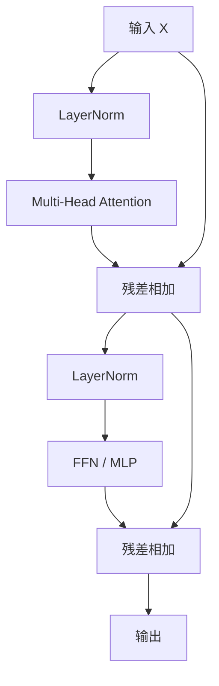
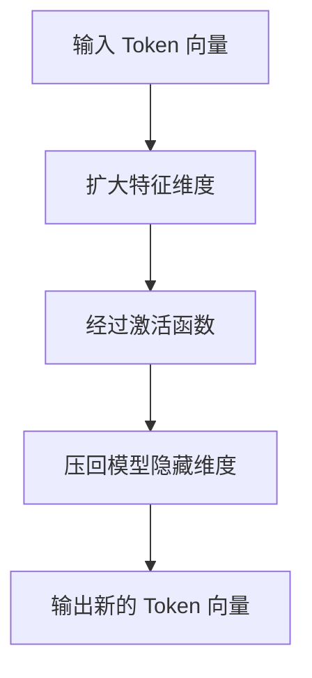
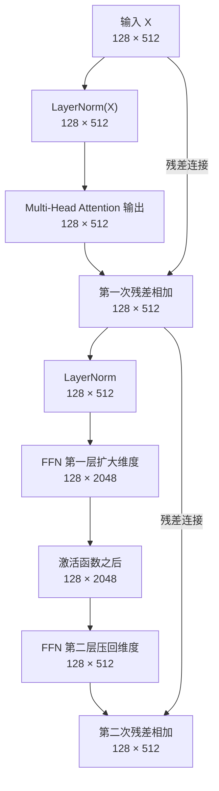

## 1.绪言

从Tokenizer到Embedding，从位置编码到Self-Attention，从Query、Key、Value到最后的Multi-Head Attention，我们前面已经成功地串联起了Token与Token之间的联系，最核心的注意力机制似乎已经讲完了

但是Transformer实际上远没有这么简单，一层单一的Attention能起到的作用也比我们所想象的小得多

换句话说，单层Attention能做到的最多只是一次上下文的信息整合，没办法捋清输入句子中复杂的逻辑结构，所以人们引入了多层的Transformer Block结构，每一层的Transformer Block都包含Self-Attention子层、FFN子层、两组残差连接、两个Norm

而我们今天要讲的FFN、残差连接，以及LayerNorm，都是为了构建出Transformer Block而服务的

---

## 2.Transformer Block

在展开整个模块之前，我们先看看一个Transformer Block具体长什么样

如果使用比较常见的Pre-LN结构，可以写成

$$
Y = X + \operatorname{MHA}(\operatorname{Norm}(X))
$$

$$
Z = Y + \operatorname{FFN}(\operatorname{Norm}(Y))
$$

这里的 $\operatorname{MHA}$ 就是前面介绍过的Multi-Head Attention，而 $\operatorname{Norm}$ 可以是LayerNorm，也可以是现代大模型常用的RMSNorm

不难看出，整个Block其实就是几个子模块的结合，Attention负责Token之间的信息交换，FFN负责单个Token内部的特征加工，残差连接负责保留原始信息，LayerNorm负责稳定计算过程

这样构成的Block被堆叠很多次，最终组成了完整的Transformer模型

---

## 3.残差连接

首先我们来假设有一个子模块，输入是 $X$，在经过某种变换之后得到 $F(X)$

最直接的做法就是把这个 $F(X)$ 作为当前模块的输出，传递到下一层作为输入，但是这也会引发一些问题

如果说这个子模块还没有训练好，或者说它对于某些信息进行了不合适的修改，原始的信息就可能被破坏

所以Transformer引入了残差连接，令

$$
Y = X + F(X)
$$

这个是什么意思呢？就是说，子模块不再负责从零开始，比如说拿到一个输入 $X$，就直接根据这个输入生成一个全新的表示，而是在这个原始表示 $X$ 的基础上去学习一个变化量

换句话来说，就是

$$
\text{新的表示} = \text{原来的表示} + \text{需要补充的内容}
$$

具体到对应的子层中，比如说Attention，就是

$$
Y = X + \operatorname{MHA}(X)
$$

再比如FFN，就是

$$
Z = Y + \operatorname{FFN}(Y)
$$

这里为了突出残差结构，省略了Norm

那么残差连接具体有什么好处呢？

首先来说，它可以保留输入的原始信息，Attention和FFN对Token进行加工之后，原始的Token信息仍然可以通过残差路径保留下来，随后子模块就只需要学习如何**修改**，而非如何**重写**，这二者的难度差距是很大的

其次，残差连接有利于训练深层的网络，我们前面已经知道Transformer会叠很多层，如果每一层都必须要完整地转换上一层的输出，那么随着层数的加深，信息和梯度都可能会越来越难以传递，而残差连接提供了一条相对直接的信息通路，让前面的信息内容能够跨过中间的处理模块，继续向后传播

---

## 4.LayerNorm

OK，我们前面提到Transformer会有很多层次，然后每一层都会对Token表示进行新的变换

但是呢现在又有一个新的问题，如果上一层输出的数值范围变化非常大，那么下一层面对的输入就会显得很不稳定，比如数值过大会使得后续计算变得剧烈，过小会让有效的信息变得不明显，最后则是不同层之间数值分布的差异过大会增加训练难度，因此我们引入了LayerNorm

LayerNorm通常作用于Attention或FFN子层的输入，或者作用于子层输出与残差相加之后，具体位置取决于Transformer采用的是Pre-LN还是Post-LN结构

LayerNorm，即为Layer Normalization，假如说我们经过前面模块的处理，得到一个Token隐藏向量：

$$
[x_{1}, x_{2}, \dots, x_{d}]
$$

那么LayerNorm就会根据这个向量自身的均值和方差，对其中的各个维度进行一次归一化

$$
\operatorname{LayerNorm}(x) = \gamma \frac{x-\mu}{\sqrt{\sigma^2+\epsilon}} +\beta
$$

不去关注公式的具体原理与细节，只需要知道下面这几点

首先，它会把当前Token的隐藏特征调整到相对稳定的范围，且不会改变Token的数量、隐藏向量的维度

然后它不会主动让不同Token之间互相交流

最后 $\gamma$ 和 $\beta$ 都是可以训练的参数

假设输入张量的形状是 $batch\_size \times seq\_len \times d_{model}$，那么LayerNorm处理的就只有最后一维 $d_{model}$，意思就是不同于BatchNorm，LayerNorm只关注当前Token自己的隐藏维度

然后现在LLM用得多的还是RMSNorm，它可以看作是LayerNorm的一种简化形式，但是从整体结构来看，它起到的作用和LayerNorm是相同的

---

## 5.FFN

FFN，即Feed-Forward Network，前馈神经网络，也可以叫做MLP

在Transformer中，FFN通常由两层的线性变换和中间的非线性激活层构成

$$
\operatorname{FFN}(x) = W_{2} \sigma(W_{1} x + b_{1}) + b_{2}
$$

可以大致理解为下面的这种流程：

假设模型的隐藏维度是 $d_{model} = 512$，那么FFN内部就可能先将它扩大到 $d_{ff} = 2048$，经过处理之后再压缩回512维

为什么要先扩大再压缩呢，原因就在于，如果始终只在原有的 $d_{model}$ 维空间中做简单的变换，模型能够表达的特征组合会受到一定的限制

所以在FFN中，我们先把维度扩大，相当于说，给它提供一个更加宽阔的中间工作空间，随后经过非线性激活，模型可以在这个空间中组合出更加复杂的特征，最后再把结果压回 $d_{model}$

所以为什么我们需要一层FFN呢？主要是单纯的Self-Attention会有这样的问题，随着层数的增加，模型的秩会迅速下降，这意味着所有的表示逐渐地趋于单一的向量，这显然不是我们想要的

所以人们引入了FFN，它与Attention的最大区别就是不会让Token之间互相交流，即每个Token都是单独进行处理

具体来说，FFN是一种特殊的两层MLP，MLP即为多层感知机，它通过升维之后线性变换，然后应用一层非线性激活函数来实现保持模型的表达复杂度

---

## 6.小结

最后用一个简单的例子来看一遍Transformer Block中的数据形状变化

假设序列长度为`128`，模型隐藏维度为`512`，注意力头数量为`8`，每个头的维度为`64`，FFN中间维度为`2048`，然后忽略Batch维度

