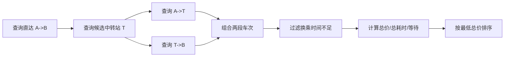
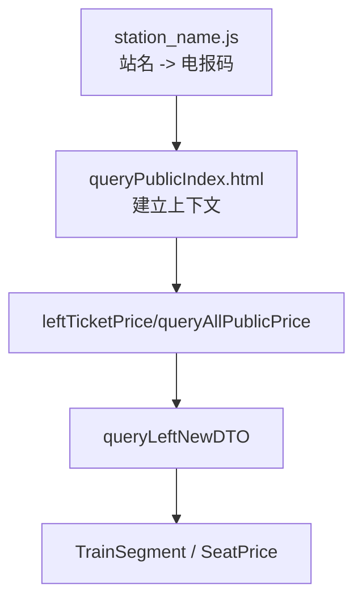

## 1.绪言

6.25上午到图书馆，马上要考概统，准备复习一下，然后不知道怎么的，脑海里突然冒出一个想法：我想实现一个查询火车中转方案的系统，以达到获得最实惠的出行方案的目的

原因可能是暑假马上要买票回家，刷了刷12306，发现老问题依然存在：火车中转方案匮乏

比如我要从厦门到深圳，查询中转方案时，全都是D开头的动车车次，甚至查询直达，也没有K开头或者Z开头的火车车次，这无疑对我这个穷鬼的钱包非常不友好

所以我决定搓一个出来

至于叫什么呢

就叫*硬座英雄*吧，~~看起来就很有悲情色彩~~

---

## 2.从需求开始

首先重新审视问题，确定需求，我到底想要做什么？

从我自身——一个穷鬼的角度出发，我不在乎路程有多漫长，不在乎到站时间是不是比较阴间，不在乎转车中间是只有几分钟还是十几个小时。我的需求只有一个：**价格最低**

至于这个方案，它到底可不可行，中间转车能不能转得过来，是否会引入额外成本，我同时作为程序设计者，我不关心，我只关心怎么从几百个火车站，几万个甚至上几十万个方案中，把价格最低的那个方案揪出来。

这些问题，交给用户自己去判断，这在某种意义上也是一种分布式，将本来由中心服务器承担的计算压力，转交给用户端。其实12306之所以没有支持真正意义上完备的中转方案，我觉得原因也在于此，春运，节假日，承担整个中国几乎最大的访问与请求压力，如果加入中转方案的计算，拉低的就是全部人的体验

所以这个项目的定位已经很明确：它不是12306的替代品，它是某种意义上的对12306功能的补充，专为我这种穷鬼设计，找最低价中转方案，就这么简单

所以最最核心的流程，其实就是下面这几步：

$$
拿到数据 \Rightarrow 计算方案 \Rightarrow 前端呈现
$$

我们需要解决的就是这些

- 出发地、目的地、日期、输入
- 0-1次中转方案搜索
- 最低总价排序
- FastAPI做查询接口
- React做前端展示

没有用户登录，没有收藏方案，没有支付或者购票跳转，没有自动抢票，我们保持系统纯粹

---

## 3.从0到MVP

首先我们需要做的，就是最小可行闭环，去证明这个方向是走得通的

### 3.1.确定技术栈

后端：

- FastAPI：整个后端总揽
- Pydantic v2：负责数据和请求校验
- httpx：网络请求库
- pytest：测试工具
- SQLite：先用轻量的数据库实现数据的持久化存储

前端：

- React：前端框架
- TypeScript：前端语言
- Vite：构建工具
- Tailwind CSS：样式构建
- shadcn/ui：UI库组件

大概就是这样，后续有需求再扩展

---

### 3.2.后端架构分层

回顾一下需求和流程，发现我们后端这里其实覆盖了两个大方面：

- **获取数据**
- **整理方案**

如果再细一点，那就是：

$$
数据源 \Rightarrow 后端拿到数据 \Rightarrow 搜索方案 \Rightarrow 方案排序 \Rightarrow 返回方案
$$

我们先把数据源抽象成`TrainDataProvider`，去实现到一个，不管你是Mock的数据，还是接入了真实查询的数据接口，还是说从本地静态数据库中查询，对我FastAPI来说这边都一样，做到解耦

然后将搜索方案和方案排序合并为`RouteSearchService`，它是两端的承接点，一边去拿数据，一边接收请求

最后就是后端与前端的交界，我们使用FastAPI routes来处理分发请求

其中真正的核心的`TrainDataProvider`，这个抽象是后续所有演进的基础

```python
class TrainDataProvider:
    name: str

    async def search_segments(
        self,
        from_station: str,
        to_station: str,
        query: RouteQuery,
    ) -> list[TrainSegment]:
        ...

    def candidate_transfer_stations(self, query: RouteQuery) -> list[str]:
        ...
```

---

### 3.3.领域模型

#### 3.3.1.概念

在讲这里定义的领域模型之前，我们先讲讲领域模型本身的概念，以及领域驱动设计

##### 3.3.1.1.面向数据表开发

传统的面向数据表开发(Table-Driven Development)是这样的：


假如说现在要实现一个需求：用户发表一篇文章，文章要超过100字，发表后用户积分加10

那么通过面向数据表开发，大概就是像这样的：

```python
# 称作贫血模型，纯粹和表结构一模一样，为了装数据而产生
class UserTable:
    user_id: int
    score: int

class PostTable:
    post_id: int
    user_id: int
    content: str


# 所有的业务逻辑都挤在Service层的一个函数中
def publish_post_service(user_id: int, post_id: int):
    # 查表
    user_data = db.query(UserTable).filter_by(user_id=user_id).first()

    # 在这里做校验
    if len(content) <= 100:
        raise HTTPException(status_code=400, detail="太短了")

    # 强行修改字段
    user_data.score += 10
    new_post = PostTable(user_id=user_id, content=content)

    db.add(new_post)
    db.commit()
```

现在看起来，逻辑还是比较清晰明了的，其实也就是我们常说的CRUD

但是我们接下来请出软件工程领域中的圣经级论文——

> “To see what rate of progress we can expect, let us examine the difficulties of software technology. Following Aristotle, I divide them into essential—the difficulties inherent in the nature of the software—and accidental—those difficulties that today attend its production but are not inherent.”
>
> <p align="right">—— Frederick P. Brooks Jr., <i>"No Silver Bullet"</i>, 1986.</p>

翻译过来也就是图灵奖得主弗雷德里克·布鲁克斯在《没有银弹：软件工程中的本质性困难和附随性困难》中提到的，将在软件开发中分为了两类：

- **本质困难**：软件**自带的**、**无法消除的**基因缺陷。软件是复杂的、一致性的、可变性的、不可见性的。只要你还在编写代码，不管使用什么框架，什么工具，什么IDE，只要业务逻辑本身复杂，这种困难就绝对存在
- **附随困难**：在实现过程中自己找罪受产生的困难。比如曾经用汇编写业务、配置恶心人的环境变量、或者不熟悉语法debug到半夜，乃至于在一定程度上的算法性能瓶颈。这些困难是可以通过工具、框架和技术的进步解决的

或者一句话总结：**在软件开发中，我们最大的敌人是复杂度**

回到这里，因此当业务复杂度开始上升，新的需求开始扩展，比如说，现在又要求，不同等级的用户发文章涨的积分不一样

然后当我们想改代码的时候，痛苦地发现我们已经在`publish_post_service`中写死了`user_data.score += 10`，现在只能改这个Service，看起来还好？那我如果增加积分获取渠道，比如说每日签到，完成任务，每个地方又都要改

你可能比较聪明，你说，我加一个`add_score_service`，大家都去调用它不就好了？

但业务继续拓展：发文章加积分需要判断文章审核状态，签到加积分需要判断连签天数，然后这些Service就开始疯狂相互调用传参

最后不断膨胀，几十个Service混在一起，变成了只有上帝才能看懂的东西

---

##### 3.3.1.2.领域模型概要

现在让我们长舒一口气，从上面的那一大坨东西中逃出来了，来看看领域模型到底是个什么东西，以及它是如何解决面向数据表开发的问题的

简单来说，领域模型就是现实世界业务逻辑在软件世界里的“数字孪生”

它把现实中的业务概念、规则和行为，抽象成**面向对象**代码中的**类**和**对象**

最重要的点在于，它不仅有**属性(数据)**，更有**行为(业务逻辑)**

在领域模型中，我们有三大核心概念：

- **实体(Entity)**：具有唯一标识(ID)的对象。哪怕两个实体的其他属性一模一样，只要ID不同，它们就是不同的
  - 例子：用户(User)。就算有两个人都叫"Abel"，年龄一样，只要他们的`user_id`不同，就是两个独立的人。用户的密码改了、昵称改了，他依然是那个用户(生命周期在延续)
- **值对象(Value Object)**：没有唯一标识，纯粹用于**描述属性**的对象。它们是不可变的，如果两个值对象的属性完全相同，那它们就可以互相替换
  - 例子：地址(Address)。包含省、市、区、街道。如果两个用户的收货地址一模一样，那这两个地址就是等价的。你不需要给地址发一个`address_id`。如果用户改了地址，直接丢弃旧的，换个新的值对象进去
- **聚合根(Aggregate Root)**：最关键的概念，一个业务往往由多个实体和值对象组合而成，而聚合根就是这个组合的**唯一入口**和**大总管**。外部只能通过聚合根来修改内部的状态，以此来保证业务规则的完整性
  - 例子：订单(Order)和订单项(OrderItem)，订单是**聚合根**，订单项是它内部的**实体**。你不能跳过订单，去直接修改某一个订单项的数量，而是必须调用类似`order.update_item_quantity()`。因为订单需要整体计算总价、校验库存，聚合根不批准，下面的内部实体不能乱动

---

##### 3.3.1.3.领域驱动设计(Domain-Driven Design, DDD)

不同于面向数据表开发，DDD要求你先去搞懂业务逻辑，而不是一上来就建表

DDD分为**战略设计**和**战术设计**

###### 3.3.1.3.1.战略设计

- **领域和子域(Domain and Subdomain)**：根据业务的边界和侧重点，以电商系统为例，分为以下三类：
  - **核心域**：业务核心竞争力，如个性化推荐、智能调度，是最需要花精力写好的地方
  - **通用域**：大家都基本一样的地方，比如用户认证、权限管理
  - **支撑域**：必须要有，但不是核心，比如物流跟踪、发票系统
- **限界上下文(Bounded Context)**：同样一个词，在不同的语境下，含义完全不同
  - 在"商品上下文"中，"商品"指的是价格、描述、库存
  - 在"物流上下文"中，"商品"变成了体积、重量、长宽高
- 统一语言：产品、运营、开发在讨论业务时，必须使用一套完全一致的术语，而且这套术语要直接变成代码里的类名和方法名

---

###### 3.3.1.3.2.战术设计

- **领域模型**：也就是我们上面提到的
- **领域服务**：有时候，一个业务操作不属于任何一个特定的实体，比如转账，它既不完全属于A账户，也不完全属于B账户，此时就应当定义一个`TransferService`，把它作为领域服务
- **仓储**：把数据库**隔离**出去。它不是ORM，它是领域层和数据层的隔离带，接口定义在领域层(只管要什么数据)，实现写在基础设施层(怎么从MySQL或者MongoDB中拿数据)，这其实就是我们上面对`TrainDataProvider`进行抽象所实现的

---

###### 3.3.1.3.3.四层架构

- **用户接口层**：负责接收请求，比如 FastAPI 的 APIRouter，处理 HTTP 传参、校验 DTO
- **应用层**：很薄的一层，它不包含业务逻辑。它只负责**编排**。比如从仓储拿到聚合根 -> 调用聚合根的方法做业务 -> 用仓储保存 -> 发送领域事件
- **领域层**：核心，包含实体、值对象、聚合、领域服务。纯粹的业务逻辑，**不依赖任何外部框架**
- **基础设施层**：提供具体技术实现。比如数据库连接、Redis 缓存、消息队列、调用第三方 API

---

###### 3.3.1.3.4.示例

为了便于理解，接下来我们用DDD把上面的用面向数据表开发的代码重新写一遍

这里我们就不写基础设施层了，直接从领域层开始自底向上写

- 构建充血领域模型

```python
from dataclasses import dataclass
from typing import Optional

# 值对象
@dataclass(frozen=True)     # 值对象不可变
class PostContent:
    value: str

    def __post_init__(self):
        if len(self.value) <= 100:
            raise ValueError(f"文章内容太短了，当前{len(self.value)}个字")


# 实体与聚合根
class User:
    def __init__(self, user_id: int, score: int, level: int = 1):
        self.id = user_id
        self._score = score
        self._level = level

    @property
    def score(self) -> int:
        return self._score

    # 业务行为
    def calculate_publish_reward(self) -> int:
        if self._level >= 5:
            return 20
        return 10

    def add_score(self, amount: int):
        if amount < 0:
            raise ValueError("积分不能为负数")
        self._score += amount


class Post:
    def __init__(self, post_id: Optional[int], author_id: int, content: PostContent):
        self.id = post_id
        self.author_id = author_id
        self.content = content
```

- 定义边界-仓储接口

```python
from abc import ABC, abstractmethod


class UserRepository(ABC):
    @abstractmethod
    def find_by_id(self, user_id: int) -> Optional[User]:
        pass

    @abstractmethod
    def save(self, user: User) -> None:
        pass


class PostRepository(ABC):
    @abstractmethod
    def save(self, post: Post) -> None:
        pass
```

- 应用服务层：现在变得极其干净，不再负责业务逻辑，只负责编排

```python
class PublishPostApplicationService:
    def __init__(self, user_repo: UserRespository, post_repo: PostRepository):
        self.user_repo = user_repo
        self.post_repo = post_repo

    def execute(self, user_id: int, content_text: str) -> None:
        user = self.user_repo.find_by_id(user_id)
        if not user:
            raise Exception("用户不存在")

        # 依赖值对象自校验
        content = PostContent(value=content_text)
        post = Post(post_id=None, author_id=user.id, content=content)

        # 领域对象之间的业务交互
        reward_score = user.calculate_publish_reward()
        user.add_score(reward_score)

        # 持久化保存
        self.post_repo.save(post)
        self.user_repo.save(user)
```

---

#### 3.3.2.本项目中的领域模型

在本项目中，我们定义了如下领域模型：

- `SeatPrice`

```python
class SeatPrice(BaseModel):
    seat_type: str
    price: Decimal - Field(ge=0)
    remaining: str = "unknown"
```

- `TrainSegment`

```python
class TrainSegment(BaseModel):
    train_no: str
    from_station: str
    to_station: str
    depart_at: datetime
    arrive_at: datetime
    duration_minutes: int = Field(gt=0)     # 字段限定
    prices: list[SeatPrice]
    source: str = "mock"
    updated_at: datetime

    @model_validator(mode="after")      # 值对象自校验
    def validate_time_order(self) -> "TrainSegment":    # 前向引用，防止此时类未定义完报错
        if self.arrive_at <= self.depart_at:
            raise ValueError("arrive_at must be later than depart_at")
        return self

    @property   # 用于读取最低价格，该装饰器可使方法像变量一样调用，且只读
    def lowest_price(self) -> Decimal | None:
        if not self.prices:
            return None
        return min(price.price for price in self.prices)
```

- `RouteQuery`

```python
class RouteQuery(BaseModel):
    from_station: str = Field(min_length=1, max_length=64)
    to_station: str = Field(min_length=1, max_length=64)
    date: date
    max_transfers: int = Field(default=1, ge=0, le=2)               # 最多中转次数
    min_transfer_minutes: int = Field(default=30, ge=0, le=360)     # 需求的最少中转时间
    max_total_duration_minutes: int = Field(default=48 * 60, ge=60, le=72 * 60) # 全程最多花费时间

    @field_validator("from_station", "to_station", mode="before")
    @classmethod    # 类方法
    def strip_station_name(cls, value: Any) -> str:
        if isinstance(value, str):
            return value.strip()
        return value

    @model_validator(mode="after")
    def validate_distinct_stations(self) -> "RouteQuery":
        if self.from_station == self.to_station:
            raise ValueError("from_station and to_station must be different")
        return self
```

- `TransferPlan`

```python
class TransferPlan(BaseModel):
    total_price: Decimal
    total_duration_minutes: int
    transfer_minutes: int
    transfer_stations: list[str]
    segments: list[TrainSegment]
```

- `RouteSearchResponse`

```python
class RouteSearchResponse(BaseModel):
    query_id: str
    source: str
    updated_at: datetime
    plans: list[TransferPlan]
```

- `StationSearchResponse`

```python
class StationSearchResponse(BaseModel):
    stations: list[str]
```

- `StationMetadata`

```python
class StationMetadata(BaseModel):
    name: str
    telecode: str
    latitude: float
    longitude: float
    centrality_score: float = Field(default=0, ge=0)
```

---

### 3.4.搜索算法

其实这阶段没有什么算法之说，就是单纯的枚举暴力，聚焦0或1次中转：



排序目标非常明确：$\text{min} (total\_price)$

然后其他的什么总耗时、换乘次数、换乘等待时间只作为辅助展示或同价排序，不改变主目标

---

### 3.5.前端

其实前端没什么要求，现在确定下来，到后面最多也就是加点样式，或者加点展示数据

`App.tsx`完成

- 出发地、目的地、日期、最短换乘时间输入
- 查询提交
- 结果列表显示
- loading状态
- 空状态
- 错误状态

---

### 3.6.第一阶段小结

在这个阶段，我没有接入真实数据，而是采用Mock模式，因为此阶段的目标就是验证链路可行性

- 前端能发起请求
- 后端能返回结构化方案
- 算法能组合中转
- 数据源可以被替换
- 测试能保护核心逻辑

---

## 4.第二阶段：站点补全与缓存

### 4.1.站点自动补全

很显然，用户是记不住那么多站点的名字的，只能记住城市叫什么，所以我们就要根据用户输入的城市名字，来自动补全站点名字

在路由层中新增接口：`GET /api/stations/search?q=北京`

```python
@router.get("/stations/search", response_model=StationSearchResponse)
async def search_stations(q: str = "") -> StationSearchResponse:
    search = getattr(provider, "search_stations", None)     # 动态获取方法
    if search is None:      # 方法不存在
        return StationSearchResponse(stations=[])
    
    try:        # 防止search(q)抛异常直接冒泡到500 Interval Server Error
        stations = search(q)
        if hasattr(stations, "__await__"):
            stations = await stations
        return StationSearchResponse(stations=stations)
    except TrainDataProviderError as exc:
        raise HTTPException(status_code=provider_error_status_code(exc), detail=str(exc)) from exc
```

前端通过datalist来展示候选站点

这看似只是用户体验优化，但实际上强化了一个架构点：站点能力也应该来自provider，而不是写死在前端

虽然此处还没有详讲`provider`，但这里先展示一下，有四个不同的`provider`：

- `MockTrainDataProvider`

```python
class MockTrainDataProvider(TrainDataProvider):
    name = "mock"

    def __init__(self) -> None:
        self._stations = ["北京", "济南西", "南京南", "上海", "天津南", "杭州东"]
    ...
    def search_stations(self, keyword: str) -> list[str]:
        if not keyword:
            return self._stations
        return [station for station in self._stations if keyword in station]
```

- `Railway12306PublicPriceProvider`

```python
class Railway12306PublicPriceProvider(TrainDataProvider):
    name = "12306-public-price"
    ...
    async def search_stations(self, keyword: str) -> list[str]:
        return await self.station_repository.search_stations(keyword)

...

class StationCodeRepository:
    ...
    async def search_stations(self, keyword: str) -> list[str]:
        stations = sorted((await self.get_station_codes()).keys())
        if not keyword:
            return stations[:20]
        return [station for station in stations if keyword in station][:20]
```

- `LocalStaticPriceProvider`

```python
class LocalStaticPriceProvider(TrainDataProvider):
    name = "static-price"
    ...
    # 没有search_stations的实现
```

- `StaticPriceFallbackProvider`

```python
class StaticPriceFallbackProvider(TrainDataProvider):
    name = "static-price"
    ...
    # 同样没有search_stations的实现
```

所以我们可以看到，最开始的那段路由代码就兼顾了三种情况

- 首先判断有没有`search_stations`这个方法？如果没有就返回空列表
- 然后判断对应的方法是不是异步的？如果是就`await`去拿结果

---

### 4.2.TTL缓存

#### 4.2.1.TTL概念

先讲讲TTL缓存的核心概念

在程序运行过程中，为了保证运行的效率和部分数据的可复用性，我们引入了缓存的概念，也就是将部分数据暂时保存在运行内存中，下一次查询的时候，就可以避开网络IO等损耗，直接从内存中读取数据

但问题在于，内存的大小是有限的，当存储的数据过多，就会挤占程序本身运行的空间

所以在此基础上，有TTL缓存，它的核心思想就是**自动化数据老化**，每个存进缓存的键值对都会绑定一个过期时间，如果过期了，就丢掉

新的问题又出现了，我们不可能每时每刻盯着缓存，时不时地全部扫一遍看看哪个过期了，所以有以下三种清理策略：

- **被动删除**：其实和线段树中的懒标记以及游戏开发中实体状态的脏标记感觉原理很相似，都是用到的时候，再去处理
  
  在这里，就是平时不主动去清理过期数据，只有当访问某个`key`的时候，缓存才会判断，如果当前数据过期了就清理掉
- **随机主动删除**：既然不能全量扫描，那我就应用随机抽样的思想，定时抽取一批`key`，检查有没有过期，过期就删掉
- **强制内存淘汰**：如果内存实在已经满了，主动和被动清理都来不及了，缓存就会触发比如LRU之类的淘汰机制，强行把没有过期的也删除

在应用中，由于单纯的被动删除可能会造成部分数据一直未被访问，持续占用缓存的情况，通常会采用被动+随机主动合并的清理方法

---

#### 4.2.2.缓存粒度

现在有了缓存，我们就要考虑往里面存储数据的方式，而这就是缓存粒度

即往缓存里存数据的时候，到底是一个对象安排一个`key`，还是把一大堆对象打包成一个大JSON再安排一个`key`

- **细粒度缓存**：就是将数据拆得尽可能小，每一个用户都有自己专属的`key`
  - **示例**：`user:1024:info -> {"id": 1024, "name": "Abel", "level": 114514}`
  - **优点**：缓存**命中率高**：只要`user`的数据没变，缓存一直有效；内存**利用率**高：更新方便，哪个`user`的状态变了，只需要修改对应的一个`key`即可
  - **缺点**：网络I/O开销大：假设想要在前端展示一个前`100`名用户列表，如果是细粒度缓存，需要向Redis发起100次查询，甚至还要在后端自己拼装；代码复杂度：维护每一个零散的`key`的生命周期
- **粗粒度缓存**：批发式存储，直接把整个列表甚至整页HTML丢进缓存
  - **示例**：`user:top100:list -> [{"id": 1024, ...}, {"id": 1145, ...}, ...]`
  - **优点**：读取性能极高，一个`key`直接打包带走大量数据，没有额外拼装和多次网络往返损耗
  - **缺点**：极其容易失效(**缓存抖动**)：只要这`100`个用户里有任何一个变了，为了保证数据一致性，必须把整个`key`废除，缓存频繁删除，后端数据库面临压力；浪费内存：大量重复数据散落

在实际应用中，两者往往权衡使用，**粗粒度框架，细粒度内容**

---

#### 4.2.3.应用

因此，在本项目中，考虑使用TTL缓存来优化车次读取，采用如下缓存粒度：

```txt
provider + date + from_station + to_station -> list[TrainSegment]
```

在`app/services/cache.py`中有实现：

```python
class TtlCache(Generic[T]):     # 泛型类
    def __init__(self, ttl_seconds: int) -> None:
        if ttl_seconds <= 0:
            raise ValueError("ttl_seconds must be greater than 0")
        self.ttl = timedelta(seconds=ttl_seconds)
        self._items: dict[str, tuple[datetime, T]] = {}

    def get(self, key: str) -> T | None:
        item = self._items.get(key)
        if item is None:
            return None
        
        expires_at, value = item
        if datetime.now(timezone.utc) >= expires_at:    # 过期删除，这里没有用到主动随机删除
            self._items.pop(key, None)
            return None

        return value

    def set(self, key: str, value: T) -> None:
        self._items[key] = (datetime.now(timezone.utc) + self.ttl, value)

    def clear(self) -> None:
        self._items.clear()
```

关于这个缓存粒度设计，其实和后面将要提到的数据源有关系，在当前的唯一动态数据源中，接口的查询粒度就是OD

```txt
某日 + 出发站 + 到达站
```

在这里，缓存仅为进程内TTL，重启后失效，但是为后来的SQLite OD缓存、静态票价库打下了统一`key`设计

---

## 5.第三阶段：寻找真实数据源

### 5.1.获取数据接口

做到这里了，是时候接入真正的数据源`provider`了

在这里很是折腾了一会，我先是去GitHub上找了一下开源的数据，找到两个项目，`clone`下来配了半天环境，发现都不太理想

- `Parse12306`：是C#写的，很是配了一会才好，还是将近十年前的老项目，出乎意料地还能用，但比较失望的是只有车站、车次、经停时刻表，没有票价
- `china-rail-way-stations-data`：这个更少，主要是车站和车次始发终到数据

很是惆怅了一会，然后决定去官网看看

翻了一下，注意到网站上有一个公布票价的站点，点进去发现确实可以查！

同步验证了一下这里的票价和12306app上查到的票价，发现几乎都没什么差别，于是决定就选这个了

其实后来突然想到，为什么不直接用正常查询接口呢，还能查到余票，没有验证过，等以后想做余票了看看

最终决定12306官方公布票价页面使用的接口：

```txt
GET https://kyfw.12306.cn/otn/leftTicketPrice/queryAllPublicPrice
```

大致链路就是：



---

### 5.2.票价字段解析

借着接口解析了一下票价字段：

|    字段     |   席别   |
| :---------: | :------: |
| `swz_price` |  商务座  |
| `zy_price`  |  一等座  |
| `ze_price`  |  二等座  |
| `yz_price`  |   硬座   |
| `yw_price`  |   硬卧   |
| `rw_price`  |   软卧   |
| `gr_price`  | 高级软卧 |

价格编码以角为单位：

```txt
07950 -> 795.0
01145 -> 114.5
```

---

## 6.第四阶段：接入公布票价Provider

### 6.1.`Railway12306PublicPriceProvider`

在这里新增了`Railway12306PublicPriceProvider`

```python
class Railway12306PublicPriceProvider(TrainDataProvider):
    name = "12306-public-price"

    def __init__(
        self,
        client: PublicPriceQueryClient | None = None,
        transfer_generator: CandidataTransferStationGenerator | None = None,
    ) -> None:
        station_repository = StationCodeRepository()
        self.client = client or PublicPriceClient(station_repository)
        self.station_repository = station_repository
        self.transfer_generator = transfer_generator or CandidateTransferStationGenerator()

    async def search_segments(
        self,
        from_station: str,
        to_station: str,
        query: RouteQuery,
    ) -> list[TrainSegment]:
        updated_at = datetime.now(timezone.utc)
        rows = await self.client.query(from_station, to_station, query)
        segments = [build_segment_from_public_price(row, query, updated_at) for row in rows]
        return [segment for segment in segments if segment is not None]

    def candidate_transfer_stations(self, query: RouteQuery) -> list[str]:
        return self.transfer_generator.generate(query)

    async def search_stations(self, keyword: str) -> list[str]:
        return await self.station_repository.search_stations(keyword)
```

首先我们需要解决一个问题，如何将汉字站名转为电报码

在铁路调度中，如果直接用汉字或者拼音传输站名，不仅浪费带宽，还容易出错，因为重名和发音像的站名太多了

所以我们采用电报码来表示火车站，例如北京南就是`BPN`，上海虹桥就是`AOH`，为什么不是`SHH`？因为上海站用了，使用特殊编码

我们这里采用`StationCodeRepository`来下载并存储电报码

```python
def describe_httpx_error(exc: httpx.HTTPError) -> str:
    if isinstance(exc, httpx.HTTPStatusError):
        response = exc.response
        return f"{type(exc).__name__}: HTTP {response.status_code} {response.reason_phrase}"
    if isinstance(exc, httpx.TimeoutException):
        return f"{type(exc).__name__}: 请求超时"
    if isinstance(exc, httpx.RequestError):
        request = exc.request
        return f"{type(exc).__name__}: {request.method} {request.url} 请求失败：{exc}"
    return f"{type(exc).__name__}: {exc}"


class StationCodeRepository:
    def __init__(self, timeout_seconds: float = 10.0, cache_ttl_seconds: int = 86400) -> None:
        self.timeout_seconds = timeout_seconds
        self.cache: TtlCache[dict[str, str]] = TtlCache(cache_ttl_seconds)

    async def get_station_codes(self) -> dict[str, str]:
        cached = self.cache.get("station-codes")
        if cached is not None:
            return cached

        last_error: Exception | None = None
        async with httpx.AsyncClient(timeout=self.timeout_seconds, headers=request_headers()) as client:
            for url in STATION_URLS:
                try:
                    response = await client.get(url)
                    response.raise_for_status()
                    station_codes = parse_station_codes(response.text)
                    self.cache.get("station-codes", station_codes)
                    return station_codes
                except (httpx.HTTPError, Railway12306Error) as exc:
                    last_error = exc
        if isinstance(last_error, httpx.HTTPError):
            detail = describe_httpx_error{last_error}"
        else:
            detail = f"{type{last_error}.__name__}: {last_error}"
        raise Railway12306Error(f"无法获取车站电报码：{detail}")

    async def search_stations(self, keyword: str) -> list[str]:
        stations = sorted((await self.get_station_codes()).keys())
        if not keyword:
            return stations[:20]
        return [station for station in stations if keyword in station][:20]
```

然后来看具体如何查询车次，在给定`from_station, to_station, query`的情况下，`Railway12306PublicPriceProvider`调用`PublicPriceClient`查询

在`PublicPriceClient`中：

```python
class PublicPriceQueryClient(Protocol):     # 结构化接口，使得下面的PublicPriceClient符合PublicPriceQueryClient协议，测试时可以传入同样实现query方法的假客户端，从而不必真的访问12306接口
    async def query(self, from_station: str, to_station: str, query: RouteQuery) -> list[dict[str, Any]]:
        ...


class PublicPriceClient:
    def __init__(self, station_code: StationCodeRepository, timeout_seconds: float = 10.0) -> None:
        self.station_codes = station_codes
        self.timeout_seconds = timeout_seconds

    async def query(self, from_station: str, to_station: str, query: RouteQuery) -> list[dict[str, Any]]:
        station_codes = await self.station_codes.get_station_codes()
        try:
            from_code = station_codes[from_station]
            to_code = station_codes[to_station]
        except KeyError as exc:
            raise Railway12306Error(f"站名无法映射电报码：{exc}") from exc

        params = {
            "leftTicketDTO.train_date": query.date.isoformat(),
            "leftTicketDTO.from_station": from_code,
            "leftTicketDTO.to_station": to_code,
            "purpose_codes": "ADULT",
        }
        async with httpx.AsyncClient(timeout=self.timeout_seconds, headers=request_headers()) as client:
            try:
                await client.get(PUBLIC_QUERY_PAGE_URL)
                response = await client.get(PUBLIC_PRICE_URL, params=params)
                response.raise_for_status()     # 检测并抛出HTTP异常
            except httpx.HTTPError as exc:
                raise Railway12306Error(f"票价接口请求失败：{describe_httpx_error(exc)}") from exc

        try:
            payload = response.json()
        except ValueError as exc:
            raise Railway12306Error("票价接口返回非 JSON") from exc
        if not payload.get("status"):
            raise Railway12306Error(f"票价接口返回失败：{payload}")
        rows = payload.get("data", [])
        if not isinstance(rows, list):
            raise Railway12306Error("票价接口 data 不是列表")
        return rows
```

这里拿到的`rows`实际上是通过公布票价查询接口获取的`data`数组，形如：

```txt
leftTicketDTO.train_date=YYYY-MM-DD
leftTicketDTO.from_station=出发站电报码
leftTicketDTO.to_station=到达站电报码
purpose_codes=ADULT
```

真实的`response.json()`解析出来的`payload`就是

```json
{
  "validateMessagesShowId": "_validatorMessage",
  "status": true,
  "httpstatus": 200,
  "data": [
    {
      "queryLeftNewDTO": {
        "train_no": "240000G54700",
        "station_train_code": "G547",
        "train_class_name": "高速",
        "from_station_name": "北京南",
        "to_station_name": "上海虹桥",
        "from_station_telecode": "VNP",
        "to_station_telecode": "AOH",
        "start_time": "06:18",
        "arrive_time": "12:11",
        "lishi": "05:53",
        "day_difference": "0",
        "swz_price": "27820",
        "zy_price": "12720",
        "ze_price": "07950"
      }
    }
  ],
  "messages": [],
  "validateMessages": {}
}
```

然后通过`build_segment_from_public_price`函数去解析价格字段

```python
PRICE_FIELDS = {
    "swz_price": "商务座",
    "zy_price": "一等座",
    "ze_price": "二等座",
    "yz_price": "硬座",
    "yw_price": "硬卧",
    "rw_price": "软卧",
    "gr_price": "高级软卧",
}


def parse_duration_minutes(value: str) -> int:
    parts = value.split(":")
    if len(parts) != 2:
        raise Railway12306Error(f"历时格式不符合预期：{value}")
    hours, minutes = (int(part) for part in parts)
    return hours * 60 + minutes


def parse_day_difference(value: Any) -> int:
    if value in (None, ""):
        return 0
    return int(value)


def build_segment_from_public_price(row: dict[str, Any], query: RouteQuery, updated_at: datetime) -> TrainSegment | None:
    dto = row.get("queryLeftNewDTO")
    if not isinstance(dto, dict):
        raise Railway12306Error("缺少 queryLeftNewDTO")

    prices = [
        SeatPrice(seat_type=seat_type, price=price, remaining="unknown")
        for field, seat_type in PRICE_FIELDS.items()
        if (price := parse_price(dto.get(field))) is not None   # 海象运算符，用于一边解析field赋值给price一边对price进行判断
    ]
    if not prices:
        return None

    # 解析逻辑
    depart_time = time.fromisoformat(str(dto.get("start_time", "")))
    arrive_time = time.fromisoformat(str(dto.get("arrive_time", "")))
    day_difference = parse_day_difference(dto.get("day_difference"))
    depart_at = datetime.combine(query.date, depart_time, tzinfo=timezone.utc)
    arrive_at = datetime.combine(query.date + timedelta(days=day_difference), arrive_time, tzinfo=timezone.utc)
    duration_minutes = parse_duration_minutes(str(dto.get("lishi", "")))

    # 转为TrainSegment返回
    return TrainSegment(
        train_no=str(dto.get("station_train_code") or dto.get("train_no") or ""),
        from_station=str(dto.get("from_station_name") or query.from_station),
        to_station=str(dto.get("to_station_name") or query.to_station),
        depart_at=depart_at,
        arrive_at=arrive_at,
        duration_minutes=duration_minutes,
        prices=prices,
        source="12306-public-price",
        updated_at=updated_at,
    )
```

---

### 6.3.`provider_factory`

利用策略模式，实现`provider_factory`工厂，根据环境变量选择工厂模式

```python
def create_train_data_provider() -> TrainDataProvider:
    provider_name = os.getenv("TRAIN_DATA_PROVIDER", "mock").strip().lower()
    if provider_name == "mock":
        return MockTrainDataProvider()
    if provider_name in {"12306", "12306-public-price", "railway_12306_public_price"}:
        return Railway12306PublicPriceProvider()
    if provider_name in {"static", "static-price", "local-static-price"}:
        return _create_static_price_provider()
    raise ValueError(f"Unsupported TRAIN_DATA_PROVIDER: {provider_name}")
```
