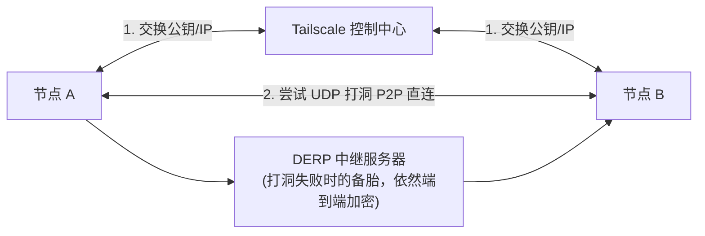

## 1.绪言

起因是中秋假期的一天晚上，结束了Coding时间，尝试和朋友搞一会Better MC，但是在一位第一次参与联机的朋友加入游戏的过程中出现了一些问题

先介绍背景，我们使用的是Tailscale组网联机，我作为Host主机，其他人作为客机进行连接，使用整合包Better MC，版本为`1.19.2`，BMC3

这个新加入的朋友在初次连接时无异常，正常进入游戏并进行了初步的游玩，经过一段时间后因电脑卡顿原因退出清理，再尝试重进时卡在地形加载中界面

于是开始了下面的故障排查

---

## 2.初步筛查

我首先看了Tailscale页面上的User Device在线情况，显示对方设备在线

于是再尝试操纵对方电脑`ping`我的Tailscale IP，显示无异常，无丢包，网络传输稳定，延迟低

再考虑是否为防火墙策略问题，但随后排除，因为先前已经成功进入游戏

随后确认`tailscale status`状态，发现连接仍为`direct`模式

一时茫然，明明网络连接看上去没有问题，为什么会卡在地形加载界面？

---

## 3.定位核心

求助AI，尝试使用指定数据包大小以及禁止分片策略进行`ping`连通性排查

```bash
ping 100.120.14.25 -l 1472 -f
```

发现报错返回`Packet needs to be fragmented but DF set`，因此初步确认可能是数据包过大原因

首先需要引入两个概念：

- **MTU**：即Maximum Transmission Unit，最大传输单元，即网络设备在一个帧中最大能承担的payload大小，这里是数据链路层对上层网络层的限制
- **DF**：即Don't Fragment，禁止分片，为IP协议头中的一个标志位，当设置为`1`时，路由器如果发现当前这个包的大小超过了MTU，就会直接丢弃，并返回上面所示的报错信息；如果设置为`0`，则会尝试切成多个小片进行分发

而现在为了提高传输效率，常常默认将DF标志位设为`1`，然后通过不断尝试发送大包接收报错，从而自动探测出整个网络路径上最小的MTU是多少，从而避免数据包在传输过程中被路由器频繁切片，以减少CPU消耗及丢包概率

然后现在的问题就比较明了了

Tailscale的原理其实就是首先各自在自己的客户端生成一对WireGuard公私钥，随后各自将自己的公钥、公网IP及端口打包发送给控制中心，随后要进行连接，A连接到B，交换双方公钥、IP及端口

对于NAT，有两种方式，如果双方NAT均较为宽松，非对称，则先通过UDP发包探测，然后穿透防火墙，直接P2P直连

如果较为严苛，则通过中转服务器DERP进行转接，稍慢

最后在实际连接过程中，双方建立起WireGuard虚拟网卡隧道，进行数据直连



Tailscale 基于 WireGuard 构建虚拟网卡隧道。通信双方在建立 P2P 直连或 DERP 中继时，数据会被二次封装，比如说追加 UDP或者WireGuard 报头等，这必然会导致虚拟网卡的可用 MTU 小于物理网卡的标准 1500 MTU

在当前 Windows 环境下，Tailscale 虚拟网卡与主机未成功协商出正确的 Path MTU。当 MC 传输巨大的区块数据包时，IP 头带有 DF 标志的大包在经过 Tailscale 虚拟网卡隧道时因超长而被丢弃，而客户端无法收到区块报文，导致一直卡在地形加载界面

但是为什么客户端卡死而没报错？因为当路由设备丢弃带 DF 的超大包时，本该回一个 ICMP Type 3 Code 4(Destination Unreachable - Fragmentation Needed and DF Set)给发送方。但很多防火墙或虚拟网卡把 ICMP 包给Drop了，导致发送者处于黑洞状态，MC 客户端自然就卡死在“正在加载地形”了

---

## 4.解决

于是尝试通过二分定位法，得出当前Tailscale的MTU设置大约在1150左右，从而以管理员身份运行PowerShell，重新设置MTU上限

```powershell
# 查找网卡名称
Get-NetIPInterface | Where-Object {$_.InterfaceAlias -like "*Tailscale*"}

# 设置 MTU 为 1150
netsh interface ipv4 set subinterface "Tailscale" mtu=1150 store=persistent
```

---

## 5.小结

然后就开始愉快地玩BMC了（虽然没玩多久，搞这个搞了好久

总结就是ICMP层面小包能通不代表网络无异常，因为小包和大包在传输行为上可能不一致，这就是DF标志位所决定的

最后我们不妨想想，为什么初次验证的时候要用1472字节？因为1472字节是ICMP payload的大小，在IPv4中，一个包大致由如下组成

$$
1472(\text{ICMP payload}) + 8(\text{ICMP header}) + 20(\text{IPv4 header}) = 1500
$$

所以这里实际是在验证当前网络通路，能否承载1500字节大小的IPv4 Packet而不发生分片
