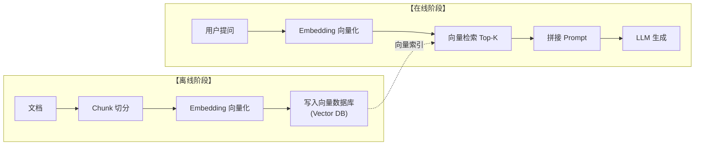

## 1.绪言

最近做项目，突发奇想，想做一下RAG，记得这玩意很火？然而开始做了才发现已经是前两年的事了，如今我们更加关注的是整个上下文工程

但是RAG本身并没有失去它的价值，只是由一个被吹捧的热点变成了Agent领域的基本知识，就像你不会吹嘘自己会TCP/IP一样，没必要彰显自己会RAG，但是你得会

所以我们今天先来从入门开始，探索RAG是如何成为Context Engineering的基础架构的一部分的

---

## 2.RAG概述

众所周知，单纯的LLM有两个比较突出的缺点，一是幻觉，二是时效性差

幻觉在于它其实并没有从数据源中搜索出个所以然来，但是直说自己没找到的分数很低，所以它宁愿胡扯也不愿意告诉你它不知道

时效性差在于如果没有接入外部网络搜索工具，它的时间就停留在它结束训练的那一年

所以RAG，即Retrieval-Augmented Generation，检索增强生成，就相当于给LLM安装了一个外置的大脑知识库，用户提问什么东西就尝试从里面找答案

但需要注意的是它并没有解决幻觉问题，如果你没有配置好RAG的检索策略，那么依然会给你胡说八道，比如引用完全不在知识库里面的东西

整个RAG的逻辑其实非常地简单粗暴，就是找资料，塞提示词，然后扔给LLM生成回答

具体来说，RAG的流程可以大致分为两部分，即**离线索引**和**在线检索**

---

## 3.离线索引

### 3.1.切分Chunk

首先准备好知识库的资料，比如各种Markdown、PDF、txt、JSON之类的文档

然后做文本切片，因为大模型的窗口长度有限，所以得切成小块即Chunk(虽然现在的大模型的上下文窗口动辄百万级，这也是RAG被认为式微的原因之一)

这个文本切片是比较重要的一环，甚至可以说大部分的RAG系统效果不好，就是因为没有重视这个第一步

切分Chunk直到如今已经演进出了很多种策略，最开始的策略就是定长切分

这显然非常粗暴，首先是这个Chunk的大小你该怎么设定呢？切太大了就淹没在语料的海洋中了，切太小又前言不搭后语，讲到关键的部分直接被截断，完全没有语义和逻辑结构的概念，适用的场景只有极度缺乏算力或者处理日志这种没有任何自然语言逻辑的纯定长流数据

既然定长切分可能会截断语义，那我们不妨尝试让两个相邻Chunk之间有一定的重叠部分，这就是Overlap Chunking，确实在一定程度上缓解了主谓宾被切断的问题，但是代价就是造成了大量的数据冗余，召回发现一堆废话，占空间

然后就是稍微聪明一点的分割策略，开始懂得尊重文档结构

比如递归字符切片，设置一个分割字符优先级列表，比如`["\n\n", "\n", "。", "！", "？", " ", ""]`，首先尝试按照段落切，如果太大就句子，还大就按空格来切，直到满足Token限制。它尽量保留了完整的句子和段落结构，属于是性价比比较高，绝大部分场景下都可以直接用，比如一般性的Markdown文档切割

随后是基于文档结构的切片，像是Markdown、HTML、PDF的header(`#`, `##`这种)，以及代码的AST抽象语法树来切割，按照类、函数进行Chunk分片

接下来就是比较高级的策略了

语义切片，大致的原理是这样：

1. 把整篇文章按照单句分开
2. 计算相邻句子之间的Embedding向量相似度
3. 然后设定一个相似度阈值，一旦发现第 $N$ 句和第 $N + 1$ 句之间的语义相似度大幅下跌，就可以判定在这里发生了转折，切一刀

它能保证同一个Chunk内部讲的都是一件事，准确性很高，但是缺点也很显著，又慢又贵，如果要进行这样的处理，对整篇文章都需要跑一遍Embedding，文档量增大的时候API额度消耗也大量增高

接着是层次化切片，它将Chunk分为两类：大块和小块

其中小块用来做向量检索，因为它语义集中，更加容易匹配到Query；然后小块匹配到，并不直接将其返回给LLM，而是根据索引映射，找到对应的父级大块，将整个大块作为上下文返回给LLM

这个策略被经常使用，它在很大程度上解决了小块精准但是上下文不够、大块上下文足够但是检索不精准的矛盾问题

最后就是这两年比较新的策略，像是延迟切片，将整篇长文档送入长文本Embedding模型生成Token级别的向量，利用Transformer的Self-Attention吸收全局的上下文，最后再按照位置进行Mean Pooling切片，这样切出来的Chunk天生就带有全篇的记忆，解决了指代词不清(如“它”指谁)的问题

---

### 3.2.向量化

这里的Embedding和Transformer中的Embedding有所不同，我们知道在Transformer中，Embedding处理的是单个Token ID，而在RAG的Embedding中，我们处理的是被切分出的Chunk，每个Chunk内部就可能含有多个Token本身

在RAG中，Embedding将对应的Chunk向量化，然后存储到向量数据库中进行持久化，这也与Transformer中Embedding向量只作为临时中间状态不同

且RAG的Embedding实际上是跑了一遍完整的Transformer模型，即它的Embedding矩阵是经过训练的结果，拉近相似语义的Chunk距离，推开不同语义的Chunk

比如说，一个Chunk经过Embedding模型之后，可能会得到一个768维的向量：

$$
\mathbf{v} = [0.11, -0.45, 0.14, \cdots, 0.91]
$$

这个向量中每一维都通常没有可以直接解释的人类语义，就和Transformer中的Embedding一样，而有意义的是整个向量在高维空间中的相对位置

如果说，两个Chunk表达的语义比较接近，那么他们的向量通常也会比较接近，反之则更远，这就是前面所谓拉近和推开

常见的相似度计算方法有欧氏距离、点积和余弦相似度，其中余弦相似度较为常见，它主要关注的是向量的方向

$$
\mathrm{cosine\ similarity}(\mathbf{a}, \mathbf{b})
=
\frac{\mathbf{a} \cdot \mathbf{b}}
{\|\mathbf{a}\| \|\mathbf{b}\|}
$$

在实际的RAG中，用来Embedding的模型和普通的LLM不同，它经过专门的对比学习和训练，让语义相近的文本向量彼此靠近，让不相关的向量彼此远离

如果说普通的LLM的目标是让模型生成一段文字回答，那么专用的Embedding模型的目标就是生成生成的向量空间具备更适合检索的几何结构

---

### 3.3.向量数据库

我们前面提到，在RAG中的Embedding实际上会将处理后产出的向量持久化，那么这时候就要用到向量数据库了，它负责Chunk向量的存储、搜索

就比如在我目前的一个项目中，`KnowledgeRepository`中`embeddings`表就有`chunk_id`, `document_id`, `model`, `dimensions`, `text_hash`, `vector_json`字段

另外其中还会有`chunks`表、`documents`表，实现从上到下的三级存储结构

---

## 4.在线检索

### 4.1.Query向量化

此时，用户提出了一个问题，称之为Query，这个时候还是自然语言文字，显然是不能直接拿去和向量数据库中的向量比较搜索的，所以我们也要对这个Query进行向量化

值得一提的是，此时的Embedding所用的模型需要和当时离线建立索引时向量化所用的模型相同，要不然可能都不在同一个向量空间，查找也是抓瞎了

经过同样的向量化处理，转为查询向量，这个时候才能转向下一步

---

### 4.2.相似度检索

现在假设向量数据库中有三个Chunk，其中Chunk A是RAG的基本概念，Chunk B是Transformer的注意力机制，Chunk C是数据库事务

然后现在用户Query，内容是RAG为什么需要Embedding

经过向量化之后，开始计算Query向量与三个Chunk向量的相似度，利用我们前面提到的相似度计算方法，得到分别为0.91, 0.63, 0.18

如果设置`Top-K = 2`，那么系统就会召回Chunk A和Chunk B

---

### 4.3.Prompt拼接与生成

最后拿到Chunk依据，拼接这些检索到的语料和用户的查询，配合固定的Prompt，丢给LLM，然后返回结果，这就是整个的流程

---

## 5.小结

可以发现，RAG的基本逻辑其实并不复杂，非常容易实现，左右不过调个API的事情，但是实际上你去使用的时候，就会发现诶为什么我的Embedding消耗这么多，为什么引用知识库里完全没有的内容，为什么引用的内容完全和问题不相关，这就涉及到后续更复杂的系统架构演化和设计策略选择

但是这不是现在的我们应该去操心的，至少现在，我们可以看到LLM磕磕绊绊地从知识库里找到了你想要的答案，一种喜悦油然而生

至于其他的？交给明天
