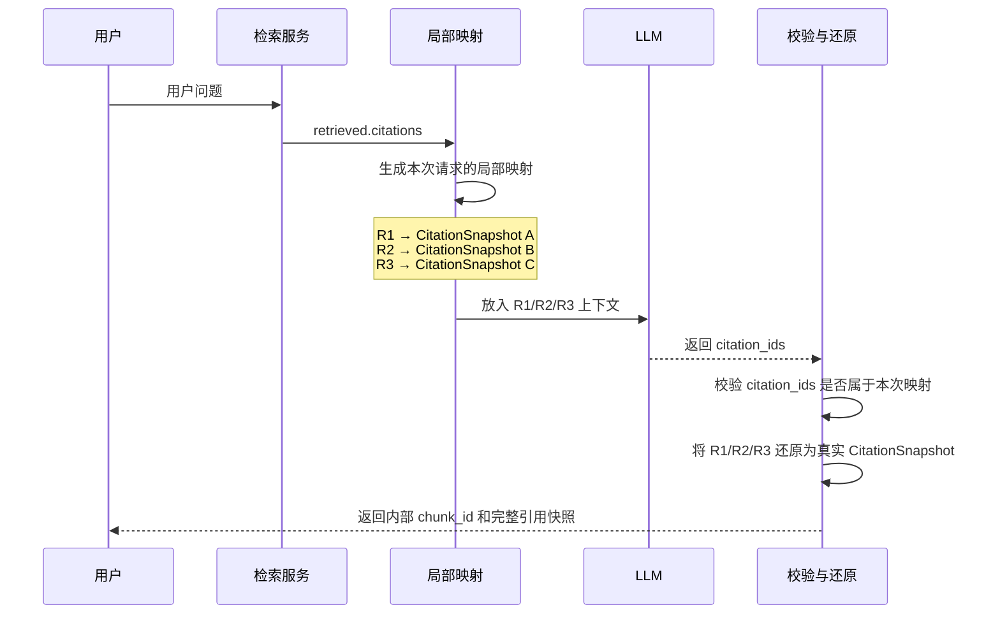

## 1.绪言

事情的起因是这样，今天在推RAG构建的时候，遇到了这样一个问题：

定义了一些problems去给Agent做测试看整个RAG问答过程中搜索、匹配以及引用召回的过程有没有什么问题，然后发现Agent的返回答案中出现了一些异常的现象，引用的`citation_id`超出了范围，根本就不存在对应的`chunk`

这个问题还是比较严重的，为什么？它会把原本的异常伪装成成功的回答，给用户构造了一个错误的，或者说根本就没有的源头，丧失可信度，胡言乱语，看到召回率以为很高，其实都是假数据

所以我们现在来尝试解决这个问题

---

## 2.问题根因

其实源头就是Chunk编号导致的，我原本在项目中对Chunk是这样编号的

```python
chunk_id = stable_hash(
    document_id,
    content_hash,
    parsed.heading_path,
    str(index),
)
```

然后`stable_hash`据此生成64位十六进制哈希值，我试图让Agent稳定地引用这个`chunk_id`，这显然是做不到的

为什么？回顾LLM的思考机制，经过Tokenizer，这个长串的`chunk_id`就会被切分成几个语义毫不相干的Token，当LLM尝试预测连续多个非语义Token，其命中正确`chunk_id`的概率就会显著下降

以及形式化外推和经典的Lost in Middle问题，当缺乏精确的上下文记忆，LLM宁愿胡说八道也不愿意说它实际上不清楚，因为被套上了遵守格式的硬约束

---

## 3.方案选择

接下来我们来开始解决这个问题，大概有三种方案：Prompt约束、重试机制以及局部映射

首先来讲Prompt约束，这个实现算是比较简单，不外乎就是在RAG系统中的Prompt里加上几句话，但是它的可靠性怎么样？仍然非常低，因为你就算三令五申让它不要瞎猜，指不定你这个提示词本身都被Lost了，谁还管你会不会幻觉，这个就是典型的软约束方案，也是之前的Prompt Engineering的痛点，无法行之有效地对模型产生硬约束，治标不治本

随后是重试机制，这个比较好理解，在运行期，看到你这轮回答引用的`citation_id`越界了，就告诉模型去尝试重试。可靠性还行，对降低偶发率有一定的效果，但是有一个比较致命的问题就是显著带来了运行负担，一次重试两次重试，浪费的都是时间和资源，它可以作为一个辅助，但绝对不能作为解决这个问题的主力

最后则是我们今天要介绍的重点，**短局部标签+服务端映射**，我们接下来详细讲一下

---

## 4.局部映射

首先对于RAG，我们对给定的`query`，在预处理好的向量数据库中进行召回

```python
retrieved = await self.retrieve(retrival_query or query, mode=mode, limit=limit)
```

然后这里召回的Chunk的编号就是其在向量数据库中的编号，即上面所提到的64位十六进制SHA-256编码

我们现在肯定不能直接拿着这个编码去给LLM处理了，所以考虑局部映射，具体地：

```python
citation_labels = {
    f"R{index}": citation for index, citation in enumerate(retrieved.citations, start=1)
}
evidence = build_evidence_context(
    retrieved.citations,
    citation_labels=citation_labels,
)
```

通过这种方式，最终LLM看到的就是：

```python
citation_labels = {
    "R1": citation_a,
    "R2": citation_b,
    "R3": citation_c,
}
```

然后只能这样引用：

```python
{
  "answer": "...",
  "citation_ids": ["R1", "R3"],
  "evidence_status": "supported"
}
```

最后通过服务端这边再将对应的`citations_ids`转换成原始的`citation`

使用这种`R1`类的编号，取代了原有一长串的随机编码，将其有效性从模型的不可预测行为转为了服务端可预测的问题

将一次完整的问答整理一下，现在就是这样的流程：



---

## 5.小结

最后，看到一句话特别适合今天的这个场景：

> 把复杂留给服务端，把简单留给LLM

以上
