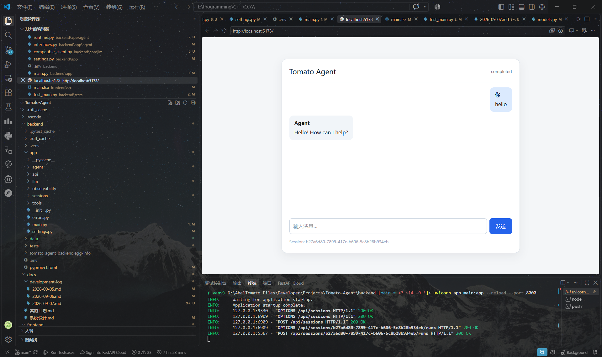

## 1.绪言

机缘巧合之下决定从零开始搭建一个Agent，期望能够在这个过程中真正入门Agent

为了挑战自己，决定至少在现在初期不用任何现有的Agent框架，包括LangChain之类

所以开始吧

---

## 2.思路梳理

我们已经知道，Agent其实就是带有Skill和Tools，并拥有记忆和感知功能的LLM，LLM就是Agent的大脑

现在最难的LLM部分，我们直接通过调用模型API来解决，那么接下来要做的就是帮助大脑搭建出它的身体，进而成为一个完整的"人"

构建一个Agent的最小原型，我们需要考虑以下方面：

- 基本Loop：实现接收用户输入 -> 判断直接回复或者调用工具 -> 调用工具 -> 根据工具结果判断是否进行新一轮Loop，或者直接回答用户，这样的一个循环过程
- Tools：考虑实现Agent可以直接调用的工具，例如calculator、search这些
- Session：不同session之间的独立性，且session可切换、可恢复
- Context：实现基本的Context管理，例如持续对话的状态记忆、追问、基础的Context Compact
- 基本的异常处理和工具调用trace以及执行日志

我们一步步来

---

## 3.Tools

其实Tools很简单，说到底也就是几个函数，API接口或者数据库操作指令而已

首先，一个tool肯定需要有名字和描述，所以加入`name`和`description`属性

其次，还需要定义，这个定义不是那种用字符串直接描述的定义，而是可以随时随着工具类的名称、描述、参数改变而改变的Python对象

那么参数呢，参数如何定义？显然我们也需要一种定义方式，能够将我们在程序中的定义转变为某种固定的形式，从而发送给LLM以确定参数格式

最后则是工具的执行函数

尝试定义Tools基类：

```python
class Tool(Protocol):
    name: str
    description: str
    input_model: type[BaseModel]

    def definition(self) -> ToolDefinition: ...

    async def execute(
        self, arguments: dict[str, Any], context: ToolContext
    ) -> ToolResult: ...
```

这里的`input_model`就是我们对于输入的定义，比如在`Calculator`工具类中：

```python
class CalculatorInput(BaseModel):
    expression: str = Field(min_length=1, max_length=500)
```

这里的`BaseModel`是由Pydantic提供的基类，也是实现类型校验的关键之处，通过`Field`对输入字段进行限制，从而实现动态运行时校验

还是以`Calculator`为例，再来看看它的`definition()`

```python
def definition(self) -> ToolDefinition:
    return ToolDefinition(
        name=self.name,
        description=self.description,
        parameters=CalculatorInput.model_json_schema(),
    )
```

其中`ToolDefinition`的定义如下：

```python
class ToolDefinition(BaseModel):
    name: str
    description: str
    parameters: dict[str, Any]
```

没错只需要这么简单，我们只用一个字典就可以描述任意的入参，然后`BaseModel`内部实现的方法`model_json_schema()`则可以将当前类定义转为字典格式输出，这也就刚好可以为LLM所阅读

其次关于`ToolContext`，虽然目前并没有使用到这个东西，但是它可以被用于查询持久化仓库或者其他需要调用特定会话中的历史状态的工具

---

## 4.Session

随后是session的管理，其实这里的核心只有两个：**层级拆分**和**持久化**

初期demo所以我只用了`aiosqlite`，实现了一个`SessionRepository`类进行持久化管理

然后是层级拆分，如何拆分一个会话的结构？

首先显然地，每一个会话都是一个`session`，可以做一个总览性的描述

随后每一轮对话，Agent会收到一个任务，然后会进行一次运行，尝试去solve这个任务并给回response，我们就把这一次的运行定义为一次`run`

在每一次`run`中，可能会发生各种各样的事件并响应到LLM，比如工具调用结果，比如调用报错，又或者触发compact的结果，我们称之为`event`

最后则是每一次`run`的恢复机制，在LLM执行任务的过程中，显然可能因为各种原因从而中断当前任务的执行，而此时我们定义一个`checkpoint`，定期记录当前`run`的执行状态，这样即使执行中断也能根据`checkpoint`快速恢复状态，而非从头开始

因此在`SessionRepository`中有数据库初始化：

```python
async def init(self):
    self.path.parent.mkdir(parents=True, exist_ok=True)
    async with aiosqlite.connect(self.path) as db:
        await self._enable_foreign_keys(db)
        await db.executescript("""
        CREATE TABLE IF NOT EXISTS sessions (id TEXT PRIMARY KEY, status TEXT NOT NULL, metadata TEXT NOT NULL, created_at TEXT NOT NULL, updated_at TEXT NOT NULL);
        CREATE TABLE IF NOT EXISTS runs (id TEXT PRIMARY KEY, session_id TEXT NOT NULL, status TEXT NOT NULL, loop_count INTEGER NOT NULL, state TEXT NOT NULL, created_at TEXT NOT NULL, updated_at TEXT NOT NULL, FOREIGN KEY (session_id) REFERENCES sessions(id));
        CREATE TABLE IF NOT EXISTS events (id TEXT PRIMARY KEY, session_id TEXT NOT NULL, run_id TEXT NOT NULL, sequence INTEGER NOT NULL, event_type TEXT NOT NULL, payload TEXT NOT NULL, created_at TEXT NOT NULL, UNIQUE(run_id, sequence), FOREIGN KEY (session_id) REFERENCES sessions(id), FOREIGN KEY (run_id) REFERENCES runs(id));
        CREATE TABLE IF NOT EXISTS checkpoints (run_id TEXT PRIMARY KEY, sequence INTEGER NOT NULL, state TEXT NOT NULL, created_at TEXT NOT NULL, FOREIGN KEY (run_id) REFERENCES runs(id));
        """)
        await db.commit()
```

注意到这里在`checkpoints`表中使用`run_id`作为主键，因此每一个`run`只能绑定一个`checkpoint`，因为这里采用的是更新覆盖机制，即后来的`checkpoint`覆盖前面的，没有实现多`checkpoint`历史状态快照保留

---

## 5.Context

既然要把Agent看成一个人，那么它就应当有记忆系统

但很可惜的是，我们的大脑LLM只能说是一个处理器，它无法持久化记忆，所以我们必须自行解决记忆管理问题

相较于我们日常生活中使用的字符数量统计，LLM使用**token**作为最小语义处理单元

大模型LLM本身并不认识字，本质上就是一堆数学上的矩阵在进行概率计算，对于我们日常生活中使用的文字，需要先通过Tokenizer分词器将文本词句划分为一串串数字ID

例如对于英文，`unhappy`被切割为`un`和`happy`进行分析，一般来说一个常见单词算一个token，而中文汉字占据的token数量更多

回到记忆，Agent所记忆的内容就是token，这个记忆区间就叫做Context即上下文窗口，然而Context窗口的大小是有上限的，如果超过限制，就很可能失忆甚至报错

因此我们需要对其进行合理的管理，而其中较为简单的方法就是在临近上限时对当前已有上下文进行提炼压缩，这个过程就是**Compact**

我们定义一个`ContextManager`类用于管理上下文，并实现两个核心方法：

`build()`：

```python
def build(
    self,
    system_instruction: str,
    state: ContextState,
    messages: list[Message],
) -> list[Message]:
    prefix = self._bulid_system_message(
        system_instruction, state, self.max_tokens
    )
    remaing = self.max_tokens - self._tokens(prefix)
    selected: list[Message] = []
    for message in reversed(messages[-self.recent_messages :]):
        if remaining <= 0:
            break
        content = self._truncate(message.content, remaining)
        if not content:
            continue
        selected.append(message.model_copy(update={"content": content}))
        remaining -= self._tokens(content)
    selected.reverse()
    return [Message(role="system", content=prefix), *selected]
```

这个是用来干嘛的呢？在每次调用LLM之前，需要整理当前的情况，一并发送给LLM，因为前面已经知道，他那边是不会帮你储存信息的

而这个`build()`方法的作用就是，整理当前系统的情况，历史信息，一并返回并发送给LLM

例如其中的`system_instruction`，这个字段用来告诉LLM你是什么角色，行为规则如何，输出格式和安全限制等等

然后先根据当前上下文的状态，做summary，列出相关的记忆信息以及尚未解决的问题，再在`token_limit`的限制下做截断，生成一条`system_message`，并与先前的消息同样做截断之后发送给LLM

然后就是`compact()`：

```python
def compact(self, state: ContextState, messages: list[Message]) -> ContextState:
    old = messages[: -self.recent_messages]
    if not old:
        return state
    lines = [f"{message.role}: {message.content[:300]}" for message in old]
    summary = (state.summary + "\n" + "\n".join(lines)).strip()
    return state.model_copy(update={"summary": summary[-4_000:]})
```

这里就是做了简单的滑动窗口截断

---

## 6.Loop

现在就是最核心，最关键的部分：**Loop**

或者说，Agent Runtime如何设计，何时去调配上下文管理器，何时恢复`run`，何时进行压缩

我们考虑设计这样的一个入口：LLM调用它，在一个`session`中跑完一个`run`，然后根据`RunResult`再回头进行决策

定义`AgentRuntime`类，设计接口函数：

```python
async def run(
    self,
    session_id: UUID,
    user_message: str | None = None,
    run_id: UUID | None = None
) -> RunResult:
    ...
```

首先思考要说什么，发起一轮`run`，本质上是发起一个解决问题的过程，在这个过程中重复地根据工具结果进行尝试，直到认为可以反馈给用户

那么在循环开始前需要做什么准备工作？自然是根据输入的`session_id`和`run_id`，尝试创建或是恢复`run`

```python
trace_id = uuid4()
started_at = monotonic()
run_id = await self._start_or_resume_run(
    session_id=session_id,
    run_id=run_id,
    trace_id=trace_id,
)
```

- `_start_or_resume_run()`：

```python
async def _start_or_resume_run(
    self,
    session_id: UUID,
    trace_id: UUID,
    run_id: UUID | None = None,
) -> UUID:
    if run_id is None:
        run_id = await self.repository.create_run(session_id)
        await self.repository.append_event(
            session_id,
            run_id,
            "run_started",
            { "trace_id": str(trace_id) }
        )
    else:
        existing = await self.repository.get_run(run_id, session_id)
        if existing is None:
            raise ValueError(f"Run not found: {run_id}")
        if existing.status in {"completed", "failed"}:
            raise ValueError(
                f"Run {run_id} is terminal and cannot be resumed"
            )

    return run_id
```

随后尝试获取当前`run`的状态，因为这个`run`如果是被恢复的，在之前可能会有旧的信息

```python
messages, state, counters = await self._load_runtime_state(
    session_id=session_id,
    run_id=run_id,
)
```

- `_load_runtime_state`：

```python
async def _load_runtime_state(
    self,
    session_id: UUID,
    run_id: UUID,
) -> tuple[list[Message], ContextState, RuntimeCounters]:
    run = await self.repository.get_run(run_id, session_id)
    if run is None:
        raise ValueError(f"Run not found: {run_id}")

    session = await self.repository.get_session(session_id)
    if session is None:
        raise ValueError(f"Session not found: {session_id}")

    checkpoint = await self.repository.get_checkpoint(run_id)
    state, counters = self.restore_checkpoint(checkpoint.state if checkpoint else None)
    if checkpoint is not None:
        counters.last_sequence = checkpoint.sequence

    if checkpoint is None:
        metadata_state = {
            key: session.metadata[key]
            for key in ContextState.model_fields
            if key in session.metadata
        }
        state = ContextState.model_validate(metadata_state)

    events = await self.repository.list_events(run_id)
    messages: list[Message] = []
    for event in events:
        message = self._message_from_event(event.event_type, event.payload)
        if message is not None:
            messages.append(message)
        counters.last_sequence = max(counters.last_sequence, event.sequence)

    return messages, state, counters
```

这里还用到了两个辅助函数，但是先讲讲这里面的顺序逻辑

首先自然是尝试通过`session_id`和`run_id`把库里面的`session`和`run`给搞出来

然后看看有没有`run`对应的`checkpoint`，如果有也读出来，然后尝试通过这个`checkpoint`恢复`state`和`counters`的信息

这里的`sequence`是什么意思？就是这个`run`中的事件日志中的事件序号，用于标识当前这个`run`已经处理到哪一条事件，比如`checkpoint`里的`last_sequence`就是指这个检查点记录状态的时候当前处理的最新一条事件是哪条

所以如果有这个`checkpoint`历史的话就好办可以直接通过`checkpoint`恢复记录，但是如果没有呢？就得尝试通过`session`层面的记录来恢复了，这也是`metadata_state`那一块的逻辑

然后那两个工具函数在逻辑上也不难理解，这里就不再展开，回到主线

再然后就是在真正的循环之前，本轮不是可能读入了用户的输入吗，就需要考虑处理这个输入：

```python
if user_message is not None:
    messages.append(Message(role="user", content=user_message))
    counters.last_sequence = await self._append_user_message(
        session_id=session_id,
        run_id=run_id,
        message=user_message,
        trace_id=trace_id,
    )
```

读取了用户输入，这显然也是一个`event`的发生，所以要考虑将这个`event`写入数据库中：

```python
async def _append_user_message(
    self,
    session_id: UUID,
    run_id: UUID,
    message: str,
    trace_id: UUID,
) -> int:
    return await self.repository.append_event(
        session_id,
        run_id,
        "user_message",
        {"content": message, "trace_id": str(trace_id)},
    )
```

自此，一切准备工作都已完成，我们可以进入循环了！

```python
try:
    while True:
        ...
except Exception as exc:
    counters.elapsed_second = max(
        counters.elapsed_seconds,
        monotonic() - started_at,
    )
    return await self._fail_run(
        session_id,
        run_id,
        state,
        counters,
        trace_id,
        exc,
    )
```

这就是一个整体的结构，内部循环抛异常的时候外部捕获，标记此次`run`失败

再来看循环体内：

```python
self._check_budget(
    loop_count=counters.loop_count,
    tool_call_count=counters.tool_call_count,
    started_at=started_at,
    persisted_elapsed=counters.elapsed_seconds,
)
```

这一步是用来校验`counters`中记录的`run`的数据有没有超出限制的，比如循环次数过多，再比如工具调用次数过多，或者`run`运行的时间太长

在这里目前的处理就是直接抛异常出来

随后

```python
counters.loop_count += 1
state = self.context_manager.compact(state, messages)
context_messages = self.context_manager.build(
    self.system_instruction,
    state,
    messages,
)
```

这一部分就是总结上下文，该做`compact`的做`compact`，然后用前面提到的`build`方法整合上下文，整理成能够直接发给LLM的信息

```python
response = await self.llm.complete(
    context_messages,
    self.tool_registry.definitions(),
)
self._validata_response(response)
```

这里就是核心了，Agent调用LLM，将`context_messages`发过去，可调用的tools也发过去，然后拿到响应结果，做校验

随后就是`if-else`做分支判断，`LLMResponse`的种类只有三种：`final`，`tool_call`，`clarification`

```python
if response.kind == "final":
    return await self._complete_run(
        session_id,
        run_id,
        response,
        state,
        counters,
        trace_id,
    )
if response.kind == "clarification":
    return await self._pause_for_clarification(
        session_id,
        run_id,
        response,
        state,
        counters,
        trace_id,
    )
messages = await self._execute_tool_call(
    session_id,
    run_id,
    messages,
    state,
    response,
    counters,
    trace_id,
)
```

这个也很好理解，`final`和`clarification`，一个是终末状态，直接返回结果，一个是需要用户澄清，也就是追问，也需要暂时结束当前`run`返回结果从而从用户获取更多信息，因为当前的信息不够去解决问题嘛

最后需要继续循环的情况只有调用工具，也就是`tool_call`，其实和`clarification`的区别就在于一个向工具要后续，一个向人要后续，从而做出的响应分支也就不同

最后的最后，记录一下当前`run`的时间，整体流程也就结束了

```python
counters.elapsed_seconds = max(
    counters.elapsed_seconds,
    monotonic() - started_at,
)
```

回顾一下，就可以发现Agent的构建其实并没有我们想象中的那么难，至少对于这种初期较为简单的Agent来说，也就只是一种状态机，通过合理地对逻辑进行拆分、分散，整个链路其实是一目了然的

---

## 7.试运行

整个Agent Runtime已经搭好，现在是时候试一下成果了

让Agent帮我写了一个OpenAI Compatible的适配接口，然后在`.env`里配置了一下API和base_url之类的，兴致冲冲开始拉起本地服务

然后发现前端发送信息半天没响应，看了一眼后端的CLI那里，居然连请求显示都没有，大感疑惑，开始排查

用`curl`请求了一下后端`\health`接口，返回正常`{ "status": "ok" }`，但是后端`uvicorn`那边仍然没有任何提示，于是突然想起来今天稍早之前还拉起了另一个项目的服务...端口一样的，好像忘记关了，看了一眼果然是

关掉之后重新拉起服务，再尝试发起请求，这次倒是有响应了，只不过是405

开始排查路由配置，发现根本没有一个逻辑会导向405啊？！后面让Agent排错才发现原来是跨域问题...浏览器发出的预检请求`OPTIONS`后端识别不了，被FastAPI拒绝了

加了跨域的域名配置以及简单的跨域中间件，再次尝试，这次终于成功了

<div align="center">



</div>

这显然是崭新的一步！
