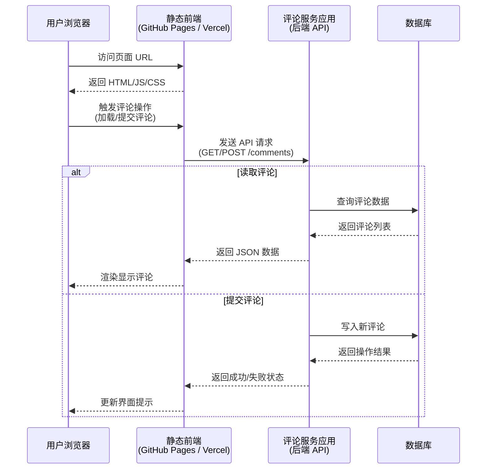
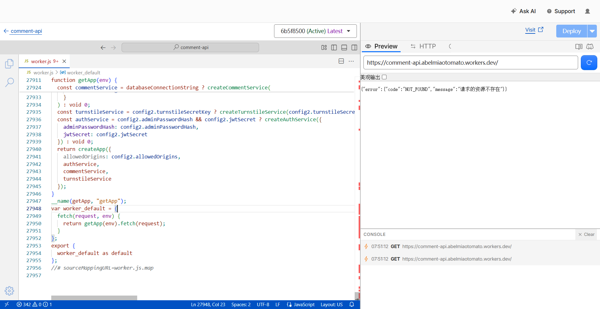

## 1.绪言

其实在放暑假之前就已经搭好了，但是回学校之后突然发现诶怎么好像又寄了，排查了一下发现是Railway的服务挂了，Project是offline状态，再仔细一看哦原来是试用额度用完了，接下来还想用就得交钱

那我能受这气？于是重新去找免费渠道，鏖战了大半天终于把评论系统给重新拉起来了

说起来这应该是我首次比较接近真正意义上地部署一个全栈Web应用上线，跟着Agent折腾了好久，于是打算把这其中的搭建过程记录下来，故有此篇

---

## 2.整体架构总览

其实这个系统的整体流程算是比较简单，无非就是用户浏览器通过访问GitHub Pages或者Vercel页面，然后拉取评论服务应用，前端通过向评论服务应用发送API请求获取或者添加评论，应用再与数据库交互以读写评论



---

## 3.评论服务应用

### 3.1.应用主体

从上面的图可以看出，评论服务应用的作用是充当前端界面与数据库之间的耦合层，接收前端API请求，然后根据请求对数据库进行操作

在`app.ts`中，通过导出`createApp()`函数以创建应用：

```ts
export function createApp(options: CreateAppOptions = {}) {
    const app = new Hono();
    ...
}
```

注意到这里创建了一个`Hono`实例作为应用`app`，什么叫Hono？其实就是一个轻量级的Web框架，非常契合现在搭建的这个评论HTTP API服务

例如通过`use()`方法给Hono实例注册中间件：

```ts
app.use("*", securityHeadersMiddleware);
app.use(
    "*",
    createCorsMiddleware({
        allowedOrigins: options.allowedOrigins ?? ["http://localhost:4321"],
    }),
);
app.use(
    "/api/comments/*",
    createRateLimitMiddleware({ windowMs: 60_000, maxRequests: 5 }),
);
```

在这里就是对所有路径`*`，都需要通过`securityHeadersMiddleware`以及`createCorsMiddleware`两个中间件给所有响应统一加安全相关的HTTP头以及处理跨域问题

以及对于路径`/api/comments/*`，添加限流中间件

再后面就是`get()`方法：

```ts
app.get("/health", (c) => {
    return c.json({ status: "ok" });
});
```

这里就是定义对于具体的接口，Hono应该做出什么样的响应

那么这个`c`是什么？它是Hono自有的上下文(Context)对象，代表一次具体的HTTP请求处理中的请求环境

具体到这里来说，这个`c`代表的就是此次针对`/health`路径的`GET`请求的上下文，然后通过`c.json()`生成JSON响应，设置响应头中`Content-Type: application/json`

除了`json()`，`c`中还有

- `c.req`：表示当前请求对象，里面有请求方法`c.req.method`，有请求URL`c.req.url`，还能获取请求头以及其中的对应项`c.req.header("authorization")`
- `c.text()`：返回纯文本响应
- `c.status()`：设置响应的状态码
- `c.param()`：获取路由参数，例如：
  
  ```ts
  app.get("/users/:id", (c) => {
    const id = c.param("id");
  });
  ```

- `c.req.query()`：获取查询参数，比如对于请求`/search?q=astro`可以写`const q = c.req.query("q");`

下面是`route()`方法：

```ts
app.route(
    "/api/comments",
    createCommentRoute({
        commentService,
        turnstileService: options.turnstileService,
    }),
);

if (options.authService) {
    app.route(
        "/api/admin",
        createAdminRoute({
            authService: options.authService,
            commentService,
        }),
    );
}
```

其实这里说起来，和FastAPI的`include_router()`有些类似，都是属于将子模块挂载到主应用程序上

我们来看`createCommentRoute()`

```ts
export function createCommentRoute({
    commentService,
    turnstileService
}: CreateCommentRouteOptions) {
    const route = new Hono();
    ...
}
```

这里创建的新的`Hono()`实例就类似于一个子应用，我们可以对子应用进行同样的定义操作

```ts
route.get("/", async (c) => {
    const query = listCommentsQuerySchema.safeParse({
        postSlug: c.req.query("postSlug"),
    });
    ...
});

route.post("/", async (c) => {
    const json = await readJson(c.req.raw);
    const body = createCommentBodySchema.safeParse(json);
    ...
});
```

最后

```ts
return route;
```

在`route`子应用中定义的事件处理函数跟随`route`被挂载到`app`上，在这里把`app.route`中的路径拼起来，就得到了`route`中定义的事件处理函数的路径即为`/api/comments`

与FastAPI中的`include_router()`相同，这种挂载子模块的方式有效降低了代码的耦合度，能够合理拆分模块

最后则是`onFound()`和`onError()`方法，这两个就没什么好解释的了：

```ts
app.notFound(() => {
    throw createHttpError(404, "NOT_FOUND", "请求的资源不存在");
});

app.onError((error, c) => {
    if (!(error instanceof Error) || error.name !== "HttpError") {
        console.error("Unhandled request error", {
        name: error instanceof Error ? error.name : "UnknownError",
        message: error instanceof Error ? error.message : String(error),
        });
    }

    const { status, body } = errorToResponse(error);
    return c.json(body, status);
});
```

---

### 3.2.worker

但是`createApp()`实际上并不是API入口，回想我们需要的是什么，是不是类似于输入请求，拿到响应的一个函数，所以在`worker.ts`中，我们有定义：

```ts
function getApp(env: WorkerEnv) {
    const config = loadConfig({
        PORT: env.PORT,
        ...
    });
    ...
    return createApp({
        allowedOrigins: config.allowedOrigins,
        authService,
        commentService,
        turnstileService,
    });
}

export default {
    fetch(request: Request, env: WorkerEnv) {
        return getApp(env).fetch(request);
    },
}
```

最后导出了一个包含`fetch`方法的对象，等价于

```ts
const worker = {
    fetch(request, env) {
        return getApp(env).fetch(request);
    },
};

export default worker;
```

这也是Cloudflare Workers运行环境要求的入口形式之一，这个对象就是主入口

我们来看Cloudflare打包好的bundle：



最终导出并被Cloudflare调用的入口就是这个`worker`对象

---

## 4.数据库

现在后端有了，需要存储数据，那么就得搞一个数据库

原本是一个Railway同时托管了后端和数据库的，但是现在寄了，所以得另找一个免费的平台

通过Agent推荐，发现Supabase貌似还不赖

那么存储数据的地方找到了，我们该如何让数据库知道我们的表结构呢？

---

### 4.1.Drizzle

Drizzle是一个ORM工具，相较于Prisma这些传统的ORM工具，它倾向于拥抱SQL，且极致轻量

重新审视这个评论系统服务，可以很容易看出，它并不是一个需要高频交互读写，对即时性要求强的应用场景

所以我们采用了**Serverless架构**，即无服务器架构，通过将核心业务代码上传到云端，由云厂商帮我们进行运维

它也有一个旗帜鲜明的特征就是事件驱动，不需要常驻后台维护，只有当用户需要读写评论的时候才运行

前面我们提到的Cloudflare worker，就是Serverless架构的典型代表，或者进一步说，它是**Edge Serverless**，区别于传统的Serverless基于容器或者微型虚拟机启动，带有冷启动延迟，Cloudflare worker通过隔离沙箱技术，部署在全球多个边缘节点，能够达到启动几乎零冷启动延迟

选择Drizzle的理由也是它对于Serverless架构的高度适配

首先通过Drizzle使用TypeScript描述表结构：

```ts
export const comments = pgTable(
    "comments",
    {
        id: uuid("id").primaryKey().defaultRandom(),
        postSlug: text("post_slug").notNull(),
        ...
    },
    (table) => [
        index("comments_post_status_created_idx").on(
            table.postSlug,
            table.status,
            table.createdAt.desc(),
        ),
        ...
    ]
)
```

随后Drizzle通过

```bash
pnpm --filter comment-api db:generate
```

生成迁移文件，再通过

```bash
pnpm --filter comment-api db:migrate
```

参考本地配置的`DATABASE_URL`环境变量，也就是数据库的连接串，从而执行迁移，Supabase的Postgres数据库就初始化成功了

---

### 4.2.client

现在只需拉起一个数据库的`postgres`实例，就能为worker所用：

```ts
export function createDb(config: Pick<AppConfig, "databaseUrl" | "hyperdriveConnectionString">) {
    const connectionString = config.hyperdriveConnectionString ?? config.databaseUrl;

    if (!connectionString) {
        throw new Error("DATABASE_URL or HYPERDRIVE_CONNECTION_STRING is required to create a database client");
    }

    const client = postgres(connectionString, {
        max: 1,
        prepare: false,
        fetch_types: false,
    });

    return drizzle(client, { schema });
}
```

然后再在worker中导入，worker就能直接调用数据库服务了

这个`drizzle()`通过传入`postgres()`创建出的底层数据库连接，以及表结构定义`{ schema }`，返回了一个Drizzle ORM的数据库实例

---

## 5.Cloudflare Hyperdrive

通过上文，我们可以很容易看出，worker的工作方式是无状态的、短生命周期的、并发高实例多的

而我们采用的数据库是Postgres，它更倾向于长连接，建连成本较高

如果让worker层直接连接Supabase的Postgres，则容易导致连接频繁创建销毁，打满数据库连接上限，后发请求长时间排队，连接超时等问题

所以为了解决这个问题，我们引入**Cloudflare Hyperdrive服务**

具体来说，它是Cloudflare推出的数据库加速及连接池托管服务，主要用于解决的就是无服务器计算(就像现在这样)在连接传统关系型数据库像是PostgreSQL以及MySQL时面临的**高延迟**和**连接数被打爆**两大痛点

具体来说，它有三大核心技术机制：

- **全球分布连接池**：Hyperdrive在Cloudflare的边缘节点与你的源数据库之间维护常驻的长连接池，从而worker只需就近连接到**Cloudflare内部**的Hyperdrive节点，通过Hyperdrive帮大量的worker实例复用有限的数十个数据库连接
- **自动TLS/TCP握手与协议优化**：传统SQL握手需要经历`TCP` + `TLS` + `Auth`，跨国请求消耗大量RTT时间；而Hyperdrive提前建立了与源数据库的加密通道，大幅减少网络往返成本
- **边缘只读查询缓存**：Hyperdrive内部集成了一套极为保守的**SQL级边缘缓存**，通过缓存简单可预测的只读查询，在边缘节点缓解数据库压力，也提升查询速度

---

## 6.小结

从Cloudflare到Supabase折腾了一圈，也算是积累了一些应用上线部署的经验

其实我本来还想拓展一下JWT相关内容，但是写累了，再者这篇也有点长了，所以下次再说吧
