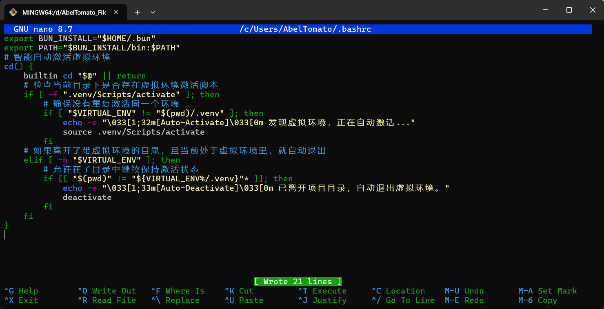
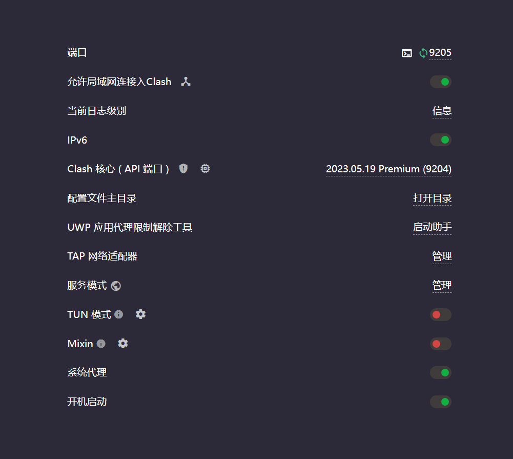
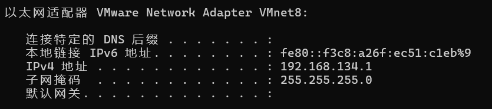

被环境配置折磨114514年之后，我决定将配置环境的流程固定记录下来，以供之后参考

## 1.FastAPI

### 1.1.Windows + Git Bash环境

- 打开文件夹

```bash
mkdir fastapi_project && cd fastapi_project
```

- 配置虚拟环境

```bash
python -m venv venv
```

- 激活虚拟环境

```bash
source ./venv/Scripts/activate
```

- 这里我有VPN，就不换源了，安装FastAPI和uvicorn

```bash
pip install fastapi uvicorn
```

- 固化依赖

```bash
pip freeze > requirements.txt
```

- 可行性验证
  - 建立文件`main.py`
  
  ```bash
  touch main.py
  ```

  - 打开`main.py`，加入如下代码
  
  ```python
  from fastapi import FastAPI

  app = FastAPI()

  @app.get("/")
  def read_root():
      return {"status": "success", "msg": "Hello World!"}
  ```

  - 在Git Bash中使用Uvicorn启动热更新服务器
  
  ```bash
  uvicorn main:app --reload
  ```

  - 打开浏览器，确认两个网址
  
  `http://127.0.0.1:8000/`返回JSON

  `http://127.0.0.1:8000/docs`Swagger UI界面正常交互

- 上述一切正常后，配置完成

---

## 2.让项目打开后自动进入虚拟环境

### 2.1.Windows + Git Bash环境

- 打开或创建`.bashrc`

```bash
nano ~/.bashrc
```



- 将光标移动至末尾空白处，将下面的代码右键粘贴进去

```bash
# 智能自动激活虚拟环境
cd() {
    builtin cd "$@" || return

    local env_dir=""
    # 动态探测当前目录下是否存在 venv 或 .venv
    if [ -f ".venv/Scripts/activate" ]; then
        env_dir=".venv"
    elif [ -f "venv/Scripts/activate" ]; then
        env_dir="venv"
    fi

    if [ -n "$env_dir" ]; then
        # 确保没有重复激活同一个环境
        if [ "$VIRTUAL_ENV" != "$(pwd)/$env_dir" ]; then
            echo -e "\033[1;32m[Auto-Activate]\033[0m 发现虚拟环境 ($env_dir)，正在自动激活..."
            source "$env_dir/Scripts/activate"
        fi
    # 如果离开了带虚拟环境的目录，且当前处于虚拟环境里，就自动退出
    elif [ -n "$VIRTUAL_ENV" ]; then
        # 直接切掉最后一级（无论是 /venv 还是 /.venv），精准拿到项目根目录
        local project_dir="${VIRTUAL_ENV%/*}"
        
        # 巧妙利用末尾斜杠匹配，防止 /workspace-toxic 误触发 /workspace 的路径
        if [[ "$(pwd)/" != "$project_dir/"* ]]; then
            echo -e "\033[1;33m[Auto-Deactivate]\033[0m 已离开项目目录，自动退出虚拟环境。"
            deactivate
        fi
    fi
}
```

- 粘贴后，`Ctrl` + `O`保存，`Enter`确认，`Ctrl` + `X`退出

- 让配置生效

```bash
source ~/.bashrc
```

- 如果配置未生效,推测为Git Bash默认读取`.bash_profile`文件，尝试在终端中执行以下命令并重试

```bash
echo "source ~/.bashrc" >> ~/.bash_profile
```

---

## 3.配置Ubuntu虚拟机使用主机VPN流量

由于虚拟机的网络连接默认使用NAT模式，即在物理机内虚拟出一个"路由器"，虚拟机连接在虚拟路由器上，上网时流量经过虚拟路由器，借由物理机网卡转发

而大多数常规VPN软件默认只代理宿主机本地的系统代理端口，则不会接管虚拟机的流量

还可能是桥接模式，虚拟机成为局域网内的一台独立实体电脑，和物理机地位平等，直接向真实路由器申请IP地址，此时VPN更无法起效

下面是配置流程：

### 3.1.Windows + Git Bash环境

- 打开物理机上的VPN客户端，勾选"允许局域网连接"或"局域网共享"



- 记录此时的代理端口，这里是9205
- 在物理机终端输入`ipconfig`，找到虚拟机对应的IP地址，这里用的是VMware Network Adapter Vmnet8，为`192.168.134.1`



- 回到Ubuntu虚拟机，打开设置 -> 网络
- 找到网络代理，把它从Off改成手动
- 在HTTP/HTTPS后面填入
  - Host：刚刚查到的物理机IP
  - Port：VPN端口
- 保存，设置成功

注意这种设置只对浏览器和常规软件生效，如果在终端中还需要走代理，在Ubuntu终端中临时跑一句：

`export http_proxy="http://你的物理机IP:端口" && export https_proxy=$http_proxy`

---

## 4.让主机的VSCode连接虚拟机环境

### 4.1.Ubuntu

- 在Ubuntu中打开终端，先更新包列表

```bash
sudo apt update
```

- 安装SSH服务端

```bash
sudo apt install openssh-server -y
```

- 检查服务是否正在运行

```bash
sudo systemctl status ssh
```

- 若为active(running)则成功，若未运行，输入下面命令，使其作为常驻服务

```bash
sudo systemctl enable --now ssh
```

- 查询虚拟机IP地址，找类似`192.168.x.x`或`10.x.x.x`的地址

```bash
ip a
```

- 回到主机VSCode，下载`Remote SSH`插件
- 点开左侧`Remote Explorer`图标，点击`+`添加新连接
- 在上方弹出输入框中，输入

```txt
ssh 你的Ubuntu用户名@刚才查到的虚拟机IP
```

- 注意这里用户名一定要小写！！
- 按回车，让你选择配置文件保存在哪里，默认第一个
- 随后在左侧对应IP点击新窗口连接，选择`Linux`，`Continue`，输入密码
- 连接成功后，就按照正常打开文件夹的方式，打开你要工作的目录，再次输入密码确认即可
