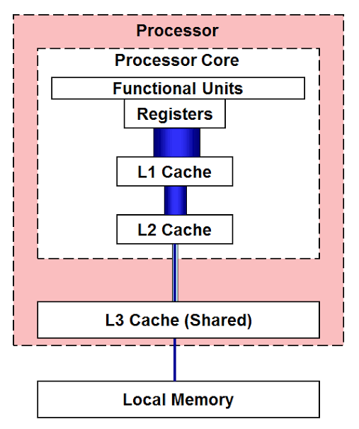

## 1.绪言

放假在家躺尸了几天，翻了翻CSAPP，看到主存那部分，突然想起来新买的平板有一个功能就是用辅存去扩容主存，一时间挺好奇的，而且感觉扩容了之后没什么差别（？

于是决定研究一下这背后的原理，从现在开始吧

---

## 2.从计算机存储层次结构开始

### 2.1.时间与空间的权衡

什么是计算机存储层次结构？来用一个简单的比喻说明

假设你是一个学生，坐在书桌前，正在读书

你的大脑是处理器，可以用来处理书本的知识

首先获取最快的是你手上的书，你翻开就能看，但是容量有限，你最多同时能拿两三本书

其次放在书桌上的书获取速度稍慢，你得伸手拿，但速度也不差，只是书桌的位置仍然有限，放不下太多书

于是为了获取更多的书，你得站起来走到房间里的书架前去找书，书架能装的书很多，但是从你站起来到走到书架前，所耗费的时间已经是翻手里的书的几十上百倍了

最后是学校里的图书馆，里面装着海量的书，但是为了拿到书，你得吭哧吭哧下楼跑到图书馆去找

而这就形象地体现了计算机存储层次结构，寄存器就是你的手掌，CPU cache就是书桌，主存就是书架，辅存就是学校的大图书馆

可以看到，从手掌到图书馆，在存储容量扩大的同时，查询速度却在降低，这就是时间与空间的权衡，那有没有查询又快，存储容量又大的存储器呢？搜了一下有NVMe SSD和CXL这种，但成本居高不下，暂时不能作为通用的解决方案，我们今天也不讨论这些，只看怎么在这种权衡的限制下完成任务

<div align="center">


</div>

---

### 2.2.各层次存储器读取速度对比表

现在来以人类的感知为比喻，来比较一下CPU读取各层级存储器的速度

|        存储层级        |    硬件介质     | 典型读取延迟 | 等价于多少CPU周期 |    人类感知等效时间     |
| :--------------------: | :-------------: | :----------: | :---------------: | :---------------------: |
|       **寄存器**       |   CPU核心内部   |    < 1 ns    |      ~1周期       |      1秒(手拿水杯)      |
|       **L1缓存**       |      SRAM       | ~1 - 1.5 ns  |    ~4 - 5周期     |     5秒(弯腰捡个笔)     |
|       **L2缓存**       |      SRAM       |  ~3 - 5 ns   |   ~12 - 15周期    |    15秒(起身去开门)     |
|       **L3缓存**       | SRAM(多核共享)  | ~10 - 20 ns  |   ~40 - 60周期    |    1分钟(下楼拿外卖)    |
|    **主内存(RAM)**     | DRAM(DDR4/DDR5) | ~50 - 100 ns |  ~200 - 300周期   | 5分钟(去小卖部买个东西) |
| **固态硬盘(NVMe SSD)** |   Flash(NAND)   | ~20 - 100 us |   ~100,000+周期   | 1天以上(搭火车跨省出差) |
|   **机械硬盘(HDD)**    | 磁性盘片 + 寻道 |  ~5 - 10 ms  |  ~20,000,000周期  | 7个月(徒步走大半个中国) |

可以看到，越往上，读取速度越快，反之往下，读取速度越来越慢

那你可能要问：啊那我们直接全部按照寄存器的方式制作存储器不就好了吗，当然可以，如果你的钱包撑得住，能折腾，而且能接受你的电脑是个阿尔茨海默症的话

首先寄存器本质上是SRAM，它很贵，**特别贵**

我们假设你要搞一个1TB存储的存储器，换算一下单位：

$$
1 \text{TB} = 1024^{4} \,\, \text{Bytes} \approx 1.0995 \times 10^{12} \,\, \text{Bytes} \approx 8.796 \times 10^{12} \,\, \text{bits}
$$

然后1个寄存器单元，也就是 $1 \text{bit}$ 的寄存器采用的是6T(6个晶体管)的结构

在目前台积电最顶级的3nm工艺下，一个6T SRAM单元的实际物理面积约为 $0.021 \mu \text{m}^{2}$

来乘上来

$$
8.796 \times 10^{12} \times 0.021 \times 10^{-6} \text{mm}^{2} \approx 184716 \text{mm}^{2}
$$

算上外围电路开销，算 $30 \%$，大概总共就是 $240130 \text{mm}^{2}$

现在光刻机单次曝光极限面积只有大约 $858 \text{mm}^{2}$，假设切成单块 $300 \text{mm}^{2}$ 的小块进行加工，在3nm的初始缺陷率下，良率大约为 $70 \% \sim 75 \%$

最后实际上需要消耗大约6-7块完整的12英寸晶圆

为了设计你的这个大块SRAM，还需要专门搞一个掩膜版，约为1500万美元，加上晶圆采购大概2万美元一片，算14万美元，以及封装，测试，最终摊下来造出这一块东西就得大概1.1亿人民币

还有电费杂七杂八懒得算了

然后是维护的问题

首先是散热，根据前面的计算，这个巨无霸SRAM总共有约52.8万亿个晶体管，光是待机总功率就有约4400W，运行时功率更是能达到约为30kW

然后算热密度，它总共有大概 $2400 \text{cm}^{2}$ 大小，热密度约为 $\frac{30000 \text{W}}{2400 \text{cm}^{2}} = 12.5 \text{W} / \text{cm}^{2}$

如果是局部核心高频读写，局部热密度会瞬间冲到 $> 200 \text{W} / \text{cm}^{2}$

接下来算最大允许热阻，假设安排 $25 °\text{C}$ 的水，然后芯片最高不能超过 $85 °\text{C}$，允许最大温升为 $\Delta T = 65 °\text{C}$，允许最大总热阻为 $0.002 °\text{C} / \text{W}$

普通顶级电脑水冷的散热热阻约为 $0.05 °\text{C} / \text{W}$，传统风冷水冷已经不顶用了

此时如果用流量法水冷，水流量就需要 $0.71$ 升 / 秒，水压超级大

最终最好是把整个SRAM阵列完全泡在特定的电子氟化液中，你得整个工业级的高压循环泵和外置冷却塔

最后，为什么说它是阿尔茨海默症？因为SRAM是易失的，也就是关机之后你的所有数据就和你say goodbye了

最最最后，它实际上跑得还是和乌龟一样慢，因为它很大，而光速实际上有上限，在上面走个来回就得有 $4 \sim 6 \text{ns}$ 的光速延迟，相当于CPU空转二三十个周期，如果以现在5GHz的CPU来看

同时还有译码器的那个庞大的逻辑门树，算出来数据在哪里都得几纳秒，以及RC延迟，位线电容暴涨等等

总之，impossible

那你可能觉得很灰暗，难道对存储器的高速访问只能是幻想吗？别沮丧，缓存机制和局部性原理来了

---

### 2.3.局部性原理

上面说到，像SRAM这样的存储方式，虽然读取快，但是容量小，易失，且很难做大块，而像DRAM乃至SSD这样的存储器，容量是大了，但是读取又在变慢，那我们的计算机是如何做到响应飞快的呢？

答案就是缓存机制，简单来说，就是上一级永远充当下一级的快速缓存

那么凭什么可以这么做？你怎么就知道需要缓存哪些数据？这是由程序的局部性原理决定的

所谓局部性原理，其实就是针对程序执行过程中的观察从而得出的结论，它主要有两个维度

- **时间局部性**：如果一个数据或者指令在某一时刻被访问了，那么在不久的将来它很可能会被再次访问
- **空间局部性**：如果一个内存位置被访问了，那么与之相邻的内存位置在不久的将来也很可能被访问

那么根据局部性原理，假设你刚刚用过一个变量，CPU并不将变量丢掉，而是放在缓存中，这样后续再调用时，就能高速获取

程序是否拥有良好的局部性，对于性能的影响是较大的，我们接下来来看一个体现局部性重要性的经典例子

```cpp
#include <chrono>
#include <iostream>
#include <vector>

int main() {
    const int N = 8192;
    std::vector<int> a(N * N);

    for (int i = 0; i < N; ++i) {
        for (int j = 0; j < N; ++j) {
            a[i * N + j] = i + j;
        }
    }

    long long sum1 = 0, sum2 = 0;

    auto start1 = std::chrono::high_resolution_clock::now();
    for (int i = 0; i < N; ++i) {
        for (int j = 0; j < N; ++j) {
            sum1 += a[i * N + j];
        }
    }
    auto end1 = std::chrono::high_resolution_clock::now();

    auto start2 = std::chrono::high_resolution_clock::now();
    for (int j = 0; j < N; ++j) {
        for (int i = 0; i < N; ++i) {
            sum2 += a[i * N + j];
        }
    }
    auto end2 = std::chrono::high_resolution_clock::now();

    auto row_time = std::chrono::duration<double, std::milli>(end1 - start1).count();
    auto col_time = std::chrono::duration<double, std::milli>(end2 - start2).count();

    std::cout << "按行遍历时间: " << row_time << " ms\n";
    std::cout << "按列遍历时间: " << col_time << " ms\n";
    std::cout << "sum1 = " << sum1 << ", sum2 = " << sum2 << '\n';

    return 0;
}
```

最终输出结果：

```txt
按行遍历时间: 137.738 ms
按列遍历时间: 1194.69 ms
sum1 = 549688705024, sum2 = 549688705024
```

可以看到这其中有将近十倍的效率差距，为什么会这样呢？

原因是按行遍历符合步长为1的引用模式，而按列遍历的步长则为 $N$，由于缓存倾向于存储在空间上排布较为相近的变量，结果就是一个可以完美读到缓存，一个每次都需要直接读取内存

接下来我们来详细讲讲CPU的缓存机制

---

## 3.CPU Cache

### 3.1.CPU三级缓存

回顾一下前面的计算机存储层次结构图，可以看到主存也就是RAM所使用的材料是DRAM，这里简单讲一下寄存器用的SRAM和主存用的DRAM的区别

SRAM即 **Static RAM** ，静态的，而DRAM就是 **Dynamic RAM** ，动态

- SRAM内部实际上是一个由晶体管构成的锁存器，只要电源不断，电路自己就能把 $0$ 或 $1$ 的状态牢牢锁住
- 而DRAM的数据保存在微型电容中，有电荷代表 $1$，没电荷代表 $0$，然而物理规律决定了电容是会漏电的，所以控制器必须不停读出并重写，也就是所谓 **Refresh**

由于DRAM的这种机制，导致读取数据延迟较高，在性能上比不过SRAM，但优点在于便宜，一个晶体管加上一个电容就OK，而SRAM得要6个晶体管，前面提到过

因此在分级存储机制中，使用可按GB计价的DRAM作为主存

现在有一个问题出现了，DRAM完全跟不上CPU的计算速度，ALU的典型响应延迟大概为 $0.1 \sim 0.5 \text{ns}$，而DRAM的响应延迟大概为 $50 \sim 100 \text{ns}$，这中间差着两个数量级，意思就是如果让寄存器直接与DRAM交互，那么大部分的时间都将花在数据读取的路上，这也称作"内存墙"问题

为了解决这个问题，智慧的先人提出了多级缓存模型，尽管一开始并不是三级，但我们这里以常见现代计算机为例说明

既然SRAM快，那么就直接在CPU内用SRAM，外面用DRAM，通过SRAM缓存DRAM数据的策略来进行数据读取加速，这背后就应用到了先前所说的局部性原理

<div align="center">



</div>

每一层都作为下一层的缓存，其中L1/L2/L3虽然都为SRAM，但是在各自的职能与结构上略有差别

|   缓存层级   |    所在位置    |            共享方式            |       容量范围        |                                        主要作用                                         |
| :----------: | :------------: | :----------------------------: | :-------------------: | :-------------------------------------------------------------------------------------: |
| **L1 Cache** |    核心内部    |            单核独占            | 32 KB ~ 128 KB / Core | 通常分为**L1i(指令缓存)** 和 **L1d(数据缓存)**，专供CPU核心流水线取指令和存取极高频数据 |
| **L2 Cache** | 核心边缘或内部 | 单核独占(部分架构为小模块共享) | 512 KB ~ 2 MB / Core  |                             存放L1经常访问但是装不下的数据                              |
| **L3 Cache** | CPU芯片公用区  |          所有核心共享          |    16 MB ~ 128 MB     |                         多核协调中心，避免各核心跨总线访问内存                          |

---

### 3.2.Cache Line

值得注意的是，当 $k$ 级缓存与 $k + 1$ 级存储器交换数据的时候，并不是以字节为单位交换的，这样太过低效，而是以缓存行为基本单位交换

**Cache Line(缓存行)** 是CPU高速缓存(L1/L2/L3 Cache)与主存(RAM)之间交换数据的最小基本单位，一行通常为64字节

为什么要设计Cache Line呢？背后的原因还是局部性原理

一个有好的局部性的程序，在对内存的访问上往往是连续的，所以为了提高效率，CPU推测你接下来还要用附近的数据，所以一次性从内存中读取一整行到缓存中

在缓存行中，并非全部都是内存数据，为了方便CPU管理，它呈现下面的结构：

- **Valid Bit**：标记这行数据是否合法，`1`代表有用，`0`代表不合法
- **Tag**：用来比对这行数据到底对应内存里的哪个物理地址
- **Dirty Bit**：用于标记这行数据有没有被CPU修改过，如果有，在被刷回内存之前必须先写回
- **Data Block**：真正的数据

---

### 3.3.MESI协议

#### 3.3.1.背景

在继续之前，我们需要先介绍一个缓存一致性协议

在多核CPU中，MESI协议是最为经典且应用最广的缓存一致性协议，解决了多个CPU核心各自拥有独立的L1/L2 Cache时，对同一块内存的读写不一致问题

为什么会产生读写不一致？在现代CPU中，采用的是**写回策略**，假设这样的一个场景，A核修改缓存行中的数据，但是并不会立即将其写回主存，而是添加**脏标记**，等到这个缓存行被替换后才将修改后的数据写回主存

这样一来就造成了一个问题，当该缓存行还未被写回时，B核从主存中读取该缓存行的数据，就读到了过期数据，违反了一致性

---

#### 3.3.2.状态定义

因此定义了MESI协议，其中最为核心的是每个核都为其Cache中的每一个缓存行定义了四种状态：

| 状态  |       名称       |                  含义                  | 与主存数据一致性 | 是否存在于其他核心Cache中 |
| :---: | :--------------: | :------------------------------------: | :--------------: | :-----------------------: |
| **M** | Modified(已修改) |    该Cache Line已经被当前核心修改过    |      不一致      |          不存在           |
| **E** | Exclusive(独占)  |    未被修改，且只有当前核心储存了它    |       一致       |          不存在           |
| **S** |   Share(共享)    | 未被修改，且有多个核心同时持有这个数据 |       一致       |           存在            |
| **I** |  Invalid(无效)   |      该Cache Line中的数据已经失效      |        -         |             -             |

---

#### 3.3.3.运作机制

运作机制大致可以分为两个核心：**总线嗅探**与**事件**

首先，每个核心的Cache控制器都在时刻监听总线上的公共读写请求

然后事件分为两类：

- 本核发出的请求(Professor Request)：
  - `PrRd`：本地CPU读
  - `PrWr`：本地CPU写
- 总线收到的广播(Bus Request)：
  - `BusRd`：某个核心因**读缺失**而发出的广播
  - `BusRdX`：某个核心因**写缺失**而发出的广播
  - `BusUpgr`：某个核心有`S`数据，但是想写它而发出的广播
  - `Flush`：将Cache Line数据写回主存或提供给别的核心

---

#### 3.3.4.状态流转

- **读操作**：
  - **本地Read Hit**：处于`M`, `E`, `S`状态时，直接读取，状态不变
  - **本地Read Miss**：处于`I`状态时，发送`BusRd`广播，分两种情况：1.如果其他核心都没有这行数据，从主存中读取，状态设为`E`；2.如果其他核心有这行数据，响应广播，数据载入后，所有拥有该数据的核心状态设为`S`
- **写操作**：
  - `M`：直接写入，状态仍为`M`
  - `E`：直接写入，状态变为`M`
  - `S`：发送`BusUpgr`或者`BusRdX`广播，其他核心接收到广播后将状态设为`I`，本地写入后设为`M`
  - `I`：发送`BusRdX`广播，获取最新数据并作废其他核心的副本，写入后设为`M`
- **监听响应**：
  - 本地`M`，总线`BusRd`：拦截主存响应，将最新数据发送回请求方并刷新主存，本地状态降级为`S`
  - 本地`E`，总线`BusRd`：本地状态静默降级为`S`
  - 本地`M/E/S`，总线`BusUpgr`或`BusRdX`：本地降级为`I`

---

#### 3.3.5.局限与演进

MESI并非没有缺点，仔细观察可以发现，它会导致CPU频频等待

例如A核想要写状态为`S`的缓存行，必须要广播并等到所有同为`S`的核心返回ACK后才能真正写入，极大拖慢了流水线

所以现代CPU引入了缓冲区机制，但这也带来了指令重排的问题，具体不再详谈，这是另一篇文章的问题了

在MESI之后，衍生了诸如MOESI以及MESIF这样的协议，在一定程度上弥补了MESI的不足之处

---

### 3.4.伪共享

虽然缓存行在大部分时候提升了程序的效率，但在部分场景下，也会成为导致运行缓慢的凶手

当多线程修改互相独立的变量时，如果这些变量共享同一个缓存行，就会无意中影响彼此的性能，这就叫做**伪共享**

我们还是举一个例子来说明：

假设有变量A，B共享同一个缓存行，此时核1想要修改变量A，于是广播`BusUpgr`通知其他核心将该缓存行标记为失效

此时核2又想要修改变量B，发现自己的缓存行已经失效了，于是不得不从核1重新读取，修改的同时，又广播`BusRdX`，反手又将核1的缓存行标记为失效了

这样一来，两个核明明改的是不同的变量，却因为挤在同一个缓存行中，缓存频频失效，硬件总线占用率大大提高，效率降低

如何解决伪共享？用空间换时间，在两个变量中间填充无用字节，故意让它们隔开64个字节，从而分布到不同的缓存行中
