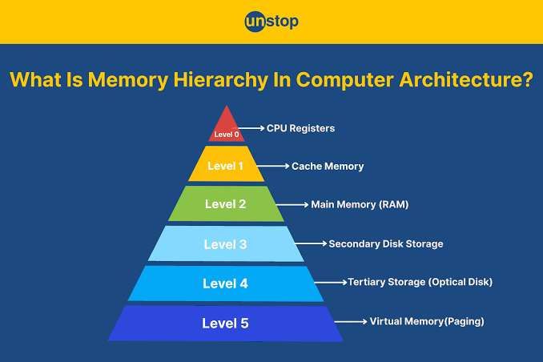

## 1.绪言

放假在家躺尸了几天，翻了翻CSAPP，看到主存那部分，突然想起来新买的平板有一个功能就是用辅存去扩容主存，一时间挺好奇的，而且感觉扩容了之后没什么差别（？

于是决定研究一下这背后的原理，从现在开始吧

---

## 2.从计算机存储层次结构开始

### 2.1.时间与空间的权衡

什么是计算机存储层次结构？来用一个简单的比喻说明

假设你是一个学生，坐在书桌前，正在读书

你的大脑是处理器，可以用来处理书本的知识

首先获取最快的是你手上的书，你翻开就能看，但是容量有限，你最多同时能拿两三本书

其次放在书桌上的书获取速度稍慢，你得伸手拿，但速度也不差，只是书桌的位置仍然有限，放不下太多书

于是为了获取更多的书，你得站起来走到房间里的书架前去找书，书架能装的书很多，但是从你站起来到走到书架前，所耗费的时间已经是翻手里的书的几十上百倍了

最后是学校里的图书馆，里面装着海量的书，但是为了拿到书，你得吭哧吭哧下楼跑到图书馆去找

而这就形象地体现了计算机存储层次结构，寄存器就是你的手掌，CPU cache就是书桌，主存就是书架，辅存就是学校的大图书馆

可以看到，从手掌到图书馆，在存储容量扩大的同时，查询速度却在降低，这就是时间与空间的权衡，那有没有查询又快，存储容量又大的存储器呢？搜了一下有NVMe SSD和CXL这种，但成本居高不下，暂时不能作为通用的解决方案，我们今天也不讨论这些，只看怎么在这种权衡的限制下完成任务

---

### 2.2.各层次存储器读取速度对比表

现在来以人类的感知为比喻，来比较一下CPU读取各层级存储器的速度

|        存储层级        |    硬件介质     | 典型读取延迟 | 等价于多少CPU周期 |    人类感知等效时间     |
| :--------------------: | :-------------: | :----------: | :---------------: | :---------------------: |
|       **寄存器**       |   CPU核心内部   |    < 1 ns    |      ~1周期       |      1秒(手拿水杯)      |
|       **L1缓存**       |      SRAM       | ~1 - 1.5 ns  |    ~4 - 5周期     |     5秒(弯腰捡个笔)     |
|       **L2缓存**       |      SRAM       |  ~3 - 5 ns   |   ~12 - 15周期    |    15秒(起身去开门)     |
|       **L3缓存**       | SRAM(多核共享)  | ~10 - 20 ns  |   ~40 - 60周期    |    1分钟(下楼拿外卖)    |
|    **主内存(RAM)**     | DRAM(DDR4/DDR5) | ~50 - 100 ns |  ~200 - 300周期   | 5分钟(去小卖部买个东西) |
| **固态硬盘(NVMe SSD)** |   Flash(NAND)   | ~20 - 100 us |   ~100,000+周期   | 1天以上(搭火车跨省出差) |
|   **机械硬盘(HDD)**    | 磁性盘片 + 寻道 |  ~5 - 10 ms  |  ~20,000,000周期  | 7个月(徒步走大半个中国) |

可以看到，越往上，读取速度越快，反之往下，读取速度越来越慢

那你可能要问：啊那我们直接全部按照寄存器的方式制作存储器不就好了吗，当然可以，如果你的钱包撑得住，能折腾，而且能接受你的电脑是个阿尔茨海默症的话

首先寄存器本质上是SRAM，它很贵，**特别贵**

我们假设你要搞一个1TB存储的存储器，换算一下单位：

$$
1 \text{TB} = 1024^{4} \,\, \text{Bytes} \approx 1.0995 \times 10^{12} \,\, \text{Bytes} \approx 8.796 \times 10^{12} \,\, \text{bits}
$$

然后1个寄存器单元，也就是 $1 \text{bit}$ 的寄存器采用的是6T(6个晶体管)的结构

在目前台积电最顶级的3nm工艺下，一个6T SRAM单元的实际物理面积约为 $0.021 \mu \text{m}^{2}$

来乘上来

$$
8.796 \times 10^{12} \times 0.021 \times 10^{-6} \text{mm}^{2} \approx 184716 \text{mm}^{2}
$$

算上外围电路开销，算 $30 \%$，大概总共就是 $240130 \text{mm}^{2}$

现在光刻机单次曝光极限面积只有大约 $858 \text{mm}^{2}$，假设切成单块 $300 \text{mm}^{2}$ 的小块进行加工，在3nm的初始缺陷率下，良率大约为 $70 \% \sim 75 \%$

最后实际上需要消耗大约6-7块完整的12英寸晶圆

为了设计你的这个大块SRAM，还需要专门搞一个掩膜版，约为1500万美元，加上晶圆采购大概2万美元一片，算14万美元，以及封装，测试，最终摊下来造出这一块东西就得大概1.1亿人民币

还有电费杂七杂八懒得算了

然后是维护的问题

首先是散热，根据前面的计算，这个巨无霸SRAM总共有约52.8万亿个晶体管，光是待机总功率就有约4400W，运行时功率更是能达到约为30kW

然后算热密度，它总共有大概 $2400 \text{cm}^{2}$ 大小，热密度约为 $\frac{30000 \text{W}}{2400 \text{cm}^{2}} = 12.5 \text{W} / \text{cm}^{2}$

如果是局部核心高频读写，局部热密度会瞬间冲到 $> 200 \text{W} / \text{cm}^{2}$

接下来算最大允许热阻，假设安排 $25 °\text{C}$ 的水，然后芯片最高不能超过 $85 °\text{C}$，允许最大温升为 $\Delta T = 65 °\text{C}$，允许最大总热阻为 $0.002 °\text{C} / \text{W}$

普通顶级电脑水冷的散热热阻约为 $0.05 °\text{C} / \text{W}$，传统风冷水冷已经不顶用了

此时如果用流量法水冷，水流量就需要 $0.71$ 升 / 秒，水压超级大

最终最好是把整个SRAM阵列完全泡在特定的电子氟化液中，你得整个工业级的高压循环泵和外置冷却塔

最后，为什么说它是阿尔茨海默症？因为SRAM是易失的，也就是关机之后你的所有数据就和你say goodbye了

最最最后，它实际上跑得还是和乌龟一样慢，因为它很大，而光速实际上有上限，在上面走个来回就得有 $4 \sim 6 \text{ns}$ 的光速延迟，相当于CPU空转二三十个周期，如果以现在5GHz的CPU来看

同时还有译码器的那个庞大的逻辑门树，算出来数据在哪里都得几纳秒，以及RC延迟，位线电容暴涨等等

总之，impossible

那你可能觉得很灰暗，难道对存储器的高速访问只能是幻想吗？别沮丧，缓存机制和局部性原理来了

---

### 2.3.缓存机制与局部性原理
