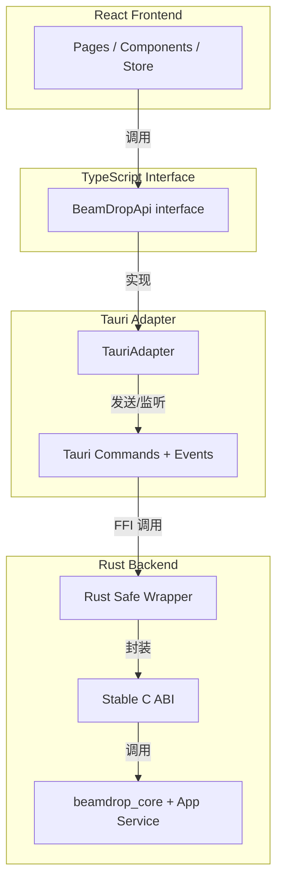
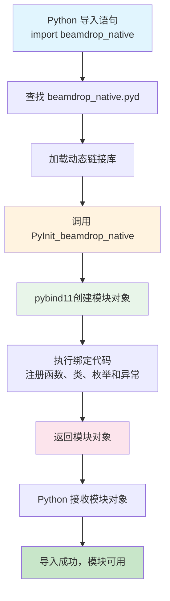
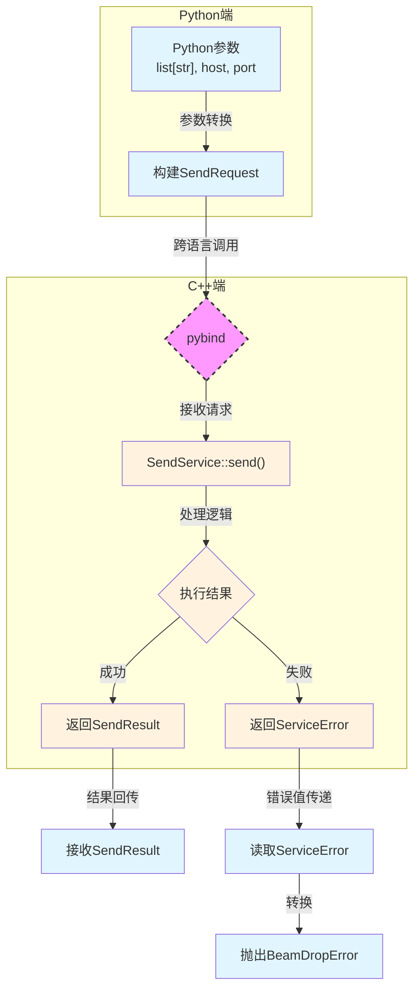
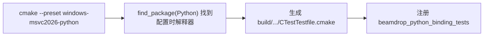
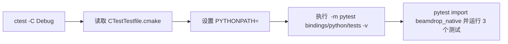

## 1.绪言

BeamDrop的断点续传和进程常驻已经做完，离小学期结束还有差不多一周的时间，单纯的CLI方面目前已经找不到什么特别有展示价值的可以做的地方了，倒是可以做一下流式分块传输的SHA-256校验，但想了一下还是觉得先做GUI界面会好一点

然后接下来考虑技术栈，本来是已经确定了用FastAPI + React做一个本地Web控制台，但是突然发现用Web来做这种东西感觉很蠢，其实这个项目的话我觉得更倾向于做成系统的托盘软件

然后我就去了解了一下相关的路线，发现比较简单的话是Qt，但是对我来说属于是完全全新的技术，而且Qt对样式的支持好像也不是那么灵活

所以翻了一下，最终还是选定了Tauri + React

但是对目前来说，我只剩一周了！！虽然说如果完全vibe的话估计是可以搞定的，但是我更想要在这个过程中尽可能地去多学习一下，Tauri + React的路线需要搞定C++和Rust之间的FFI，然后这个懂的都懂了

所以在现阶段来说，先把Tauri + React作为一个长期的目标来去慢慢做，为了及时交付，最后还是暂时先采用FastAPI + React的Web控制台模式实现GUI

为了之后的迁移性，这里采用了双宿主模式，通过抽象React接口为BeamDrop interface api，可以做到以后后端从FastAPI迁移到Tauri时，前端React界面完全不需要动一行代码，套上直接用

然后大概就是这个样子



多的也不说了，我们来先看第一阶段的Web控制台应该如何实现

Python，JavaScript/TypeScript，C++，这是三套不同的运行时和类型系统。前端的TypeScript最终会被编译成JavaScript运行在浏览器里，而C++核心和Python后端之间还隔着编译型/解释型、GC/无GC、对象模型和ABI这些边界，所以它们不能像同一种语言内部调用那样直接沟通

但问题在于，我们是需要它们之间的通信的，也就是实现C++核心到FastAPI再到前端React的链路

其中从FastAPI到React很好解决，只需要REST请求或者WebSocket长连接就可以，但主要问题就在于Python和C++之间的通信

首先我考虑到的是subprocess实现进程通信，因为之前有接触过，但是了解了一下发现这个序列化开销还有状态实时性以及测试还有错误处理，如果想要做得好非常难做，所以不考虑了

后面综合考虑了一下，选择了pybind11，因为其他方案比如C ABI还有自建HTTP服务、IPC服务这些实现难度都比较高，而pybind只需要整理一下现有的C++代码，暴露出app层接口，构建出Python扩展模块之后就可以从Python调用了。这里需要明确一点：pybind11解决的是本阶段FastAPI宿主调用C++核心的问题，后续Tauri路线仍然应该走稳定C ABI + Rust safe wrapper，而不是让Tauri依赖Python binding。缺点可能就是后续的异步回调比较难处理，但是在可接受范围内

---

## 2.收束C++范围

然后现在就相当于需要梳理现有的C++代码，整理出一个app层，只暴露这些接口给外界调用

现在是`run_server`启动`server`，开始监听，然后不断尝试建立`connection`，发起单个`receive_session`用来完成单次接收任务，然后`run_send`用来发送

所以在`app`层中，我抽出了`ReceiveServerService`，`ReceiveService`，`SendService`三个类，分别对应原来的`run_server`，`receive_session`，`run_send`

然后就是定义了一些传输事件模型之类，这里就不展开讲了，最终就是实现了最后整个C++模块可以被构建为一个`beamdrop_core`，重点还是在后面Python如何通过pybind与C++通信

---

## 3.pybind11初步绑定

### 3.1.pybind11是什么

简单来说，pybind11其实是一个轻量级的C++库，作用就是把C++的类型、类、函数暴露给Python，然后Python就可以在它的代码里直接像写Python代码一样调用C++的东西

大概就像这样调用：

```cpp
#include <pybind11/pybind11.h>

int add(int i, int j) {
    return i + j;
}

PYBIND11_MODULE(my_math, m) {
    m.doc() = "pybind11 example";
    m.def("add", &add, "a function that add two integers");
}
```

然后将这个cpp文件编译成动态链接库，在Python中就可以这样使用了：

```python
import my_math

print(my_math.add(1, 2))
```

---

### 3.2.如何构建

对于普通的C++ target，它的构建产物一般是`.exe`或者`.dll`，而Python原生扩展在Windows上产出`.pyd`，它的本质其实也是`.dll`，但是Python在导入加载它的时候有额外的约定



对于上面我们所提到的`PYBIND11_MODULE(beamdrop_native, m)`，它实际上会生成这个`PyInit_beamdrop_native`函数，所以首先我们需要构建对应的`beamdrop_native`的`target`

简单来讲，就是需要构建一个Python扩展模块，让它链接到现有的`beamdrop_core`，从而能够方便地让Python方面直接调用C++ app service

---

### 3.3.实现import模块

我们先做最简单的一步，让Python能够成功识别到并导入`beamdrop_native`

首先在`bindings/python/CMakeLists.txt`中，写入以下内容，先构建出对应目标

```txt
find_package(Python REQUIRED COMPONENTS Interpreter Development.Module)
find_package(pybind11 CONFIG REQUIRED)

pybind11_add_module(beamdrop_native
    beamdrop_pybind.cpp
)

target_link_libraries(beamdrop_native PRIVATE beamdrop_core)
```

首先前面两步，利用现代CMake的`find_package`先找到对应的Python解释器、开发模块`Development.Module`，以及最重要的`pybind11`，`REQUIRED`代表这个包是必需的

为什么前面要先找Python解释器，因为在我这里如果直接找`pybind11`的话，会去全局的Python环境中找而忽略虚拟环境，所以需要先确定对应的Python解释器

随后`pybind11_add_module`则是增加模块，找到`beamdrop_pybind.cpp`这个文件，生成`beamdrop_native`这个Python扩展模块。在Windows上它的产物一般是`.pyd`

最后`target_link_libraries`，将`beamdrop_native`这个库和底层的核心库`beamdrop_core`链接起来，`beamdrop_core`在根目录的`CMakeLists.txt`有定义：

```txt
set(BEAMDROP_CORE_SOURCES
    src/config/AppConfig.cpp
    src/filesystem/FileScanner.cpp
    src/filesystem/FileUtils.cpp
    src/logger/Logger.cpp
    src/network/TcpClient.cpp
    src/network/TcpConnection.cpp
    src/network/TcpServer.cpp
    src/protocol/PacketIO.cpp
    src/protocol/PacketParser.cpp
    src/protocol/Serializer.cpp
    src/transfer/FileInfoCodec.cpp
    src/transfer/Receiver.cpp
    src/transfer/ResumeAckCodec.cpp
    src/transfer/ResumeManager.cpp
    src/transfer/Sender.cpp
    src/transfer/TransferManifest.cpp
    src/utils/Sha256.cpp
    src/app/SendService.cpp
    src/app/ReceiveService.cpp
    src/app/ReceiveServerService.cpp)

add_library(beamdrop_core STATIC
    ${BEAMDROP_CORE_SOURCES}
)
```

然后现在CMake的配置就搞定了，接下来看`beamdrop_pybind.cpp`怎么写

```cpp
#include <pybind11/pybind11.h>

namespace py = pybind11;

PYBIND11_MODULE(beamdrop_native, m) {
    m.doc() = "BeamDrop C++ application-service binding";
}
```

和刚才一样，不过这里暂时没有引入函数和类这些，因为这里先跑冒烟测试，验证核心功能是否正确

然后就搞定了，验证一下：

```PowerShell
$pyd = Get-ChildItem build\windows-msvc2026-python -Recurse -Filter 'beamdrop_native*pyd' | Select-Object -First 1
$env:PYTHONPATH = $pyd.DirectoryName
& "$PWD\.venv\Scripts\python.exe" -c "import beamdrop_native; print(beamdrop_native.__doc__)"
Remove-Item Env:PYTHONPATH
```

最后成功输出

```txt
BeamDrop C++ application-service binding
```

---

### 3.4.绑定最小纯数据对象

接下来，我们也暂时不进入逻辑的引入和编写，显而易见，所有的逻辑都是跑在底层类型之上的，所以我们先尝试用pybind11引入C++中简单的纯数据对象，即暂时不引入含有类似于`progress_callback`或`std::stop_token`这样的复杂类

要将C++中的枚举类型或者类转为Python的枚举类型或类，需要分别用到`pybind11::enum_`和`pybind11::class_`，具体如下

`bindings/python/beamdrop_pybind.cpp`

```cpp
py::class_<beamdrop::app::ServiceError>(m, "ServiceError")
    .def_readonly("code", &beamdrop::app::ServiceError::code)
    .def_readonly("message", &beamdrop::app::ServiceError::message);

py::enum_<beamdrop::app::TransferProgress::Direction>(m, "TransferDirection")
    .value("SEND", beamdrop::app::TransferProgress::Direction::Send)
    .value("RECEIVE", beamdrop::app::TransferProgress::Direction::Receive);
```

意思是，将C++中的枚举或类，绑定到模块`m`中指定名称的枚举或类上，其中`def_readonly()`代表只读，也就是Python端无法修改C++端传来的值，这也符合结构定位

---

### 3.5.设计初步请求入口

接下来，尝试实现`send()`，但是并不包含所有参数，比如`progress_callback`以及`stop_token`之类，也不设置什么异步回调，就直接写一个同步的方便Python调用的接口函数，看看行为是否正常



首先，增加一个只含基本参数的`SendResult`绑定：

```cpp
py::class_<beamdrop::app::SendResult>(m, "SendResult")
    .def_readonly("file_count", &beamdrop::app::SendResult::file_count)
    .def_readonly("total_bytes", &beamdrop::app::SendResult::total_bytes);
```

然后思考一下，我们在Python端运行这个函数，期望的结果是什么

就如同上图一样，拿到正常的`SendResult`就直接回传，但是拿到`ServiceError`了呢？这里的`ServiceError`是我们自己定义的错误结构，而且`SendService::send()`本身并不是抛出异常，而是通过`ServiceResult<SendResult>`返回成功值或者错误值。所以需要在pybind这一层把C++业务错误转换成Python端的异常并`raise`出来。在`raise`之前，需要先定义一个Python端对应的异常类型`beamdrop_error`

所以有：

```cpp
auto beamdrop_error = py::reinterpret_steal<py::object>(
    PyErr_NewException("beamdrop_native.BeamDropError", PyExc_RuntimeError, nullptr));
m.attr("BeamDropError") = beamdrop_error;
```

我们先看那个括号里面：

```cpp
PyErr_NewException("beamdrop_native.BeamDropError", PyExc_RuntimeError, nullptr)
```

这里调用了CPython底层的C API，意思是告诉Python解释器，生成一个叫做`BeamDropError`的异常类，`PyExc_RuntimeError`代表基类，`nullptr`代表使用默认的类字典

随后，`PyErr_NewException()`返回了一个带有引用计数的指针，而`py::reinterpret_steal<py::object>`则相当于把这个指针所有权拿过来，交给`beamdrop_error`管理

最后，调用`m.attr`，即在模块内声明这样的一个属性

现在Python端的异常已经定义完成了，我们再写一个辅助函数，方便`raise`

```cpp
namespace {
[[noreturn]] void raise_service_error(const py::object &exception_type,
                                      const beamdrop::app::ServiceError &error) {
    auto exception = exception_type(py::str(error.message));
    exception.attr("code") = py::cast(error.code);
    PyErr_SetObject(exception_type.ptr(), exception.ptr());
    throw py::error_already_set();
}
} // namespace
```

首先，通过外部传入的异常类型，先根据当前`error`的`message`初始化一个Python端的异常对象

然后通过`.attr()`方法强制其持有一个名为`code`的属性，通过`py::cast`将原有的`beamdrop::app::ErrorCode`类型转换为前面已经绑定好的Python枚举对象并赋值给`code`属性

随后`PyErr_SetObject`调度Python解释器，通过拿到`exception_type`和`exception`的指针，指明异常对象及其类型，告知解释器，将当前线程的异常状态设置为该`exception`对象

最后，Python端已经登记了异常，C++这里也不能继续下去了，通过抛出一个pybind11特有的C++异常，中断执行流

最后，就可以在模块`m`中添加`send()`函数了

```cpp
m.def(
    "send",
    [beamdrop_error](const std::vector<std::string> &paths, const std::string &host,
                     int port, std::size_t chunk_size) {
        if (port < 0 || port > 65535) {
            throw py::value_error("port must be in range 0..65535");
        }

        beamdrop::app::SendRequest request;
        request.host = host;
        request.port = port;
        request.chunk_size = chunk_size;
        request.paths.reserve(paths.size());
        for (const auto &path : paths) {
            request.paths.emplace_back(path);
        }

        const auto result = beamdrop::app::SendService{}.send(request);
        if (!result) {
            raise_service_error(beamdrop_error, result.error());
        }
        return result.value();
    },
    py::arg("paths"), py::arg("host"), py::arg("port"),
    py::arg("chunk_size") = 1024 * 1024);
```

注意到这里也做了校验，因为这里相当于Python到C++的类型边界错误，应当持有校验职责。不过当前这段只校验能否安全落入`uint16_t`范围，`port = 0`会继续交给`SendService`按应用层错误返回`BeamDropError`。如果希望绑定层直接拦截应用层非法端口，这里可以进一步收紧成`port <= 0 || port > 65535`

最后验证收工

```PowerShell
$pyd = Get-ChildItem build\windows-msvc2026-python -Recurse -Filter 'beamdrop_native*.pyd' | Select-Object -First 1
$env:PYTHONPATH = $pyd.DirectoryName
@'
import beamdrop_native as b

try:
    b.send([], '127.0.0.1', 9000)
except b.BeamDropError as e:
    print(e.code, str(e))
'@ | & "$PWD\.venv\Scripts\python.exe"
Remove-Item Env:PYTHONPATH
```

---

### 3.6.加入`progress_callback`回调

接下来继续，要实现前端界面能够实时显示传输进度，就需要Python将自身的回调函数交给C++，在那边调用

具体地，我们对原有的`send()`函数改造一下，加上回调函数的传参

```cpp
[beamdrop_error](const std::vector<std::string> &paths, const std::string &host, int port,
                         std::size_t chunk_size, py::object on_progress)
```

然后在这里，传入的`on_progress`的合法情况只有两种，要么是空，也就是没有回调，要么就是Python的可调用类型，所以在函数体内也加一个校验

```cpp
if (!on_progress.is_none() && !PyCallable_Check(on_progress.ptr())) {
    throw py::type_error("on_progress must be callable or None");
}
```

然后尝试将这个传入的函数化为`request`中能够被调用的`progress_callback`

```cpp
if (!on_progress.is_none()) {
    py::function callback = py::reinterpret_borrow<py::function>(on_progress);
    request.progress_callback = [callback = std::move(callback)](
                                    const beamdrop::app::TransferProgress &progress) {
        py::gil_scoped_acquire aquire;
        try {
            callback(progress);
        } catch (py::error_already_set &error) {
            const std::string message = error.what();
            error.discard_as_unraisable(callback);
            throw PythonProgressCallbackError(message);
        }
    };
}
```

#### 3.6.1.GIL: 全局解释器锁

在讲这段代码之前，先需要知道什么叫GIL

GIL，也叫做全局解释器锁，意思就是，在任意一个确定的时刻，一个Python进程内只有一个线程能够运行

所以说，Python内部其实并没有真正的多线程，在CPU也就是计算密集型任务上，无法利用多核加速，只能不断地切换线程达到时间片轮转，也就是一个核吭哧吭哧地跑，其他核在旁边冻得要感冒了

为什么Python的设计要弄出来这个东西，大概来讲，有三个原因

- 首先最重要的，因为Python内部的GC也就是垃圾回收机制是依靠对Python对象的引用计数实现的，如果没有GIL，就可能出现多个线程同时对单个对象的引用计数加加减减的情况，产生竞态，导致内存泄漏等等
- 其次，为了偷懒和效率，在Python出现的初期，多核CPU尚未普及，然后加一把GIL锁，单线程运行快，又简化了CPython的C语言底层实现，扩展库写起来也简单
- 最后则是积重难返，等到后来发现不对劲，想删了，发现已经有太多的核心代码和第三方库依赖这个GIL，一拆就崩

虽然现在人们正在尝试逐步将GIL拆掉，目前也已经推出了实验性的无锁CPython，在Python3.13以上，但是等到整个生态都支持无锁也就不知道要到什么时候了

这个GIL锁，再加上Python本身就是一门解释型语言，在计算密集型场景下，跑得就更像蜗牛了

---

#### 3.6.2.回调函数转换

回到刚才的代码，这段代码实际上是将Python的回调函数包装成C++能够调用的lambda表达式

首先

```cpp
py::function callback = py::reinterpret_borrow<py::function>(on_progress);
```

这里用了`py::reinterpret_borrow`，而上面我们在构造`beamdrop_error`的时候用到了`py::reinterptre_steal`，这里简单讲一下两者的区别

我们上面提到，Python中对象是持有一个引用计数的，然后GC就根据这个引用计数销毁对象

对于`py::reinterptre_borrow`，它就相当于普通地引用这个对象，使得该对象的引用计数增加1，等到这里的`callback`销毁之后，对应的这个Python对象也销毁，引用计数减少1，相对来说比较安全

而`py::reinterptre_steal`，顾名思义，就是将所有权拿过来，它不增加引用计数，但是销毁之后引用计数也会减少1，因此如果操作不当，则会造成悬空引用等问题

为什么上面的`beamdrop_error`用`py::reinterpret_steal`？因为其所取的对象是在括号内用`PyErr_NewException`构造出来的类似于右值的东西，出了这条语句就自动销毁了，相当于此时只有`beamdrop_error`持有这个对象，是安全的

而`callback`不同，这个`on_progress`是由Python端传进来的函数，不可盲目转移所有权，只能用`reinterpret_borrow`借用

然后这里就通过`reinterpret_borrow`将`on_progress`强制转换为`py::function`类型，并赋给`callback`，这个就是库的底层实现

随后拿到`callback`，我们构造一个lambda表达式，其中`[callback = std::move(callback)]`变量捕获，应用移动语义将所有权完全转移到这个lambda内部

传参`progress`，这里重点是调用了

```cpp
py::gil_scoped_acquire acquire;
```

这里的意思是重新申请Python的全局解释器锁

为什么要重新申请？因为为了防止为了调用C++传输进程导致Python进程等待同步阻塞，我们在调度例如`SendService.send()`这样的耗时网络I/O任务之前，会先通过

```cpp
py::gil_scoped_release release;
```

释放GIL，这样C++进程就可以异步去执行传输任务，Python端则可以回去继续执行自己的任务，如果不释放就会导致前端UI无响应这样，背后就是Python进程阻塞了

但这里为什么要拿回来呢？因为这里需要回调Python端的回调函数，需要抢占线程，否则多线程并发读写可能导致混乱，比如正在调用回调的过程中，另一个线程把这个回调函数销毁了，进程自然崩溃

随后就是调用回调和异常处理

```cpp
try {
    callback(progress);
} catch (py::error_already_set &error) {
    const std::string message = error.what();
    error.discard_as_unraisable(callback);
    throw PythonProgressCallbackError(message);
}
```

这里的`py::error_already_set`就是捕获抛出的Python异常，但由于C++进程肯定没办法直接把Python异常抛回给Python主进程，所以这里用`discard_as_unraiseable`方法标记异常上下文，意为不可引发，然后在控制台或者别的什么地方抛出一个Traceback，方便追踪，避免直接抛回去异常导致整个Python解释器崩了

最后在C++进程抛出一个自定义的`public`继承`std::runtime_error`的异常，用于标记在调用回调的过程中寄了

这里还有一个比较有意思的是，注意到在申请全局解释器锁的时候，我们相当于声明了一个对象`acquire`，而不是调用函数方法`py::gil_scoped_acquire()`，这样做的好处就是通过RAII原则，在退出当前作用域的时候，自动析构`acquire`对象，而无需手动`release`

这样一来就成功将Python的回调传给C++了

---

#### 3.6.3.`ReceiveServerService`转译

发送端已经OK，接下来则需要让Python也可以直接调用C++接收端的持续监听服务

为了暂时的简单起见，这里没有同步将接收端的回调函数也配置了，暂时实现一个无回调同步版本的接收端

```cpp
py::class_<beamdrop::app::ReceiveServerService,
            std::shared_ptr<beamdrop::app::ReceiveServerService>>(m, "ReceiverService")
    .def(py::init<>())
    .def(
        "start",
        [beamdrop_error](beamdrop::app::ReceiveServerService &service, const std::string &host,
                            int port, const std::string &save_dir, const std::string &state_file) {
            if (port < 0 || port > 65535) {
                throw py::value_error("port must be in range 0..65535");
            }

            beamdrop::app::ReceiveServerRequest request;
            request.host = host;
            request.port = static_cast<std::uint16_t>(port);
            request.receive_request.save_dir = std::filesystem::path{save_dir};
            request.receive_request.state_file = std::filesystem::path{state_file};

            const auto result = service.start(request);
            if (!result) {
                raise_service_error(beamdrop_error, result.error());
            }
            return result.value();
        },
        py::arg("host"), py::arg("port"), py::arg("save_dir"), py::arg("state_file"))
    .def("status", &beamdrop::app::ReceiveServerService::status)
    .def("stop", [beamdrop_error](beamdrop::app::ReceiveServerService &service) {
        const auto result = service.stop();
        if (!result) {
            raise_service_error(beamdrop_error, result.error());
        }
        return result.value();
    });
```

---

#### 3.6.4.测试编写

使用pytest编写测试，验证回调函数的正常调用和异常抛出行为与预期的符合

```python
import hashlib
import socket
import time
from pathlib import Path

import pytest

import beamdrop_native as b


def free_loopback_port() -> int:
    with socket.socket(socket.AF_INET, socket.SOCK_STREAM) as sock:
        sock.bind(("127.0.0.1", 0))
        return sock.getsockname()[1]


def wait_for_file(path: Path, timeout_seconds: float = 2.0) -> None:
    deadline = time.monotonic() + timeout_seconds
    while time.monotonic() < deadline:
        if path.exists():
            return
        time.sleep(0.02)
    raise AssertionError(f"received file not found: {path}")


@pytest.fixture
def receiver(tmp_path: Path):
    service = b.ReceiverService()
    port = free_loopback_port()
    received_dir = tmp_path / "received"
    received_dir.mkdir()

    started = service.start(
        "127.0.0.1",
        port,
        str(received_dir),
        str(tmp_path / "receiver-state.json"),
    )
    assert started.state == b.ReceiverState.RUNNING

    try:
        yield service, port, received_dir
    finally:
        status = service.status()
        if status.state != b.ReceiverState.STOPPED:
            service.stop()


def test_send_reports_progress_and_transfers_file(receiver, tmp_path: Path) -> None:
    service, port, received_dir = receiver
    del service  # fixture owns lifetime; prevents an unused-variable warning

    source = tmp_path / "数据.bin"
    source.write_bytes(bytes(range(256)) * 16_384)  # 4 MiB
    stages: list[object] = []

    result = b.send(
        [str(source)],
        "127.0.0.1",
        port,
        on_progress=lambda progress: stages.append(progress.stage),
    )

    assert result.file_count == 1
    assert result.total_bytes == source.stat().st_size
    assert b.TransferStage.TASK_STARTED in stages
    assert b.TransferStage.TRANSFERRING in stages
    assert b.TransferStage.FILE_COMPLETED in stages
    assert b.TransferStage.TASK_COMPLETED in stages

    received = received_dir / source.name
    wait_for_file(received)
    assert hashlib.sha256(received.read_bytes()).digest() == hashlib.sha256(source.read_bytes()).digest()


def test_send_converts_python_callback_exception_to_internal_error(receiver, tmp_path: Path) -> None:
    service, port, _ = receiver
    del service

    source = tmp_path / "数据.bin"
    source.write_bytes(b"callback failure test")

    def failing_callback(_: object) -> None:
        raise RuntimeError("intentional callback failure")

    with pytest.raises(b.BeamDropError) as caught:
        b.send([str(source)], "127.0.0.1", port, on_progress=failing_callback)

    assert caught.value.code == b.ErrorCode.INTERNAL_ERROR


def test_send_rejects_non_callable_progress_handler() -> None:
    with pytest.raises(TypeError, match="on_progress must be callable or None"):
        b.send([], "127.0.0.1", 19090, on_progress=42)

```

这里用中文名是为了验证utf-8编码的正常转换

最后这里比较重要的就是，我实际上并不单独运行pytest，而是通过CTest间接调用测试脚本，统一验证

CTest本身无法理解pytest，但是它只是实现了执行CMake在配置阶段注册的一条外部命令

```cmake
add_test(
    NAME beamdrop_python_binding_tests
    COMMAND ${Python_EXECUTABLE} -m pytest
            ${CMAKE_CURRENT_SOURCE_DIR}/tests
            -v
)
set_tests_properties(beamdrop_python_binding_tests PROPERTIES
    ENVIRONMENT "PYTHONPATH=$<TARGET_FILE_DIR:beamdrop_native>"
)
```

在具体的构建与测试中，大概像下面这样

<div align="center">

构建阶段



测试阶段



</div>

---

## 4.从pybind到Python应用层

### 4.1.Gateway

到目前为止，Python端已经可以通过pybind导出的动态链接库`.pyd`直接调用C++的发送和接收服务

也就是说相当于在路由层就可以直接

```python
@app.post("api/transfer/send")
async def send(request: SendRequest):
    result = await beamdrop_native.send(request)
    ...
```

但是仔细思考，这样做会有什么问题？

稍微画一下数据流向图

<div align="center">


</div>

发现什么问题？现在FastAPI直接依赖于pybind层，也就说明如果以后我们需要修改方案，比如说用subprocess或者gRPC进行进程间通信这样，那整个FastAPI的路由层都要大改，所以我们考虑在FastAPI和pybind层之间引入一个过渡层，进行一个通用接口的适配

首先需要抽象出一个父类，这个适配层作用在应用层，起到一个应用层网关的作用，故命名为gateway

那么这个需要抽象出什么方法？就目前设计来看，只需要设计发送、启动接收端、获取接收端状态、停止接收端这四个方法，因此有抽象类

```python
class NativeGateway(Protocol):
    def send(self, on_progress: ProgressCallback, cancel_event: Event | None = None) -> NativeSendResult:
        ...

    def start_receiver(self, request: StartReceiverRequest) -> ReceiverSnapshot:
        ...

    def receiver_status(self) -> ReceiverSnapshot:
        ...

    def stop_receiver(self) -> ReceiverSnapshot:
        ...
```

通过继承出一个`PybindNativeGateway`，我们就成功将整个架构拆分为表现层、业务层、网关层、绑定层、逻辑层
