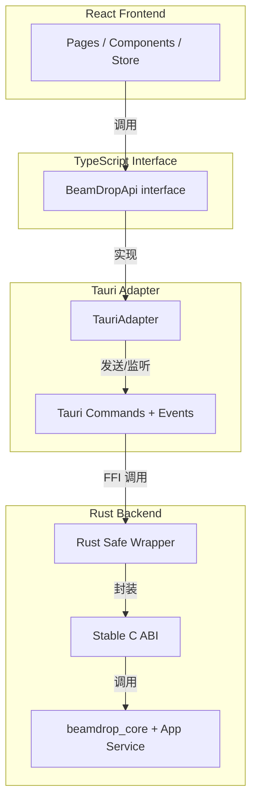
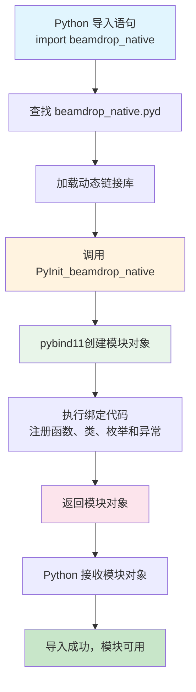
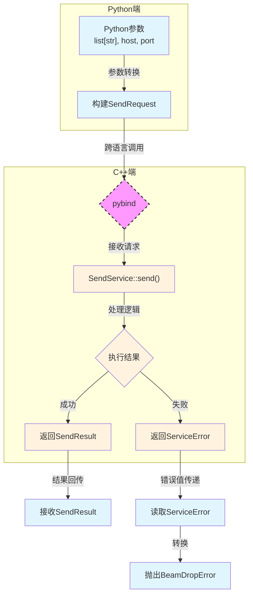

## 1.绪言

BeamDrop的断点续传和进程常驻已经做完，离小学期结束还有差不多一周的时间，单纯的CLI方面目前已经找不到什么特别有展示价值的可以做的地方了，倒是可以做一下流式分块传输的SHA-256校验，但想了一下还是觉得先做GUI界面会好一点

然后接下来考虑技术栈，本来是已经确定了用FastAPI + React做一个本地Web控制台，但是突然发现用Web来做这种东西感觉很蠢，其实这个项目的话我觉得更倾向于做成系统的托盘软件

然后我就去了解了一下相关的路线，发现比较简单的话是Qt，但是对我来说属于是完全全新的技术，而且Qt对样式的支持好像也不是那么灵活

所以翻了一下，最终还是选定了Tauri + React

但是对目前来说，我只剩一周了！！虽然说如果完全vibe的话估计是可以搞定的，但是我更想要在这个过程中尽可能地去多学习一下，Tauri + React的路线需要搞定C++和Rust之间的FFI，然后这个懂的都懂了

所以在现阶段来说，先把Tauri + React作为一个长期的目标来去慢慢做，为了及时交付，最后还是暂时先采用FastAPI + React的Web控制台模式实现GUI

为了之后的迁移性，这里采用了双宿主模式，通过抽象React接口为BeamDrop interface api，可以做到以后后端从FastAPI迁移到Tauri时，前端React界面完全不需要动一行代码，套上直接用

然后大概就是这个样子



多的也不说了，我们来先看第一阶段的Web控制台应该如何实现

Python，JavaScript/TypeScript，C++，这是三套不同的运行时和类型系统。前端的TypeScript最终会被编译成JavaScript运行在浏览器里，而C++核心和Python后端之间还隔着编译型/解释型、GC/无GC、对象模型和ABI这些边界，所以它们不能像同一种语言内部调用那样直接沟通

但问题在于，我们是需要它们之间的通信的，也就是实现C++核心到FastAPI再到前端React的链路

其中从FastAPI到React很好解决，只需要REST请求或者WebSocket长连接就可以，但主要问题就在于Python和C++之间的通信

首先我考虑到的是subprocess实现进程通信，因为之前有接触过，但是了解了一下发现这个序列化开销还有状态实时性以及测试还有错误处理，如果想要做得好非常难做，所以不考虑了

后面综合考虑了一下，选择了pybind11，因为其他方案比如C ABI还有自建HTTP服务、IPC服务这些实现难度都比较高，而pybind只需要整理一下现有的C++代码，暴露出app层接口，构建出Python扩展模块之后就可以从Python调用了。这里需要明确一点：pybind11解决的是本阶段FastAPI宿主调用C++核心的问题，后续Tauri路线仍然应该走稳定C ABI + Rust safe wrapper，而不是让Tauri依赖Python binding。缺点可能就是后续的异步回调比较难处理，但是在可接受范围内

---

## 2.收束C++范围

然后现在就相当于需要梳理现有的C++代码，整理出一个app层，只暴露这些接口给外界调用

现在是`run_server`启动`server`，开始监听，然后不断尝试建立`connection`，发起单个`receive_session`用来完成单次接收任务，然后`run_send`用来发送

所以在`app`层中，我抽出了`ReceiveServerService`，`ReceiveService`，`SendService`三个类，分别对应原来的`run_server`，`receive_session`，`run_send`

然后就是定义了一些传输事件模型之类，这里就不展开讲了，最终就是实现了最后整个C++模块可以被构建为一个`beamdrop_core`，重点还是在后面Python如何通过pybind与C++通信

---

## 3.pybind11初步绑定

### 3.1.pybind11是什么

简单来说，pybind11其实是一个轻量级的C++库，作用就是把C++的类型、类、函数暴露给Python，然后Python就可以在它的代码里直接像写Python代码一样调用C++的东西

大概就像这样调用：

```cpp
#include <pybind11/pybind11.h>

int add(int i, int j) {
    return i + j;
}

PYBIND11_MODULE(my_math, m) {
    m.doc() = "pybind11 example";
    m.def("add", &add, "a function that add two integers");
}
```

然后将这个cpp文件编译成动态链接库，在Python中就可以这样使用了：

```python
import my_math

print(my_math.add(1, 2))
```

---

### 3.2.如何构建

对于普通的C++ target，它的构建产物一般是`.exe`或者`.dll`，而Python原生扩展在Windows上产出`.pyd`，它的本质其实也是`.dll`，但是Python在导入加载它的时候有额外的约定



对于上面我们所提到的`PYBIND11_MODULE(beamdrop_native, m)`，它实际上会生成这个`PyInit_beamdrop_native`函数，所以首先我们需要构建对应的`beamdrop_native`的`target`

简单来讲，就是需要构建一个Python扩展模块，让它链接到现有的`beamdrop_core`，从而能够方便地让Python方面直接调用C++ app service

---

### 3.3.实现import模块

我们先做最简单的一步，让Python能够成功识别到并导入`beamdrop_native`

首先在`bindings/python/CMakeLists.txt`中，写入以下内容，先构建出对应目标

```txt
find_package(Python REQUIRED COMPONENTS Interpreter Development.Module)
find_package(pybind11 CONFIG REQUIRED)

pybind11_add_module(beamdrop_native
    beamdrop_pybind.cpp
)

target_link_libraries(beamdrop_native PRIVATE beamdrop_core)
```

首先前面两步，利用现代CMake的`find_package`先找到对应的Python解释器、开发模块`Development.Module`，以及最重要的`pybind11`，`REQUIRED`代表这个包是必需的

为什么前面要先找Python解释器，因为在我这里如果直接找`pybind11`的话，会去全局的Python环境中找而忽略虚拟环境，所以需要先确定对应的Python解释器

随后`pybind11_add_module`则是增加模块，找到`beamdrop_pybind.cpp`这个文件，生成`beamdrop_native`这个Python扩展模块。在Windows上它的产物一般是`.pyd`

最后`target_link_libraries`，将`beamdrop_native`这个库和底层的核心库`beamdrop_core`链接起来，`beamdrop_core`在根目录的`CMakeLists.txt`有定义：

```txt
set(BEAMDROP_CORE_SOURCES
    src/config/AppConfig.cpp
    src/filesystem/FileScanner.cpp
    src/filesystem/FileUtils.cpp
    src/logger/Logger.cpp
    src/network/TcpClient.cpp
    src/network/TcpConnection.cpp
    src/network/TcpServer.cpp
    src/protocol/PacketIO.cpp
    src/protocol/PacketParser.cpp
    src/protocol/Serializer.cpp
    src/transfer/FileInfoCodec.cpp
    src/transfer/Receiver.cpp
    src/transfer/ResumeAckCodec.cpp
    src/transfer/ResumeManager.cpp
    src/transfer/Sender.cpp
    src/transfer/TransferManifest.cpp
    src/utils/Sha256.cpp
    src/app/SendService.cpp
    src/app/ReceiveService.cpp
    src/app/ReceiveServerService.cpp)

add_library(beamdrop_core STATIC
    ${BEAMDROP_CORE_SOURCES}
)
```

然后现在CMake的配置就搞定了，接下来看`beamdrop_pybind.cpp`怎么写

```cpp
#include <pybind11/pybind11.h>

namespace py = pybind11;

PYBIND11_MODULE(beamdrop_native, m) {
    m.doc() = "BeamDrop C++ application-service binding";
}
```

和刚才一样，不过这里暂时没有引入函数和类这些，因为这里先跑冒烟测试，验证核心功能是否正确

然后就搞定了，验证一下：

```PowerShell
$pyd = Get-ChildItem build\windows-msvc2026-python -Recurse -Filter 'beamdrop_native*pyd' | Select-Object -First 1
$env:PYTHONPATH = $pyd.DirectoryName
& "$PWD\.venv\Scripts\python.exe" -c "import beamdrop_native; print(beamdrop_native.__doc__)"
Remove-Item Env:PYTHONPATH
```

最后成功输出

```txt
BeamDrop C++ application-service binding
```

---

### 3.4.绑定最小纯数据对象

接下来，我们也暂时不进入逻辑的引入和编写，显而易见，所有的逻辑都是跑在底层类型之上的，所以我们先尝试用pybind11引入C++中简单的纯数据对象，即暂时不引入含有类似于`progress_callback`或`std::stop_token`这样的复杂类

要将C++中的枚举类型或者类转为Python的枚举类型或类，需要分别用到`pybind11::enum_`和`pybind11::class_`，具体如下

`bindings/python/beamdrop_pybind.cpp`

```cpp
py::class_<beamdrop::app::ServiceError>(m, "ServiceError")
    .def_readonly("code", &beamdrop::app::ServiceError::code)
    .def_readonly("message", &beamdrop::app::ServiceError::message);

py::enum_<beamdrop::app::TransferProgress::Direction>(m, "TransferDirection")
    .value("SEND", beamdrop::app::TransferProgress::Direction::Send)
    .value("RECEIVE", beamdrop::app::TransferProgress::Direction::Receive);
```

意思是，将C++中的枚举或类，绑定到模块`m`中指定名称的枚举或类上，其中`def_readonly()`代表只读，也就是Python端无法修改C++端传来的值，这也符合结构定位

---

### 3.5.设计初步请求入口

接下来，尝试实现`send()`，但是并不包含所有参数，比如`progress_callback`以及`stop_token`之类，也不设置什么异步回调，就直接写一个同步的方便Python调用的接口函数，看看行为是否正常



首先，增加一个只含基本参数的`SendResult`绑定：

```cpp
py::class_<beamdrop::app::SendResult>(m, "SendResult")
    .def_readonly("file_count", &beamdrop::app::SendResult::file_count)
    .def_readonly("total_bytes", &beamdrop::app::SendResult::total_bytes);
```

然后思考一下，我们在Python端运行这个函数，期望的结果是什么

就如同上图一样，拿到正常的`SendResult`就直接回传，但是拿到`ServiceError`了呢？这里的`ServiceError`是我们自己定义的错误结构，而且`SendService::send()`本身并不是抛出异常，而是通过`ServiceResult<SendResult>`返回成功值或者错误值。所以需要在pybind这一层把C++业务错误转换成Python端的异常并`raise`出来。在`raise`之前，需要先定义一个Python端对应的异常类型`beamdrop_error`

所以有：

```cpp
auto beamdrop_error = py::reinterpret_steal<py::object>(
    PyErr_NewException("beamdrop_native.BeamDropError", PyExc_RuntimeError, nullptr));
m.attr("BeamDropError") = beamdrop_error;
```

我们先看那个括号里面：

```cpp
PyErr_NewException("beamdrop_native.BeamDropError", PyExc_RuntimeError, nullptr)
```

这里调用了CPython底层的C API，意思是告诉Python解释器，生成一个叫做`BeamDropError`的异常类，`PyExc_RuntimeError`代表基类，`nullptr`代表使用默认的类字典

随后，`PyErr_NewException()`返回了一个带有引用计数的指针，而`py::reinterpret_steal<py::object>`则相当于把这个指针所有权拿过来，交给`beamdrop_error`管理

最后，调用`m.attr`，即在模块内声明这样的一个属性

现在Python端的异常已经定义完成了，我们再写一个辅助函数，方便`raise`

```cpp
namespace {
[[noreturn]] void raise_service_error(const py::object &exception_type,
                                      const beamdrop::app::ServiceError &error) {
    auto exception = exception_type(py::str(error.message));
    exception.attr("code") = py::cast(error.code);
    PyErr_SetObject(exception_type.ptr(), exception.ptr());
    throw py::error_already_set();
}
} // namespace
```

首先，通过外部传入的异常类型，先根据当前`error`的`message`初始化一个Python端的异常对象

然后通过`.attr()`方法强制其持有一个名为`code`的属性，通过`py::cast`将原有的`beamdrop::app::ErrorCode`类型转换为前面已经绑定好的Python枚举对象并赋值给`code`属性

随后`PyErr_SetObject`调度Python解释器，通过拿到`exception_type`和`exception`的指针，指明异常对象及其类型，告知解释器，将当前线程的异常状态设置为该`exception`对象

最后，Python端已经登记了异常，C++这里也不能继续下去了，通过抛出一个pybind11特有的C++异常，中断执行流

最后，就可以在模块`m`中添加`send()`函数了

```cpp
m.def(
    "send",
    [beamdrop_error](const std::vector<std::string> &paths, const std::string &host,
                     int port, std::size_t chunk_size) {
        if (port < 0 || port > 65535) {
            throw py::value_error("port must be in range 0..65535");
        }

        beamdrop::app::SendRequest request;
        request.host = host;
        request.port = port;
        request.chunk_size = chunk_size;
        request.paths.reserve(paths.size());
        for (const auto &path : paths) {
            request.paths.emplace_back(path);
        }

        const auto result = beamdrop::app::SendService{}.send(request);
        if (!result) {
            raise_service_error(beamdrop_error, result.error());
        }
        return result.value();
    },
    py::arg("paths"), py::arg("host"), py::arg("port"),
    py::arg("chunk_size") = 1024 * 1024);
```

注意到这里也做了校验，因为这里相当于Python到C++的类型边界错误，应当持有校验职责。不过当前这段只校验能否安全落入`uint16_t`范围，`port = 0`会继续交给`SendService`按应用层错误返回`BeamDropError`。如果希望绑定层直接拦截应用层非法端口，这里可以进一步收紧成`port <= 0 || port > 65535`

最后验证收工

```PowerShell
$pyd = Get-ChildItem build\windows-msvc2026-python -Recurse -Filter 'beamdrop_native*.pyd' | Select-Object -First 1
$env:PYTHONPATH = $pyd.DirectoryName
@'
import beamdrop_native as b

try:
    b.send([], '127.0.0.1', 9000)
except b.BeamDropError as e:
    print(e.code, str(e))
'@ | & "$PWD\.venv\Scripts\python.exe"
Remove-Item Env:PYTHONPATH
```
